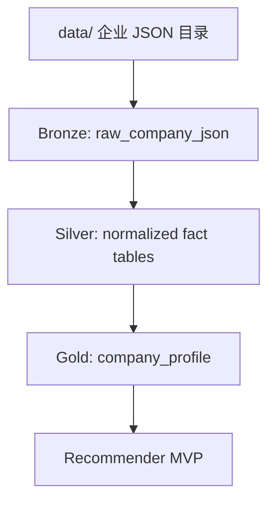
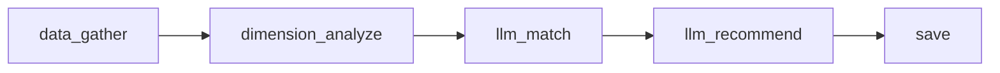

# DUCK.md

本文档记录当前 DuckDB 本地企业数据仓库、产品推荐 MVP 的架构、使用方式、配置方法和后续演进计划。

当前目标不是替换原有尽调流水线，而是在尽量保持现有架构不变的前提下，先跑通一条本地数据驱动的 MVP：

```text
data/ JSON
  -> DuckDB warehouse
  -> company_profile
  -> data_gather
  -> dimension_analyze
  -> llm_match
  -> llm_recommend
  -> save
```

Web search、外部补证、复杂报告生成先不纳入本阶段，后续作为可插拔增强能力加入。

## 当前状态

已经完成：

- 从项目根目录 `data/` 读取 Prophet 企业 JSON 包。
- 构建本地 DuckDB 数据库：`cache/company_warehouse.duckdb`。
- 形成 Bronze / Silver / Gold 三层数据结构。
- 提供稳定的 Gold 层视图表：`company_profile`。
- 基于 `company_profile` 跑通产品模块推荐 MVP。
- 推荐维度和产品模块均放到 YAML 配置中。
- LLM 不可用时支持 deterministic fallback，可以离线跑通流程。

当前关键入口：

```text
etl_json_to_duckdb.py                         # JSON -> DuckDB ETL
run_recommender.py                            # DuckDB -> 推荐结果
src/diligence/warehouse/                      # DuckDB warehouse 模块
src/diligence/recommender/                    # 推荐 MVP 模块
config/recommender/analysis_dimensions.yaml   # 分析维度配置
config/recommender/products.yaml              # 产品模块配置
config/recommender/prompts/                   # LLM 提示词
recommendation_runs/                          # 推荐运行输出
```

## 数据输入约定

当前数据放在项目根目录：

```text
data/
  {统一社会信用代码}_{企业名称}/
    .meta.json
    info.json
    query_company.json
    label.json
    ...
```

示例：

```text
data/
  91440606707539050R_广东德美精细化工集团股份有限公司/
  9144060628009483XQ_广东科德环保科技股份有限公司/
```

注意：

- `.cache/` 不参与本轮 ETL。
- JSON 文件可能不完整，完整企业预计最多约 45 个 JSON。
- 当前 ETL 允许缺文件，缺文件会进入 `missing_v1_files`，不会导致导入失败。
- 新增公司时，只要按上述目录结构放入 `data/`，重新跑 ETL 即可。

## DuckDB 分层设计

当前 warehouse 采用三层结构：



### Bronze

Bronze 层保存原始 JSON：

```text
raw_company_json
company_import_status
```

用途：

- 保留每个来源文件的完整 JSON。
- 记录文件大小、hash、抓取时间、解析状态。
- 支持后续重跑解析逻辑。
- 支持审计和 debug。

### Silver

Silver 层把常用字段解析成相对结构化的事实表：

```text
companies
company_labels
key_personnel
shareholders
ip_summary
risk_features
recruitments
bidding_summary
qualifications
branches
financing_events
outbound_investments
```

当前 Silver V1 只解析对企业画像和推荐有用的稳定字段，没有试图一次性覆盖所有 JSON 文件。

### Gold

Gold 层当前只有一张推荐友好的宽表：

```text
company_profile
```

推荐模块原则上只读 `company_profile`，不直接依赖各个原始 JSON 文件。这样可以把“数据解析”和“业务推荐”解耦。

`company_profile` 的关键字段包括：

```text
credit_code
company_name
industry
industry_big
industry_mid
industry_small
employee_count
registered_capital
registered_location
business_scope
reg_status
company_org_type
is_listed
stock_code
labels
bank_flags
cross_border_flags
ip_counts
risk_counts
recruitment_count
recent_recruitment_titles
bidding_total
branch_count
shareholder_summary
qualification_count
financing_event_count
outbound_investment_count
source_files
missing_v1_files
profile_completeness
import_status
```

## 初始化与重建数据库

首次初始化或重建：

```bash
uv run python etl_json_to_duckdb.py --input data --output cache/company_warehouse.duckdb
```

默认参数等价于：

```bash
uv run python etl_json_to_duckdb.py
```

追加导入：

```bash
uv run python etl_json_to_duckdb.py --input data --output cache/company_warehouse.duckdb --append
```

建议当前阶段优先使用重建模式，不使用 `--append`，因为本地数据量不大，重建更容易保证一致性。

成功后会输出类似：

```text
input: data
output: cache/company_warehouse.duckdb
companies: 25
raw_json_rows: 808
import_status:
  complete_or_rich: 18
  meta_only: 2
  partial: 5
table_rows:
  company_profile: 25
  ...
```

## 如何查询 DuckDB

### 命令行查询

如果本机安装了 DuckDB CLI：

```bash
duckdb cache/company_warehouse.duckdb
```

常用查询：

```sql
SHOW TABLES;

SELECT company_name, industry, employee_count, profile_completeness, import_status
FROM company_profile
ORDER BY profile_completeness DESC;

SELECT company_name, missing_v1_files
FROM company_profile
WHERE import_status <> 'complete_or_rich';
```

### Python 查询

```python
import duckdb

conn = duckdb.connect("cache/company_warehouse.duckdb", read_only=True)
rows = conn.execute("""
    SELECT company_name, industry, employee_count, labels
    FROM company_profile
    LIMIT 5
""").fetchall()
print(rows)
```

### 当前推荐模块如何读取

推荐模块通过：

```text
src/diligence/recommender/profile_repository.py
```

读取 `company_profile`。

它会先按企业全名精确匹配，匹配不到时再做模糊匹配。

## 运行推荐 MVP

默认使用 LLM：

```bash
uv run python run_recommender.py "广东德美精细化工集团股份有限公司"
```

离线或不想调用 LLM 时：

```bash
uv run python run_recommender.py --no-llm "广东德美精细化工集团股份有限公司"
```

指定数据库：

```bash
uv run python run_recommender.py \
  --warehouse cache/company_warehouse.duckdb \
  "广东德美精细化工集团股份有限公司"
```

指定输出目录：

```bash
uv run python run_recommender.py \
  --output-dir recommendation_runs \
  "广东德美精细化工集团股份有限公司"
```

指定配置文件：

```bash
uv run python run_recommender.py \
  --products-config config/recommender/products.yaml \
  --dimensions-config config/recommender/analysis_dimensions.yaml \
  "广东德美精细化工集团股份有限公司"
```

运行成功后会输出：

```text
status: success
run_id: rec_...
output_dir: recommendation_runs/rec_...
report: recommendation_runs/rec_.../report.md
result: recommendation_runs/rec_.../result.json
```

## 推荐输出文件

每次推荐运行会生成一个独立目录：

```text
recommendation_runs/
  rec_YYYYMMDD_HHMMSS_{企业名称}/
    profile.json
    dimension_analysis.json
    match_results.json
    result.json
    report.md
```

各文件含义：

```text
profile.json
  从 company_profile 读取出的企业画像。

dimension_analysis.json
  基于配置维度和本地字段生成的维度分析。

match_results.json
  产品模块与企业需求的匹配结果。

result.json
  最终推荐结构化结果，适合后续系统读取。

report.md
  面向人工阅读的 Markdown 推荐报告。
```

## 推荐流水线

当前推荐图在：

```text
src/diligence/recommender/graph.py
```

流程：



### data_gather

文件：

```text
src/diligence/recommender/nodes/data_gather_node.py
```

职责：

- 从 DuckDB `company_profile` 读取企业画像。
- 判断画像完整度。
- 若 `profile_completeness` 较低，标记 `needs_web_enrichment = true`。

### dimension_analyze

文件：

```text
src/diligence/recommender/nodes/dimension_analyze_node.py
src/diligence/recommender/dimension_analyzer.py
```

职责：

- 根据 `analysis_dimensions.yaml` 中定义的维度读取本地字段。
- 生成事实证据、缺失证据、基础推断和置信度。
- 不调用外部搜索。

### llm_match

文件：

```text
src/diligence/recommender/nodes/llm_match_node.py
```

职责：

- 结合维度分析和产品配置，判断每个产品模块的匹配度。
- LLM 可用时调用 LLM。
- LLM 不可用、超时或解析失败时，使用 deterministic fallback。

### llm_recommend

文件：

```text
src/diligence/recommender/nodes/llm_recommend_node.py
```

职责：

- 把匹配结果整理成最终推荐列表。
- 生成推荐理由、业务需求、建议话术和待补充数据。
- 同样支持 fallback。

### save

文件：

```text
src/diligence/recommender/nodes/save_node.py
```

职责：

- 写入结构化 JSON。
- 生成 Markdown 报告。

## 配置方法

当前 MVP 的扩展点主要在 `config/recommender/`。

### 分析维度配置

文件：

```text
config/recommender/analysis_dimensions.yaml
```

当前包含 10 个维度：

```text
basic_profile              企业基础信息与股权结构
business_product           业务模式与产品特征
supply_chain_procurement   供应链与采购管理
sales_channel              销售与市场覆盖
hr_workforce               人力资源与用工特征
finance_tax                财务与税务特征
tech_innovation            科技创新与研发能力
compliance_risk            合规与风险评估
overseas_business          海外业务与全球化
digitalization             数字化与信息化水平
```

单个维度示例：

```yaml
- id: supply_chain_procurement
  level1: 供应链与采购管理
  level2: 采购规模与特征
  level3: 供应链复杂度
  role: 供应链管理与商业调研专家
  local_fields:
    - industry
    - employee_count
    - business_scope
    - bidding_total
    - qualification_count
  evidence_templates:
    - field: industry
      label: 行业
    - field: employee_count
      label: 员工规模
  insufficient_evidence:
    - 供应商数量
    - 前五大供应商集中度
    - 年采购金额
  analysis_prompt: |
    判断该企业是否存在采购协同、供应商准入、供应商绩效、采购合规等数字化需求。
    只能基于已提供证据分析，不得编造供应商数量、采购金额或采购品类。
  evidence_policy: |
    直接采购数据优先于行业和规模推断。制造业、员工规模、资质和招投标只能作为间接线索。
    没有供应商和采购金额证据时，不得给出高置信结论。
  support_rules:
    - field: employee_count
      op: ">="
      value: 200
      claim: 员工规模较大，可能存在采购流程协同与供应商管理需求。
      confidence: 低
    - field: bidding_total
      op: ">"
      value: 0
      claim: 存在招投标记录，可作为项目型采购或销售管理复杂度线索。
      confidence: 低
  web_search_queries:
    - "{company_name} 供应商"
    - "{company_name} 采购"
    - "{company_name} 招投标"
```

字段说明：

```text
id
  稳定 ID。产品配置通过它引用分析维度。

level1 / level2 / level3
  对应 enquery.xlsx 和 prompt-v3.md 的层级分析口径。

role
  给 LLM 的专家角色提示。

local_fields
  该维度优先读取 company_profile 中哪些字段。

evidence_templates
  把字段转成人可读证据时使用的标签。

insufficient_evidence
  当前本地数据不足时，需要后续 Web search 或人工补充的证据项。

analysis_prompt
  该维度自己的分析意图。LLM match 会收到这个字段，并优先遵守该维度的分析口径。

evidence_policy
  该维度的证据使用边界。例如哪些是直接证据、哪些只是间接线索、哪些结论不能从当前字段推出。

support_rules
  该维度的本地规则推断。命中后会进入 dimension_analysis.json 的 inferences，不会伪装成事实证据。

web_search_queries
  后续 Web enrichment 的补证查询模板。当前 MVP 不会自动搜索，但会把渲染后的查询写入 dimension_analysis.json。
```

新增维度时，优先只改 YAML。只有当新增维度需要读取 `company_profile` 里不存在的新字段时，才需要扩展 ETL 和 Gold 层。

`support_rules` 当前支持的操作符：

```text
exists      字段存在且非空
contains    字符串、列表或字典值中包含指定内容
==          等于
!=          不等于
>           数值大于
>=          数值大于等于
<           数值小于
<=          数值小于等于
```

字段可以使用点路径访问嵌套 JSON，例如：

```yaml
support_rules:
  - field: risk_counts.self
    op: ">="
    value: 20
    claim: 自身风险记录较多，建议建立风险台账和合规跟踪机制。
    confidence: 中
```

`web_search_queries` 支持这些模板变量：

```text
{company_name}
{industry}
{industry_big}
```

示例：

```yaml
web_search_queries:
  - "{company_name} ERP"
  - "{company_name} {industry} 数字化"
```

### 产品模块配置

文件：

```text
config/recommender/products.yaml
```

当前包含产品模块：

```text
procurement_srm     供应商关系管理(SRM)
finance_erp         财务管理(ERP)
crm_channel         客户与渠道管理(CRM)
hr_attendance       人力资源与考勤管理
ip_management       知识产权与研发资产管理
risk_compliance     风控合规管理
bidding_management  招投标管理
data_analytics      数据分析与经营驾驶舱
```

单个产品示例：

```yaml
- module_id: procurement_srm
  module_name: 供应商关系管理(SRM)
  priority: 90
  target_needs:
    - supply_chain_procurement
    - business_product
  match_rule: 制造业、采购链条较长、招投标或资质较多、员工规模较大的企业，优先考虑供应商准入、采购协同和供应商绩效管理。
```

字段说明：

```text
module_id
  稳定产品模块 ID。

module_name
  面向报告展示的产品名称。

priority
  产品基础优先级。fallback 推荐会参考该值。

target_needs
  该产品要匹配哪些分析维度 ID。

match_rule
  给 LLM 和 fallback 的业务匹配规则。
```

新增产品模块通常只需要改 `products.yaml`，不需要改代码。

### Prompt 配置

文件：

```text
config/recommender/prompts/match_system.md
config/recommender/prompts/recommend_system.md
```

用途：

- `match_system.md` 控制产品匹配阶段。
- `recommend_system.md` 控制最终推荐生成阶段。

Prompt 设计原则：

- 基于证据，不允许编造。
- 区分事实、推断、缺失证据。
- 每个维度的 `analysis_prompt` 和 `evidence_policy` 优先于全局 prompt。
- `web_search_queries` 只代表后续补证方向，不能当作已经存在的事实。
- 明确本地数据不足时应输出数据缺口。
- Web search 未接入前，不假设外部信息。

### Web Search 配置

文件：

```text
config/recommender/web_search.yaml
```

当前 Web enrichment 是 MVP V2.1 能力，目标是把 Web search 像 `data/` JSON 一样资产化：先缓存原始文件和中间文件，再导入 DuckDB，最后推荐流程按需读取 `web_evidence`。

配置示例：

```yaml
version: "1.1"
enabled: true
cache_root: data/web
default_providers:
  - minimax_search

providers:
  metaso_search:
    type: metaso
    enabled: false
    mode: search
    search_size: 3
    timeout_seconds: 30

  metaso_chat:
    type: metaso
    enabled: false
    mode: chat
    search_size: 3
    timeout_seconds: 45

  minimax_search:
    type: minimax
    enabled: true
    max_results: 5
    timeout_seconds: 30

execution:
  max_queries_per_dimension: 3
  max_results_per_query: 5
  fetch_pages: true
  refresh: false

fetch:
  enabled: true
  timeout_seconds: 25
  concurrency: 20
  max_full_text_chars: 12000
  blocked_domains:
    - qixin.com
    - qcc.com
```

当前复用已有 provider 代码：

```text
src/diligence/utils/minimax_search.py
src/diligence/utils/fetch.py
src/diligence/utils/metaso.py
```

默认链路是：

```text
MiniMax Search -> crawl4ai fetch -> LLM/fallback evidence extraction
```

Metaso 默认关闭，可通过 `--providers minimax_search,metaso_search` 或配置文件启用。

API key 仍从现有 `.env` / `settings.py` 读取：

```text
minimax_api_key
metaso_api_key
metaso_enabled
metaso_verify_tls
```

MVP V2 暂时不把 API key 完全 YAML 化，避免重复造密钥管理；后续可以把 provider key 来源也配置化。

### Web 缓存目录

默认写入：

```text
data/web/
  {credit_code}_{company_name}/
    {web_run_id}/
      manifest.json
      plan.json
      skipped_queries.jsonl
      queries.jsonl
      search_results.jsonl
      fetched_pages.jsonl
      extraction_requests.jsonl
      extraction_results.jsonl
      web_evidence.jsonl
      conflicts.jsonl
      provider_responses/
        minimax_search__0001.json
      pages/
        {content_hash}.md
        {content_hash}.json
```

文件含义：

```text
manifest.json
  本次 Web enrichment 的公司、provider、维度、配置和状态。

queries.jsonl
  实际执行的查询。每行包含 dimension_id、provider、query、status、raw_response_path。

search_results.jsonl
  标准化搜索结果。每行包含 title、url、snippet、preview、page_path、content_hash、source、rank。

fetched_pages.jsonl
  crawl4ai 抓取后的页面元信息。DuckDB 存路径和 hash，不直接存大量正文。

extraction_requests.jsonl / extraction_results.jsonl
  Web 证据抽取的 LLM 输入摘要和输出结构，便于审计与重放。

web_evidence.jsonl
  证据层。当前支持 supplement / confirmation / conflict，并保留冲突说明。

provider_responses/
  provider 返回 payload 的缓存。当前以标准化后的 ProviderSearchResponse 保存，后续可增强为完整 HTTP raw response。
```

### Web DuckDB 表

`etl_web_to_duckdb.py` 会创建并写入：

```text
web_search_runs
web_search_queries
web_search_results
web_pages
web_evidence
```

常用查询：

```sql
SELECT dimension_id, claim, source_title, source_url
FROM web_evidence
WHERE company_name = '广东德美精细化工集团股份有限公司'
ORDER BY created_at DESC;
```

当前 `web_evidence` 是给推荐链路消费的稳定接口。网页正文保留在 `data/web/.../pages/`，DuckDB 只保存页面路径、hash、preview 和结构化证据。

### Web 抽取 LLM 配置

文件：

```text
config/recommender/web_extract_llm.yaml
config/recommender/prompts/extract_evidence_system.md
```

Web 证据抽取 LLM 与推荐 LLM 解耦。当前实现仍复用项目现有 OpenAI-compatible client，但抽取任务有独立的 prompt、timeout、temperature、source 数量和 source 字符数配置。

如果不想调用 LLM：

```bash
uv run python run_web_enrichment.py --no-llm-extraction "企业名称"
```

fallback 会使用去重后的搜索结果生成低置信 `supplement` 证据。

## 扩容能力

### 更多公司

支持。

做法：

1. 把新公司的 JSON 目录放入 `data/`。
2. 重新运行：

```bash
uv run python etl_json_to_duckdb.py --input data --output cache/company_warehouse.duckdb
```

3. 运行推荐：

```bash
uv run python run_recommender.py "新公司名称"
```

### 更多产品模块

支持，通常不需要改代码。

只需要在：

```text
config/recommender/products.yaml
```

新增一段产品配置，并让 `target_needs` 指向已有维度 ID。

### 更多分析维度

支持，分两种情况。

如果新维度只依赖已有 `company_profile` 字段，只改：

```text
config/recommender/analysis_dimensions.yaml
```

推荐新增步骤：

1. 先定义稳定 `id`，例如 `production_manufacturing`。
2. 填写 `level1/level2/level3/role`。
3. 从 `company_profile` 选择可用字段写入 `local_fields` 和 `evidence_templates`。
4. 用 `analysis_prompt` 写清楚该维度要判断什么。
5. 用 `evidence_policy` 写清楚证据边界，避免把间接线索说成强结论。
6. 用 `support_rules` 配置本地可解释推断。
7. 用 `web_search_queries` 配置后续补证方向。
8. 在 `products.yaml` 中让相关产品的 `target_needs` 引用这个新维度。

新增维度示例：

```yaml
- id: production_manufacturing
  level1: 生产制造与产能管理
  level2: 生产组织与工厂运营
  level3: 产能、设备与制造协同
  role: 制造业运营与数字化转型专家
  local_fields:
    - industry
    - employee_count
    - business_scope
    - recent_recruitment_titles
  evidence_templates:
    - field: industry
      label: 行业
    - field: employee_count
      label: 员工规模
    - field: business_scope
      label: 经营范围
  insufficient_evidence:
    - 工厂数量
    - 产线数量
    - MES/ERP/PLM 使用情况
  analysis_prompt: |
    判断企业是否存在生产计划、车间执行、质量追溯、设备协同和制造数据采集需求。
    只能基于本地画像和后续补证结果分析，不得编造产线数量或设备类型。
  evidence_policy: |
    制造业属性和员工规模是间接线索；工厂、产线、设备、系统招标和招聘 JD 是更强证据。
  support_rules:
    - field: industry
      op: contains
      value: 制造
      claim: 制造业属性提示可能存在生产组织和车间协同场景。
      confidence: 低
    - field: employee_count
      op: ">="
      value: 300
      claim: 员工规模较大，可能存在生产排程、质量和现场管理复杂度。
      confidence: 低
  web_search_queries:
    - "{company_name} MES"
    - "{company_name} 工厂"
    - "{company_name} 生产线"
```

如果新维度依赖当前 `company_profile` 没有的字段，需要同步扩展：

```text
src/diligence/warehouse/adapters.py
src/diligence/warehouse/prophet_loader.py
src/diligence/warehouse/schema.py
src/diligence/recommender/profile_repository.py
config/recommender/analysis_dimensions.yaml
```

### 更多 JSON 字段

支持，但需要按层扩展。

建议流程：

1. Bronze 不用改，原始 JSON 已经完整保留。
2. 如果字段需要结构化分析，扩展 Silver 表。
3. 如果字段会被推荐或报告直接使用，扩展 `company_profile`。
4. 在 `analysis_dimensions.yaml` 中把该字段加入对应维度的 `local_fields`。

### 更多 Web Search Provider

当前 provider adapter 在：

```text
src/diligence/recommender/web/providers.py
```

新增 provider 的推荐步骤：

1. 在 `providers.py` 新增 adapter，实现 `search(query, dimension_id=...)`。
2. 返回统一 `ProviderSearchResponse`，其中 `items` 尽量使用现有 `SearchItem` 形状。
3. 在 `build_provider()` 注册 provider type。
4. 在 `config/recommender/web_search.yaml` 增加 provider 配置。
5. 增加测试，验证缓存文件和 DuckDB 导入。

原则：provider 负责搜索，runner 负责缓存，loader 负责入库，推荐流程只读 DuckDB。

## 拷贝给别人使用

有两种方式。

### 方式一：直接拷贝数据库

适合只使用已有数据的人。

拷贝：

```text
cache/company_warehouse.duckdb
config/recommender/
run_recommender.py
src/diligence/recommender/
```

对方安装依赖后可直接运行：

```bash
uv run python run_recommender.py "企业名称"
```

### 方式二：拷贝 data 后本地重建

适合需要新增、更新企业 JSON 的人。

拷贝：

```text
data/
config/recommender/
etl_json_to_duckdb.py
run_recommender.py
src/diligence/warehouse/
src/diligence/recommender/
```

初始化：

```bash
uv sync
uv run python etl_json_to_duckdb.py --input data --output cache/company_warehouse.duckdb
uv run python run_recommender.py --no-llm "企业名称"
```

如果要使用 LLM，需配置项目现有 `.env` 中的模型/API key 相关变量。

## 和原有架构的关系

现有尽调主流程仍然保留：

```text
src/diligence/graph.py
src/diligence/nodes/
```

本次新增的是一条局部 MVP 推荐链路：

```text
src/diligence/recommender/
```

两者暂时并行，降低对原有搜索、抓取、总结、保存逻辑的影响。

后续可以逐步融合：

- `data_gather` 可以优先读 DuckDB。
- 数据不足时再触发现有 search/crawl 节点。
- Web 结果回填到证据层或独立 enrichment 表。
- 最终报告可以复用现有 save/report 体系。

## 当前限制

当前 MVP 有意保持简单，因此存在以下限制：

- 默认推荐仍优先使用本地 DuckDB 企业画像；只有显式使用 `--with-web` 才会在缺少 Web 证据时自动搜索。
- Web 缓存复用当前按企业最新 run 粗粒度判断，后续可以升级为按 provider、query、维度和配置 hash 的细粒度缓存。
- Web 抽取 LLM 已有独立配置和 prompt，但底层 client 暂时复用项目现有 OpenAI-compatible client。
- `dimension_analyze` 的本地推断规则较轻量，适合作为 MVP，不等于完整专家判断。
- LLM 返回的推荐排序目前按模型输出接受，尚未强制按分数归一化重排。
- 复杂字段还没有全部从 47 类 JSON 中解析出来。
- `company_profile` 是当前唯一稳定 Gold 接口，未来可以增加更多 Gold 表。
- 当前报告是 Markdown 简报，不是最终商业交付版报告。

## 后续计划

### 阶段 1：MVP 稳定化

目标：让本地 DuckDB 推荐链路稳定可重复运行。

建议任务：

- 对 LLM 输出做后处理归一化：排序、rank 修正、分数范围校验、缺失字段补齐。
- 增加 `--top-k` 参数，控制推荐模块数量。
- 增加 `--company-list` 批量运行能力。
- 增加企业不存在时的候选企业提示。
- 修复当前 `.env` 第 24 行解析 warning。

### 阶段 2：配置增强

目标：让产品、维度、阈值更少依赖代码。

已完成：

- `AnalysisDimension` 支持 `analysis_prompt`、`evidence_policy`、`support_rules`、`web_search_queries`。
- `dimension_analysis.json` 会输出每个维度的分析口径、证据策略和补证查询。
- `support_rules` 支持本地规则推断，并写入 `inferences`。
- 10 个默认维度已补充第一版配置。
- LLM match prompt 已要求优先遵守每维度自己的分析口径和证据策略。

后续建议任务：

- 为每个产品配置硬性排除条件和加分条件。
- 增加 `confidence_rules`，让规则命中可以更细致地影响维度置信度。
- 支持不同推荐场景，例如售前、尽调、客户分层、银行营销。

### 阶段 3：Web enrichment

目标：数据不足时自动补证，但不破坏本地数据优先原则。

已完成 MVP V2.1：

- 新增 `config/recommender/web_search.yaml`。
- 新增 `run_web_enrichment.py`，可按维度查询 Web 并写入 `data/web/`。
- 新增 `etl_web_to_duckdb.py`，可从 `data/web/` 重建 DuckDB Web 表。
- 新增 `web_search_runs`、`web_search_queries`、`web_search_results`、`web_evidence` 表。
- 默认链路调整为 `MiniMax Search + crawl4ai`，Metaso 可选。
- 搜索前 planner 会跳过本地 JSON 已经支持的维度，并写入 `skipped_queries.jsonl`。
- 新增页面缓存 `pages/`、`fetched_pages.jsonl` 和 DuckDB `web_pages` 表。
- 新增独立 Web evidence LLM 抽取配置和 prompt。
- `web_evidence` 支持 `supplement / confirmation / conflict`，冲突默认以 JSON 画像为准。
- `run_recommender.py` 支持 `--with-web-evidence`，可把 DuckDB 中缓存的 `web_evidence` 合并到维度推断里。
- `run_recommender.py` 支持 `--with-web`，当 DuckDB 中缺少 Web 证据时可自动搜索、缓存、入库再生成推荐。

后续建议任务：

- 为 Web evidence 增加冲突消解和置信度提升规则。
- 报告中单独展示“本地证据”和“Web 补证”。

### 阶段 4：和原尽调流水线融合

目标：让推荐能力成为原企业尽调流程的一部分。

建议任务：

- 把 DuckDB `company_profile` 接入原 `data_gather` 或 collect 阶段。
- 让原有 search/crawl/summarize 节点只补本地数据缺口。
- 复用现有 artifact 保存结构。
- 把推荐结果纳入最终企业报告。

### 阶段 5：数据仓库扩展

目标：让 DuckDB 成为长期可维护的本地事实层。

建议任务：

- 扩展更多 JSON 文件到 Silver 表。
- 增加 schema version 和 migration 策略。
- 增加数据质量报告。
- 增加公司维度增量更新策略。
- 增加跨公司检索和相似企业推荐。

## 推荐的日常工作流

### 新增数据后

```bash
uv run python etl_json_to_duckdb.py --input data --output cache/company_warehouse.duckdb
uv run python run_recommender.py --no-llm "企业名称"
uv run python run_recommender.py "企业名称"
```

### 修改产品配置后

```bash
uv run python run_recommender.py --no-llm "企业名称"
```

不需要重建 DuckDB。

### 修改分析维度配置后

```bash
uv run python run_recommender.py --no-llm "企业名称"
```

如果只是修改 YAML，不需要重建 DuckDB。

### 执行 Web 补证后

```bash
uv run python run_web_enrichment.py "企业名称"
```

默认会复用已有 `data/web/` 缓存；如果已经有可用 run，会返回 `status: skipped`。强制重新搜索：

```bash
uv run python run_web_enrichment.py --refresh "企业名称"
```

只补指定维度：

```bash
uv run python run_web_enrichment.py \
  --only-dimensions supply_chain_procurement,digitalization \
  "企业名称"
```

本地 JSON 已经支持的维度默认会跳过；显式要求仍搜索：

```bash
uv run python run_web_enrichment.py \
  --force-dimensions \
  --only-dimensions basic_profile \
  "企业名称"
```

只写文件、不导入 DuckDB：

```bash
uv run python run_web_enrichment.py --no-etl "企业名称"
```

不抓取网页正文、不调用 LLM 抽取：

```bash
uv run python run_web_enrichment.py \
  --no-fetch \
  --no-llm-extraction \
  "企业名称"
```

手动从 `data/web/` 重建 DuckDB Web 表：

```bash
uv run python etl_web_to_duckdb.py \
  --input data/web \
  --warehouse cache/company_warehouse.duckdb \
  --rebuild
```

让推荐读取已缓存的 Web 证据：

```bash
uv run python run_recommender.py --with-web-evidence "企业名称"
```

`--with-web-evidence` 不会自动联网，只读取 DuckDB 中已有的 `web_evidence`。这样可以把“搜索缓存”和“推荐生成”两个动作分开验证。

如果希望推荐时自动补 Web：

```bash
uv run python run_recommender.py --with-web "企业名称"
```

逻辑是：先查 DuckDB 是否已有 `web_evidence`；已有则复用，没有才搜索、缓存、导入。强制刷新：

```bash
uv run python run_recommender.py --with-web --refresh-web "企业名称"
```

### 修改 ETL 字段解析后

```bash
uv run python etl_json_to_duckdb.py --input data --output cache/company_warehouse.duckdb
uv run python run_recommender.py --no-llm "企业名称"
```

需要重建 DuckDB。

### 修改推荐代码后

```bash
uv run ruff check src/diligence/recommender run_recommender.py run_web_enrichment.py etl_web_to_duckdb.py tests/test_recommender.py tests/test_web_enrichment.py
uv run mypy src/diligence/recommender run_recommender.py run_web_enrichment.py etl_web_to_duckdb.py
uv run pytest tests/test_recommender.py tests/test_web_enrichment.py -q
```

如果改动 warehouse：

```bash
uv run ruff check src/diligence/warehouse etl_json_to_duckdb.py tests/test_warehouse.py
uv run mypy src/diligence/warehouse etl_json_to_duckdb.py
uv run pytest tests/test_warehouse.py -q
```

全量验证：

```bash
uv run pytest
```

## 设计原则

当前方案遵循以下原则：

- 本地事实层优先，Web search 后补。
- 原始数据完整保留，结构化解析逐步推进。
- 推荐模块只依赖稳定 Gold 层，不直接绑定 JSON 文件形状。
- 配置优先，代码只承载通用流程。
- 证据不足要显式表达，不用模型想象补齐。
- 先跑通 MVP，再逐步增强准确性和覆盖面。
