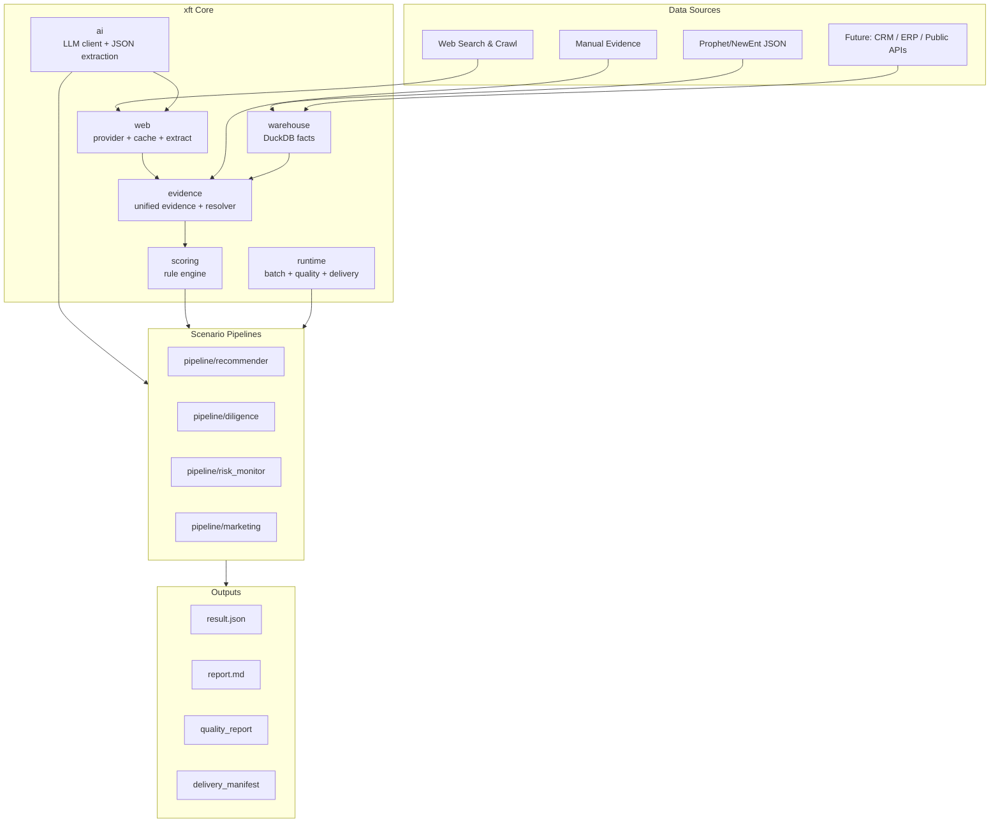

# NEXT.md

本文档记录 2026-05-17 目录重构后的架构判断、包命名建议，以及后续把项目升级为“通用企业分析流水线底座”的路线图。

## 当前判断

这次重构后，项目已经不再只是“企业尽调报告”或“产品推荐”脚本，而是自然分成了两层：

```text
通用企业分析基础设施
  warehouse / evidence / web / scoring / ai / cache

场景流水线
  pipeline/recommender
  后续可新增 pipeline/diligence、pipeline/risk_monitor、pipeline/marketing
```

当前目录已经接近这个结构：

```text
src/diligence/
  ai/                     LLM 客户端、JSON 提取、置信度工具
  cache/                  SQL 两级缓存
  warehouse/              DuckDB 企业数据仓库与 Prophet JSON 入库
  evidence/               统一证据模型、仓库、冲突消解
  web/                    Web 搜索、抓取、抽取、缓存、入库
  scoring/                配置驱动规则评分引擎
  pipeline/
    recommender/          产品推荐场景
  nodes/                  旧尽调报告流水线节点
```

DeepSeek 的判断总体是对的：`warehouse -> evidence -> web -> ai -> scoring` 已经是通用底座；`pipeline/recommender` 是一个场景。后续如果新增 `pipeline/diligence`，就可以让“尽调”和“推荐”并行复用同一套底层能力。

但还没有完全解耦。当前仍存在几个边界问题：

- 根包已迁移到 `xft`，但旧 `diligence` 仍作为兼容路径保留。
- `xft.web` 与 `xft.scoring` 已完成对 `xft.pipeline.recommender` 的反向依赖清理。
- 旧尽调流水线已迁入 `xft.pipeline.diligence`，根级 `xft.graph/config/models/state/batch/crawler_mode/nodes` 仅作为兼容转发层保留。
- 根包名 `diligence` 已经不再准确，因为 due diligence 只是未来众多 pipeline 中的一个；兼容期结束后应删除旧 alias。
- 旧 `src/diligence/*` 仍作为兼容路径存在，后续可在外部调用全部迁移到 `xft.*` 后删除。

因此下一步不是继续堆功能，而是做一次“平台化边界收敛”：把通用协议下沉，把场景逻辑上移。

## 命名建议

### 推荐包名：`xft`

我建议把根包从 `diligence` 改为 `xft`。

理由：

- `xft` 是项目/产品语境下的品牌根名，比 `diligence` 更中性。
- 它能容纳多个场景：推荐、尽调、风控、营销、批量交付。
- 未来 import 清晰：

```python
from xft.warehouse import load_prophet_data
from xft.evidence import EvidenceRepository
from xft.web import run_web_enrichment
from xft.scoring import score_products
from xft.pipeline.recommender import run_recommendation
```

推荐目标结构：

```text
src/xft/
  ai/
  cache/
  warehouse/
  evidence/
  web/
  scoring/
  runtime/
  pipeline/
    recommender/
    diligence/
    risk_monitor/
```

其中：

- `xft` 是平台根包。
- `xft.pipeline.diligence` 才表示“企业尽调场景”。
- `xft.pipeline.recommender` 表示“产品推荐场景”。

### 备选命名

如果不想用品牌缩写，可以考虑：

- `enterprise_flow`：语义明确，但略长。
- `entinsight`：偏产品化，但不如 `xft` 稳。
- `bizintel`：偏 BI/智能分析，可能过窄。
- `company_analytics`：非常清晰，但包名较长。

我不建议继续使用 `diligence` 作为根包。它会让后续 `pipeline/diligence` 变成 `diligence.pipeline.diligence`，语义重复，也会误导新开发者以为仓库只服务尽调。

### 改名策略

不要一次性硬改所有 import。建议分三步：

1. 新增 `src/xft/`，先迁移通用层代码。
2. 保留 `src/diligence/` 作为兼容 alias，短期内转发到 `xft`。
3. 等 CLI、测试、文档、外部使用方都切到 `xft` 后，再删除 alias。

兼容期可以这样做：

```python
# src/diligence/warehouse/__init__.py
from xft.warehouse import *
```

这样可以避免一次重命名导致大面积破坏。

## 目标架构

目标不是“多做一个推荐系统”，而是形成一个可复用的企业分析底座：



核心原则：

- `warehouse` 只处理企业事实入库，不知道推荐、尽调、营销。
- `evidence` 只处理证据、置信度、冲突、来源，不知道产品模块。
- `web` 只处理搜索、抓取、抽取和缓存，不绑定推荐维度模型。
- `scoring` 只处理规则评分，不绑定 `ProductModule`。
- `pipeline/*` 负责场景编排、场景模型、prompt、报告。
- `runtime` 负责批量运行、质量报告、交付产物、恢复/重试。

## 当前里程碑

已经完成：

- DuckDB warehouse：Prophet/NewEnt JSON 入库。
- unified evidence：本地 JSON 与 Web evidence 统一。
- EvidenceRepository / EvidenceResolver：证据查询、去重、冲突解决。
- Web enrichment：minimax/metaso/crawl4ai、缓存、抽取、DuckDB 入库。
- Web cache 2B：search/fetch/extraction key、cache_index 1.1、web_cache_report。
- Scoring：positive/negative/exclusion 规则评分。
- Scenario bundle：`config/scenarios/sales_recommendation`。
- Batch delivery：batch manifest、summary、quality report、delivery manifest。
- `pipeline/recommender`：产品推荐场景主线。

## 下一阶段路线

### Sprint A：平台命名与兼容迁移

目标：把根包从 `diligence` 平滑迁移到 `xft`。

状态：**已完成第一阶段。**

任务：

- 新增 `src/xft/`。
- 先迁移通用层：
  - `ai`
  - `cache`
  - `warehouse`
  - `evidence`
  - `web`
  - `scoring`
- 保留 `src/diligence/` alias。
- CLI import 切到 `xft`。
- 测试 import 切到 `xft`。
- 文档统一使用 `xft`。

已完成：

- 已新增 `src/xft/`，包含当前平台代码。
- `src/xft/` 内部 import 已切换为 `xft.*`。
- `pyproject.toml` 已包含 `src/xft` package。
- CLI/ETL 入口已切换到 `xft`：
  - `run_recommender.py`
  - `run_web_enrichment.py`
  - `etl_json_to_duckdb.py`
  - `etl_web_to_duckdb.py`
- `src/diligence/` 暂时保留，作为旧 import 兼容路径。
- 已新增 `tests/test_import_alias.py`，验证 `xft.*` 与旧 `diligence.*` 均可导入。
- `pipeline.recommender.__init__` 已改为懒加载，修复 `web` 与 `pipeline.recommender` 顶层 import 循环。

验收：

- `from xft.warehouse import load_prophet_data` 可用。
- `from xft.pipeline.recommender import run_recommendation` 可用。
- 旧 `from diligence...` 暂时仍可用。
- 全量测试通过。

建议优先级：最高。包名越晚改，迁移成本越高。

剩余小收尾：

- 逐步把测试中的新主线 import 从 `diligence.*` 改为 `xft.*`，只保留 alias 专项测试使用 `diligence.*`。
- `xft` 根级旧尽调入口已变成兼容转发层；后续删除旧 alias 前再统一清理。

### Sprint B：通用协议下沉

目标：让 `web` 和 `scoring` 真正脱离 recommender 场景。

状态：**已完成第一阶段。**

原问题：

- `web.runner` 依赖 recommender 的 `DimensionAnalysis`、`CompanyProfileRepository`、scenario loader。
- `scoring` 依赖 recommender 的 `ProductModule`、`ScoreBreakdown`、`ScoringSummary`。

已完成：

```text
xft.core/
  models.py              通用维度、维度分析、评分规则、评分结果、scenario config
  config_loader.py       通用维度配置读取
  dimension_analyzer.py  通用本地画像 -> 维度分析
  scenario.py            通用 scenario bundle 解析

xft.warehouse/
  profile_repository.py  通用 DuckDB company_profile 读取
```

具体变更：

- `xft.web.runner` 改为依赖：
  - `xft.core.config_loader.load_dimensions_config`
  - `xft.core.dimension_analyzer.analyze_dimensions`
  - `xft.core.scenario.load_scenario`
  - `xft.warehouse.profile_repository.CompanyProfileRepository`
- `xft.web.config_loader / planner / evidence` 不再 import `xft.pipeline.recommender`。
- `xft.scoring` 改为依赖 `xft.core.models`：
  - `DimensionAnalysis`
  - `ProductScoreRule`
  - `ProductExclusionRule`
  - `ScoreBreakdown`
  - `ScoringSummary`
  - `ScoringSubject`
- `score_products()` 现在支持通用 `subjects`，同时保留 `products` 参数作为 recommender 兼容适配。
- `xft.pipeline.recommender.models` 保留原公开模型名，但把通用模型 re-export 到 `xft.core.models`，减少现有场景代码改动。
- `xft.pipeline.recommender.scenario / dimension_analyzer / profile_repository` 保留为兼容转发模块。
- 新增 `tests/test_xft_boundaries.py`，静态验证 `xft.web` 和 `xft.scoring` 不再 import `xft.pipeline.recommender`。

验收：

- `xft.web` 不再 import `xft.pipeline.recommender`。
- `xft.scoring` 不再 import `xft.pipeline.recommender`。
- recommender 只是 core/scoring/web 的调用方。
- `uv run ruff check src tests run_recommender.py run_web_enrichment.py etl_json_to_duckdb.py etl_web_to_duckdb.py` 通过。
- `uv run mypy src run_recommender.py run_web_enrichment.py etl_json_to_duckdb.py etl_web_to_duckdb.py` 通过。
- `uv run pytest -q` 通过，当前为 `369 passed`。

后续可继续细化：

- `pipeline/recommender.models.AnalysisDimension` 拆成：
  - 通用 `AnalysisDimensionSpec`
  - 推荐场景自己的展示字段/业务字段。
- `web.plan_web_search()` 输入改成通用 `DimensionFinding`。
- `web.runner` 不再直接读取 recommender profile repository，由调用方传入 profile + dimensions + output/cache 配置。
- `scoring` 输入改成通用 `RuleSpec` 和 `ScoringContext`，推荐场景只负责把 `ProductModule` 转换成 `RuleSpec`。

### Sprint C：旧尽调流水线场景化

目标：把旧报告流水线从根目录迁移到 `pipeline/diligence`。

状态：**已完成第一阶段。**

原旧模块：

```text
src/diligence/graph.py
src/diligence/nodes/
src/diligence/batch.py
src/diligence/config.py
src/diligence/models.py
src/diligence/state.py
src/diligence/crawler_mode.py
```

已落地目标：

```text
src/xft/pipeline/diligence/
  __init__.py
  graph.py
  nodes/
  config.py
  models.py
  state.py
  batch.py
  crawler_mode.py
```

同时保留：

```text
xft.pipeline.recommender/
```

兼容层：

```text
src/xft/graph.py
src/xft/nodes/
src/xft/batch.py
src/xft/config.py
src/xft/models.py
src/xft/state.py
src/xft/crawler_mode.py
```

这些根级文件现在只转发到 `xft.pipeline.diligence.*`，不再承载旧尽调主实现。

CLI 更新：

- `main.py` 已切到 `xft.pipeline.diligence`。
- `xft.pipeline.diligence.__init__` 暴露懒加载 `run_company_graph()`。

验收：

- `pipeline/diligence` 可以独立导入旧报告流水线。
- `pipeline/recommender` 可以独立跑产品推荐。
- 两者共享 `warehouse/evidence/web/ai/cache`。
- 根级 `xft.graph/nodes/batch/config/models/state/crawler_mode` 仅为兼容转发。
- `uv run ruff check src tests main.py run_recommender.py run_web_enrichment.py etl_json_to_duckdb.py etl_web_to_duckdb.py` 通过。
- `uv run mypy src main.py run_recommender.py run_web_enrichment.py etl_json_to_duckdb.py etl_web_to_duckdb.py` 通过。
- `uv run pytest -q` 通过，Sprint C 完成时为 `370 passed`。

剩余小收尾：

- `src/diligence/*` 仍是兼容路径，尚未全部改成转发到 `xft.*`。
- `xft.web/utils/cache` 仍通过 `xft.models.SearchItem` 使用旧搜索模型；后续可把 `SearchItem / make_item_id` 下沉到 `xft.core.search_models`，让 web 更纯粹。

### Sprint D：统一场景运行协议

目标：让所有 pipeline 都遵守一套运行接口。

状态：**已完成第一阶段。**

已新增：

```text
src/xft/runtime/
  __init__.py
  models.py
  runner.py

run_pipeline.py
```

已落地通用模型：

```python
class PipelineRunRequest:
    pipeline: Literal["recommender", "diligence"]
    target: str
    warehouse_db: str
    scenario_path: str | None
    config_path: str | None
    output_dir: str | None
    run_id: str | None
    use_llm: bool
    use_web: bool
    use_web_evidence: bool
    refresh_web: bool
    only_dimensions: list[str] | None
    skip_dimensions: list[str] | None
    options: dict[str, Any]

class PipelineRunResult:
    pipeline: Literal["recommender", "diligence"]
    target: str
    status: str
    run_id: str
    output_dir: str
    result_path: str | None
    report_path: str | None
    artifacts_dir: str | None
    error: str | None
    raw: dict[str, Any]
```

统一运行入口：

```python
from xft.runtime import PipelineRunRequest, run_pipeline

result = await run_pipeline(PipelineRunRequest(pipeline="recommender", target="企业名称"))
```

统一 CLI：

```bash
uv run python run_pipeline.py recommender --scenario ... "企业名称"
uv run python run_pipeline.py diligence --config config "企业名称"
```

适配说明：

- `recommender` 适配到 `xft.pipeline.recommender.run_recommendation()`。
- `diligence` 适配到 `xft.pipeline.diligence.graph.run_company_graph()`。
- `diligence` 支持 `--only / --skip` 维度过滤。
- `recommender` 支持 `--with-web / --with-web-evidence / --refresh-web` 和 Web provider/extraction 选项。
- 现有 `main.py`、`run_recommender.py` 保留，新的 `run_pipeline.py` 是统一入口，不强制替换旧入口。

验收已完成：

- recommender 和 diligence 都能通过统一 request/result 运行。
- 新增 `tests/test_runtime_pipeline.py` 覆盖 request 默认值、recommender dispatch、diligence dispatch。
- `uv run ruff check src tests main.py run_pipeline.py run_recommender.py run_web_enrichment.py etl_json_to_duckdb.py etl_web_to_duckdb.py` 通过。
- `uv run mypy src main.py run_pipeline.py run_recommender.py run_web_enrichment.py etl_json_to_duckdb.py etl_web_to_duckdb.py` 通过。
- `uv run pytest -q` 通过，Sprint D 完成时为 `373 passed`。

剩余小收尾：

- batch runner 还没有完全平台化，仍由 recommender/diligence 各自维护。
- delivery manifest 已在 Sprint E 迁入 `xft.runtime.artifacts`。

### Sprint E：质量报告平台化

目标：把 batch quality 从 recommender 专属变成通用运行质量系统。

状态：**已完成第一阶段。**

已新增：

```text
xft/runtime/artifacts.py
```

已平台化能力：

- `BatchQualityReport`
- `build_quality_report()`
- `write_quality_report()`
- `write_delivery_manifest()`
- `write_failed_companies()`
- `batch_status()`

通用质量维度：

- 数据完整度。
- Top 推荐分。
- Top 推荐分布。
- 冲突数量。
- 失败企业清单。
- 输出产物完整性。

落地方式：

- `xft.pipeline.recommender.batch` 已复用 `xft.runtime.artifacts` 写质量报告、失败清单、交付清单。
- `xft.pipeline.diligence.batch` 已补齐：
  - `batch_manifest.json`
  - `batch_quality_report.json`
  - `batch_quality_report.md`
  - `failed_companies.txt`
  - `delivery_manifest.json`
- `delivery_manifest.json` 现在支持通用 summary/quality/failed artifacts，并自动收集 company report/result。

验收已完成：

- `batch_quality_report` 可用于 recommender 和 diligence。
- 质量报告分为 common metrics + pipeline-specific metrics。
- 失败清单生成已平台化。
- 新增 `tests/test_runtime_artifacts.py` 覆盖通用质量聚合、交付清单写入、diligence batch artifact 写入。
- `tests/test_batch_delivery.py` 继续覆盖 recommender batch delivery artifacts。
- `uv run ruff check src tests main.py run_pipeline.py run_recommender.py run_web_enrichment.py etl_json_to_duckdb.py etl_web_to_duckdb.py` 通过。
- `uv run mypy src main.py run_pipeline.py run_recommender.py run_web_enrichment.py etl_json_to_duckdb.py etl_web_to_duckdb.py` 通过。
- `uv run pytest -q` 通过，Sprint E 完成时为 `376 passed`。

剩余小收尾：

- batch runner 本身还没有统一成 `xft.runtime.batch`；当前只是 artifact/quality/delivery 层平台化。
- Web 搜索/抓取/抽取成功率、LLM fallback 比例还需要从运行产物中标准化采集。
- 每个 pipeline 的业务指标仍由各自 summary row 提供，后续可定义 `PipelineBatchSummarizer` 协议。

### Sprint F：配置系统升级

目标：从“每个场景复制一套 YAML”升级为“可继承、可组合的 scenario bundle”。

状态：**已完成第一阶段。**

已实现：

- `ScenarioConfig` 支持：
  - `extends`
  - `overrides`
- `xft.core.scenario.load_scenario()` 支持递归继承。
- 子场景显式字段覆盖父场景，`overrides` 最后覆盖。
- 继承解析时会把配置文件、prompt、output/cache root 路径解析成相对各自 scenario 根目录的绝对路径，避免父子场景路径漂移。
- `ScenarioBundle.resolved_payload()` 可返回完整解析结果。
- `ScenarioBundle.write_resolved_config()` 可写出 `scenario_resolved.json`。
- `run_pipeline.py` 新增：

```bash
uv run python run_pipeline.py recommender \
  --scenario config/scenarios/sales_recommendation \
  --write-scenario-resolved /tmp/scenario_resolved.json \
  "企业名称"
```

支持配置示例：

```yaml
id: bank_marketing
extends: ../sales_recommendation/scenario.yaml

overrides:
  products_config: products.yaml
  prompts:
    recommend_system: prompts/bank_recommend.md
```

支持能力：

- scenario 继承。
- prompt override。
- output/cache root override。
- provider/scoring rule 可通过覆盖对应 YAML 路径实现。
- 配置解析结果可输出 `scenario_resolved.json` 便于审计。

验收已完成：

- `sales_recommendation` 与 `bank_marketing` 可以共享 80% 配置。
- 新增场景不需要复制全部 YAML。
- 配置解析结果可输出 `scenario_resolved.json` 便于审计。
- 新增/更新 `tests/test_scenario_bundle.py` 覆盖：
  - 旧 scenario bundle 路径解析。
  - config loaders 接受 scenario directory。
  - scenario extends + prompt override + output override。
  - `scenario_resolved.json` 写出。
- `uv run ruff check src tests main.py run_pipeline.py run_recommender.py run_web_enrichment.py etl_json_to_duckdb.py etl_web_to_duckdb.py` 通过。
- `uv run mypy src main.py run_pipeline.py run_recommender.py run_web_enrichment.py etl_json_to_duckdb.py etl_web_to_duckdb.py` 通过。
- `uv run pytest -q` 通过，Sprint F 完成时为 `377 passed`。

剩余小收尾：

- 尚未创建真实 `bank_marketing` 示例场景，可在业务规则稳定后补。
- YAML 内部局部 patch 还停留在 scenario 顶层覆盖；如果未来要对 `products.yaml` 内单个产品规则做结构化 merge，需要新增专门的 config patch 机制。

### Sprint G：真实业务试跑与规则校准

目标：用真实企业批量跑，校准产品规则和报告输出。

状态：**已完成第一阶段。**

已新增：

```text
xft/runtime/calibration.py
run_calibration.py
tests/test_runtime_calibration.py
TECH_DEBT.md
```

校准命令：

```bash
uv run python run_calibration.py --limit 10 --batch-id sprint-g-final-10
```

本地试跑：

- 数据库：`cache/company_warehouse.duckdb`
- 场景：`config/scenarios/sales_recommendation`
- 模式：无 LLM、无 Web，仅验证本地画像 + 规则评分基础分布。
- 批次目录：`recommendation_runs/calibration/sprint-g-final-10`
- 企业数：10
- 状态：10 家 success
- 平均 Top 推荐分：84.0
- Top1 分布：`hr_attendance` 5 家、`crm_channel` 5 家
- 无低完整度企业、无高冲突企业、无无推荐企业。

已完成校准：

- 发现初始试跑中 `procurement_srm` Top1 占比 100%，且多产品 100 分，属于评分饱和。
- 降低通用维度支持、本地证据支持和 Web 支持的加分权重。
- 同分排序改为优先：
  - 未被排除
  - 负向扣分少
  - 正向规则更强
  - 维度支持更强
  - 产品优先级
- 最终 Top1 分布不再由产品配置顺序锁死。

原建议步骤：

1. 选择 5-10 家企业跑 `sales_recommendation`。
2. 检查：
   - Top1 产品是否符合业务直觉。
   - 评分是否过高或过低。
   - 报告是否能支持销售跟进。
   - Web 证据是否引入噪声。
3. 调整：
   - `positive_rules`
   - `negative_rules`
   - `exclusion_rules`
   - 维度缺失项。
   - Web 查询模板。
4. 再跑 30-50 家企业，看 batch quality 分布。

验收已完成：

- Top 产品分布合理。
- 低完整度企业能被质量报告识别。
- 冲突企业能被标出。
- 报告可直接交付或进入销售工作流。
- 新增校准报告：
  - `calibration_report.json`
  - `calibration_report.md`
- `uv run ruff check src tests main.py run_pipeline.py run_calibration.py run_recommender.py run_web_enrichment.py etl_json_to_duckdb.py etl_web_to_duckdb.py` 通过。
- `uv run mypy src main.py run_pipeline.py run_calibration.py run_recommender.py run_web_enrichment.py etl_json_to_duckdb.py etl_web_to_duckdb.py` 通过。
- `uv run pytest -q` 通过，当前为 `378 passed`。

剩余小收尾：

- Sprint G 目前只跑了本地画像规则模式；需要再跑 Web/LLM 校准批次验证证据噪声和报告表达。
- 校准工具还缺少业务标注输入，后续可加 `calibration_labels.csv` 计算 Top1 命中率。
- 评分权重仍是代码常量，后续建议迁入 scenario 可覆盖的 `scoring_policy.yaml`。

## 建议执行顺序

历史执行顺序：

1. **Sprint A：包名迁移到 `xft`，保留 `diligence` alias。**
2. **Sprint B：解耦 `web/scoring` 对 recommender 的反向依赖。**
3. **Sprint C：把旧尽调流水线迁入 `pipeline/diligence`。**
4. **Sprint D/E：统一 pipeline runtime 与质量报告。**
5. **Sprint F：scenario bundle 继承与配置解析审计。**
6. **Sprint G：真实批量试跑与规则校准。**

下一步建议见 `TECH_DEBT.md`。当前优先级最高的是：兼容层瘦身、统一 batch runner、业务标注校准。

## 命名迁移验收清单

迁移到 `xft` 后，必须满足：

```bash
uv run python -c "from xft.warehouse import load_prophet_data"
uv run python -c "from xft.web import run_web_enrichment"
uv run python -c "from xft.scoring import score_products"
uv run python -c "from xft.pipeline.recommender import run_recommendation"
uv run python -c "from diligence.pipeline.recommender import run_recommendation"
uv run pytest -q
```

其中最后一条 `diligence...` 是兼容期要求，等外部调用全部迁移后再删除。
