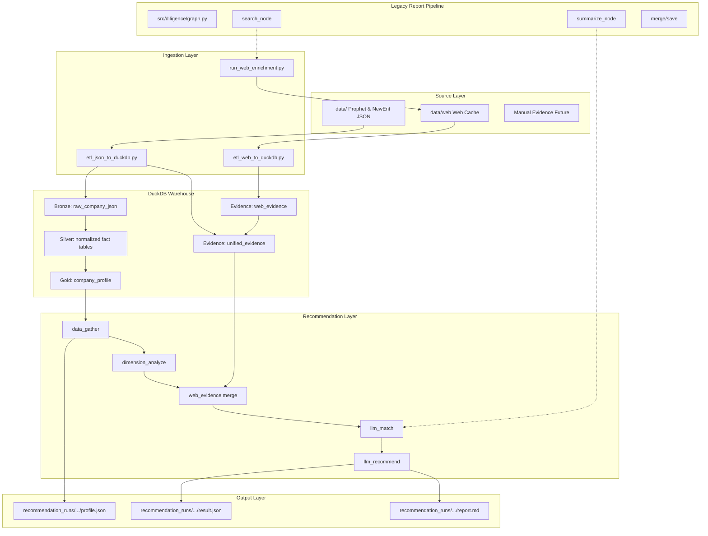
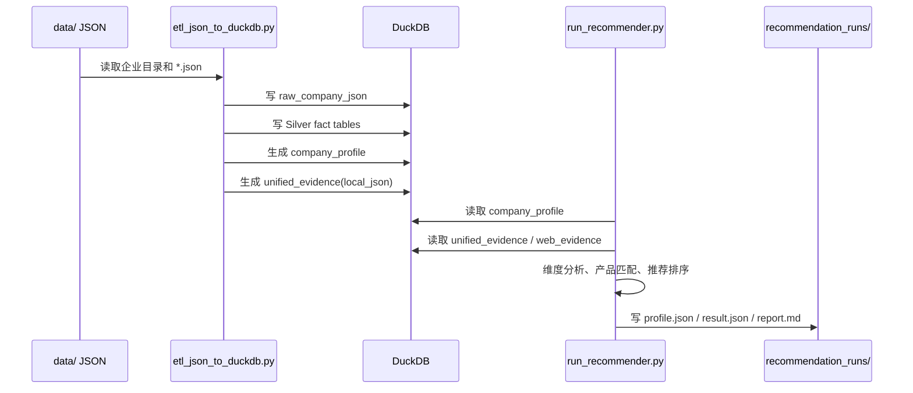
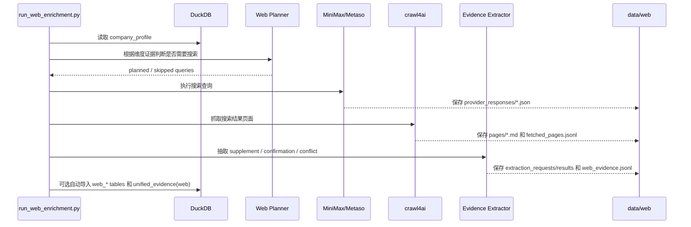
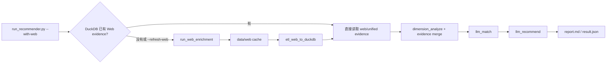

# xft-dd-craw4ai 当前架构

本项目已经从早期“搜索 -> 总结 -> 合并报告”的单一路线，重构为以 DuckDB 事实层为中心的企业画像与产品推荐架构。旧报告流水线仍保留，主要作为 MiniMax Search、Metaso、crawl4ai、LLM 结构化抽取等能力的复用来源；新的主链路以本地 JSON 和 Web evidence 入库后的结构化证据为基础。

## 总体架构图



核心原则：

- `DuckDB` 是事实中心，推荐流程不直接读取零散 JSON 或临时搜索结果。
- `company_profile` 提供快速企业画像，适合推荐和筛选。
- `unified_evidence` 承接本地 JSON 证据、Web 补证和后续人工证据，是长期证据接口。
- Web 搜索结果必须先缓存到 `data/web/`，再经过抽取和 ETL 入库，最后才进入推荐。
- 旧报告流水线不再是新主线，但其中搜索、抓取、结构化抽取、来源判断能力会继续复用。

## 当前主链路

```text
data/ Prophet/NewEnt JSON
  -> etl_json_to_duckdb.py
  -> DuckDB warehouse
  -> company_profile / unified_evidence
  -> run_recommender.py
  -> recommendation_runs/.../report.md
```

可选 Web 补证链路：

```text
run_web_enrichment.py
  -> data/web 原始响应、页面正文、中间抽取文件、web_evidence.jsonl
  -> etl_web_to_duckdb.py
  -> web_* tables / unified_evidence
  -> run_recommender.py --with-web-evidence
```

也可以让推荐流程在缺少 Web 证据时自动补证：

```bash
uv run python run_recommender.py --with-web "企业名称"
```

默认会复用已有 `data/web/` 缓存；如需强制刷新：

```bash
uv run python run_recommender.py --with-web --refresh-web "企业名称"
```

## 数据流向图

### 本地 JSON 到推荐报告



这条链路可以完全离线运行。`data/` 中 JSON 不完整也可以导入，缺失文件会记录在 `company_import_status` 和 `company_profile.missing_v1_files`，推荐阶段会把证据不足显式暴露出来，而不是让模型补造事实。

### Web 补证到 DuckDB



Web 补证遵循“本地 JSON 优先”：

- 如果本地画像已经覆盖某个维度，planner 默认跳过该维度的 Web 搜索。
- 如果 Web 信息与 JSON 信息冲突，`relation_to_profile=conflict`，并默认 `resolution=use_local`。
- 原始响应、页面正文、中间抽取请求和抽取结果都会保留在 `data/web/`，便于审计和重放。
- 默认复用已有缓存，除非显式传 `--refresh` 或 `--refresh-web`。

### 自动 Web 推荐链路



这条链路适合日常生成报告；如果需要更强可控性，则建议分三步执行：先 `run_web_enrichment.py --no-etl` 准备缓存，再 `etl_web_to_duckdb.py --rebuild` 手工入库，最后 `run_recommender.py --with-web-evidence` 生成推荐。

## 核心原理

### 1. Bronze / Silver / Gold

`etl_json_to_duckdb.py` 对 `data/` 做分层入库：

- Bronze：`raw_company_json` 保留每个原始 JSON 文件、文件 hash、抓取时间、解析状态。
- Silver：把常用实体解析为结构化表，例如企业主体、股东、人员、风险、招聘、招投标、资质。
- Gold：`company_profile` 把推荐常用字段压成一张宽表，作为推荐主入口。

这样做的好处是，原始数据永远可追溯；业务推荐不需要知道每个 Prophet/NewEnt JSON 的复杂路径；后续新增字段时可以先落 Bronze，再逐步提取到 Silver 或 Evidence。

### 2. 统一证据层

`unified_evidence` 是当前新架构的关键表。它把不同来源的信息统一成类似下面的形状：

```text
evidence_id
company_name / credit_code
dimension_id
source_type: local_json | web | manual | rule
source_name / source_path / source_url / source_field
claim
value
confidence
authority_level
relation_to_profile: primary | supplement | confirmation | conflict | inference
conflict_note
resolution
raw_ref
created_at
```

本地 JSON 画像会写成 `source_type=local_json`、`relation_to_profile=primary`；Web 抽取会写成 `source_type=web`，并区分补充、佐证和冲突。推荐侧以后只需要理解 evidence，不需要关心底层来自 JSON、搜索摘要还是网页正文。

### 3. 维度分析

`dimension_analyze` 根据 `analysis_dimensions.yaml` 或 bundle 中的 `dimensions/*.yaml` 工作。每个维度定义：

- 读取哪些本地字段。
- 如何把字段格式化为事实证据。
- 哪些证据不足需要 Web 或人工补充。
- 本地规则如何产生弱推断。
- Web 查询模板是什么。

维度分析会输出结构化 `DimensionAnalysis`，其中保留：

```text
facts                 兼容旧输出的人类可读事实
inferences            兼容旧输出的人类可读推断
local_evidence        本地 JSON 证据
inference_evidence    规则推断证据
web_evidence          Web 补证/佐证
conflicts             Web 与本地画像冲突
missing_evidence      仍缺失的证据项
```

### 4. 产品匹配与推荐

推荐分两步：

1. `llm_match`：判断每个产品模块是否匹配企业当前需求，输出分数、置信度、理由和缺失证据。
2. `llm_recommend`：基于匹配结果生成最终推荐列表、切入话术和报告摘要。

如果 LLM 不可用，系统会走 deterministic fallback，仍能生成可运行的 MVP 报告。LLM prompt 明确要求基于证据，不允许把 `web_search_queries` 或缺失证据当成事实。

### 5. 旧报告流水线的定位

旧入口 `src/diligence/graph.py` 仍然保留，流程是：

```text
init -> search/summarize -> collect -> merge -> save
```

它不再是推荐主链路，但其中的能力被拆给新架构复用：

- `utils/minimax_search.py`：MiniMax Search。
- `utils/metaso.py`：Metaso search/chat。
- `utils/fetch.py`：crawl4ai 页面抓取。
- `utils/source_registry.py`：来源可信度分类。
- `src/diligence/ai/`：公共 LLM client 和 JSON 提取工具。

## 关键入口

```text
etl_json_to_duckdb.py                         # data/ JSON -> DuckDB
run_web_enrichment.py                         # Web 搜索、抓取、抽取、缓存
etl_web_to_duckdb.py                          # data/web -> DuckDB Web 表
run_recommender.py                            # 推荐主入口

src/diligence/warehouse/                      # DuckDB 本地仓库
src/diligence/evidence/                       # 统一证据模型
src/diligence/ai/                             # 公共 LLM client / JSON 抽取工具
src/diligence/recommender/                    # 推荐图、维度分析、报告渲染
src/diligence/recommender/web/                # Web enrichment 服务
src/diligence/nodes/                          # legacy 报告流水线节点，可复用但非新主线
```

## DuckDB 分层

当前 DuckDB 包含三类稳定接口：

```text
Bronze
  raw_company_json
  company_import_status

Silver
  companies
  company_labels
  key_personnel
  shareholders
  ip_summary
  risk_features
  recruitments
  bidding_summary
  qualifications
  branches
  financing_events
  outbound_investments

Gold / Evidence
  company_profile
  web_search_runs
  web_search_queries
  web_search_results
  web_pages
  web_evidence
  unified_evidence
```

`company_profile` 是推荐的快速画像宽表；`unified_evidence` 是本地 JSON 证据与 Web 证据的统一事实入口。后续新增字段时，优先沉淀为事实或证据，再进入推荐逻辑。

## 常用命令

初始化或重建本地 JSON 仓库：

```bash
uv run python etl_json_to_duckdb.py --input data --output cache/company_warehouse.duckdb
```

离线跑推荐：

```bash
uv run python run_recommender.py --no-llm "企业名称"
```

单独准备 Web 缓存但不入库：

```bash
uv run python run_web_enrichment.py --no-etl "企业名称"
```

从 Web 缓存重建 DuckDB Web 表：

```bash
uv run python etl_web_to_duckdb.py --input data/web --warehouse cache/company_warehouse.duckdb --rebuild
```

读取已有 Web 证据生成推荐：

```bash
uv run python run_recommender.py --with-web-evidence "企业名称"
```

## 配置

当前兼容两种配置方式：

```text
config/recommender/analysis_dimensions.yaml
config/recommender/products.yaml
```

以及目录 bundle：

```text
config/recommender/
  products.yaml
  analysis_dimensions.yaml
```

如果没有 `analysis_dimensions.yaml`，也支持：

```text
config/recommender/
  products.yaml
  dimensions/
    basic_profile.yaml
    compliance_risk.yaml
```

Web 与抽取配置：

```text
config/recommender/web_search.yaml
config/recommender/web_extract_llm.yaml
config/recommender/prompts/extract_evidence_system.md
```

更详细的架构、配置和后续计划见 `DUCK.md`。Prophet 数据字段参考见 `docs/prophet-data-catalog.md`。
