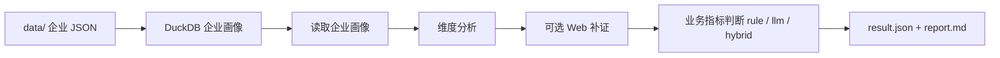

# XFT 企业产品推荐工具

XFT 用企业本地数据、Web 补证和可配置的业务规则，生成面向销售/业务人员的产品推荐结果。

当前推荐主线已经收敛为一套配置体系：业务人员主要维护 `business_modules.yaml`，在同一个文件里配置 `rule`、`llm`、`hybrid` 三种判断方式。旧的产品匹配链路、`products.yaml`、`scoring_policy.yaml`、`internal_result.json` 已删除。

## 一句话流程



## 快速运行

### 1. 安装依赖

```bash
uv sync
```

### 2. 构建本地企业画像库

把企业 JSON 放到 `data/` 后执行：

```bash
uv run xft warehouse build --input data --output cache/company_warehouse.duckdb
```

### 3. 验证配置

```bash
uv run xft scenario validate config/recommend/sales_recommendation
```

正常会看到类似：

```json
{
  "scenario_id": "sales_recommendation",
  "business_modules": 7,
  "dimensions": 10
}
```

### 4. 离线跑推荐

`--scenario` 默认为 `config/recommend/sales_recommendation`，以下命令可省略该参数：

```bash
uv run xft recommend --no-llm "企业名称"
```

### 5. 启用 LLM

配置 `.env` 后执行：

```bash
uv run xft recommend "企业名称"
```

### 6. 启用 Web 补证

```bash
uv run xft recommend --with-web "企业名称"
```

已抓取的 Web 原始文件、中间文件和入库结果会被缓存。再次运行默认复用缓存；需要重新抓取时使用：

```bash
uv run xft recommend --with-web --refresh-web "企业名称"
```

## 输出文件

每次运行会写入 `recommendation_runs/.../`：

| 文件 | 用途 |
| --- | --- |
| `result.json` | 最终业务交付结果，业务人员优先看这个 |
| `report.md` | 人类可读推荐报告 |
| `business_label_result.json` | 全量模块、标签、指标判断明细 |
| `dimension_analysis.json` | 企业维度证据分析 |
| `profile.json` | 企业画像 |
| `decision_trace.json` | Web、规则、LLM 决策过程 |
| `llm_calls.jsonl` | LLM 原始调用记录 |
| `llm_metrics.json` | LLM 调用统计 |
| `config_manifest.json` | 本次运行使用了哪些配置及其哈希 |

不再生成：

```text
match_results.json
internal_result.json
```

## 怎么配置

配置已经按业务用途拆开：

```text
config/
  recommend/   产品推荐场景配置，业务人员主要改这里
  diligence/   企业尽调流水线配置，只有跑 xft diligence 时才改这里
```

推荐主场景目录：

```text
config/recommend/sales_recommendation/
  scenario.yaml
  business_modules.yaml
  analysis_dimensions.yaml
  evidence_policy.yaml
  web_search.yaml
  web_extract_llm.yaml
  prompts/
```

`config/recommend/bank_marketing/` 是第二个示例推荐场景，当前通过 `scenario.yaml` 继承销售推荐配置。要做新的推荐场景，优先复制或继承 `config/recommend/sales_recommendation/`。

### `scenario.yaml`

这是场景入口，告诉系统使用哪些配置文件：

```yaml
version: "1.0"
id: sales_recommendation
name: 销售产品推荐

dimensions_config: analysis_dimensions.yaml
web_search_config: web_search.yaml
web_extract_llm_config: web_extract_llm.yaml
evidence_policy_config: evidence_policy.yaml
business_modules_config: business_modules.yaml

prompts:
  web_extract_system: prompts/extract_evidence_system.md

output_dir: ../../../recommendation_runs/sales_recommendation
web_cache_root: ../../../data/web/sales_recommendation
```

### `business_modules.yaml`

这是业务推荐的核心配置。一个模块下面可以配置多个标签，每个标签下面配置多个指标。

```yaml
modules:
  - module_id: daily_reimbursement
    module_name: 日常报销
    priority: 90
    base_score: 20
    labels:
      - label_id: tech_attribute
        label_name: 科技属性
        min_matched_indicators: 1
        indicators:
          - indicator_id: tech_certification
            indicator_name: 科技企业-科技资质认证
            evaluator: hybrid
            merge_policy: rule_first
            standard: 企业具备高新技术企业、专精特新、科技型中小企业等资质
            rule:
              source_field: labels
              op: contains_any
              value:
                - 高新技术企业
                - 专精特新
                - 科技型中小企业
            prompt: 判断企业是否具备科技型企业资质。
            evidence_hints:
              - 企业标签
              - 资质认证
```

字段说明：

| 字段 | 含义 |
| --- | --- |
| `module_id` | 模块稳定 ID，不要随意改 |
| `module_name` | 展示给业务人员看的模块名 |
| `base_score` | 模块基础分 |
| `label_id` / `label_name` | 业务标签 |
| `indicator_id` / `indicator_name` | 具体判断指标 |
| `standard` | 判断标准 |
| `evaluator` | `rule`、`llm`、`hybrid` |
| `rule` | 结构化规则，只读企业画像字段 |
| `prompt` | LLM 判断时使用的业务提示 |
| `evidence_hints` | 提醒 LLM 优先看的证据范围 |

### 三种 evaluator

| evaluator | 适合场景 |
| --- | --- |
| `rule` | JSON 字段明确，例如标签包含“高新技术企业” |
| `llm` | 需要综合文本和证据推理，例如判断业务复杂度 |
| `hybrid` | 先用规则命中硬证据，再用 LLM 补充模糊判断 |

`hybrid` 的合并策略：

| `merge_policy` | 逻辑 |
| --- | --- |
| `rule_first` | 规则命中直接通过，不调用 LLM；规则未命中再让 LLM 判断 |
| `llm_confirm` | 规则给出候选信号，LLM 负责确认或降级 |
| `require_both` | 规则和 LLM 都命中才算满足 |

## Web 配置

`analysis_dimensions.yaml` 决定哪些维度需要 Web 搜索：

```yaml
web_search_queries:
  - "{company_name} 招投标"
  - "{company_name} 供应商"
```

`evidence_policy.yaml` 决定什么时候跳过 Web。例如本地证据已经足够时，可以不再搜索。

`web_search.yaml` 配置搜索 provider、抓取页数、缓存目录和屏蔽域名。

## LLM 调试

测试阶段建议加上：

```bash
uv run xft recommend --llm-debug "企业名称"
```

运行产物里也会保留：

```text
llm_calls.jsonl
llm_metrics.json
decision_trace.json
```

## 批量校准

准备企业名单：

```text
company.txt
```

运行：

```bash
uv run xft calibrate \
  --company-list company.txt \
  --limit 10
```

如有人工标注，可以增加：

```bash
uv run xft calibrate \
  --company-list company.txt \
  --labels calibration_labels.csv \
  --limit 10
```

## Docker

构建镜像：

```bash
docker build -t xft-dd .
```

运行帮助：

```bash
docker run --rm xft-dd uv run xft --help
```

挂载本地数据和缓存后运行推荐：

```bash
docker run --rm \
  -v "$PWD/data:/app/data" \
  -v "$PWD/cache:/app/cache" \
  -v "$PWD/recommendation_runs:/app/recommendation_runs" \
  xft-dd uv run xft recommend --no-llm "企业名称"
```

## 更多文档

- [架构说明](docs/ARCHITECTURE.md)
- [业务评分规则](docs/SCORING.md)
- [冒烟验证](docs/SMOKE.md)
- [下一步计划](docs/NEXT.md)
- [技术债](docs/TECH_DEBT.md)
