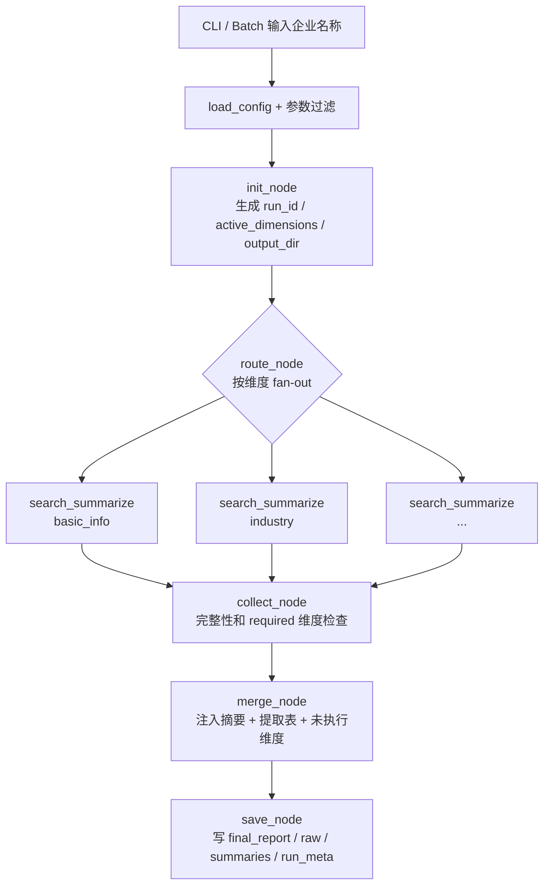
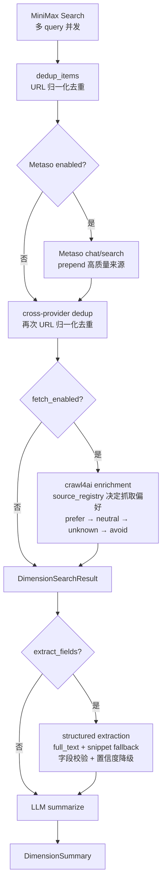

# xft-dd · 企业尽调自动化工具

基于多源检索、crawl4ai 全文抓取、结构化字段提取和 LLM 综合推理的企业尽调流水线。输入企业名称后，系统会按配置并行检索多个尽调维度，生成可审计的 Markdown 报告，并保存原始搜索结果、维度摘要、字段提取结果和运行成本。

当前版本的核心目标不是“把数据模型一次设计到完美”，而是先把数据流做成 **可追溯、可降级、可验证、可迭代**。

---

## 快速开始

```bash
# 安装依赖
uv sync

# 复制环境变量模板，填写 API 凭证
cp .env.example .env

# 单企业尽调
uv run main.py "佛山市固特家居制品有限公司"

# 仅处理指定维度
uv run main.py "某公司" --only basic_info,tech_cert

# 排除指定维度
uv run main.py "某公司" --skip listing

# 预览查询词，不发起网络/API 调用
uv run main.py "某公司" --dry-run

# 批量处理（支持 .txt 或 .csv）
uv run main.py --batch companies.txt
uv run main.py --batch companies.csv --name-column company_name

# 批量续跑（跳过已完成企业）
uv run main.py --batch companies.txt --resume --batch-dir batch_runs/20260510-...

# 显式指定配置目录或兼容旧单文件配置
uv run main.py "某公司" --config config/
uv run main.py "某公司" --config config.yaml
```

常用开发命令：

```bash
uv run pytest
uv run ruff check
uv run ruff format
```

---

## 环境变量

复制 `.env.example` 后按需填写：

```env
# MiniMax Search：网页搜索召回
MINIMAX_API_KEY=SM4:<加密后的密钥>
MINIMAX_BASE_URL=https://api.minimax.io/v1

# Metaso：可选增强源
METASO_API_KEY=
METASO_ENABLED=false
METASO_VERIFY_TLS=true

# LLM：OpenAI 兼容推理接口；为空时复用 MINIMAX_API_KEY
LLM_API_KEY=
LLM_BASE_URL=https://api.minimax.io/v1
LLM_MODEL=MiniMax-M2.7-Highspeed
```

API key 支持 `SM4:` 前缀密文存储，相关工具在 `src/diligence/keys.py`。

---

## 总体架构

流水线由 LangGraph 组装，先初始化运行上下文，再按维度扇出执行 `search + summarize`，最后扇入合并报告并保存产物。



每个维度分支内部：



---

## 数据流与关键决策

### 1. 搜索召回：MiniMax Search

实现：`src/diligence/utils/minimax_search.py`

- 每个维度配置多条 `minimax_queries`。
- 维度内查询并发由 `query_concurrency_per_dimension` 控制。
- `max_results_per_query` 控制本地保留条数；设为 `0` 表示 MiniMax 返回几条就全部进入后续流程。
- 返回 `SearchItem`：`title`、`url`、`snippet`、`source=minimax`、`rank`。
- 搜索层只负责召回，通常没有网页全文。

### 2. URL 归一化去重

实现：`normalize_url()` / `dedup_items()`

去重规则：

- 优先按 URL 去重。
- URL 会小写 scheme/host、去掉 `www.`、去掉尾部 `/`。
- 删除跟踪参数：`utm_*`、`from`、`source`、`spm`。
- 保留业务 query，例如 `id`、`q`。
- 无 URL 时降级为 `title + snippet` 去重。

数据流中有两次去重：

```text
MiniMax Search -> dedup -> Metaso prepend -> dedup -> crawl4ai -> summarize
```

第二次去重用于处理 Metaso source items 与 MiniMax 裸搜索结果之间的重复 URL。

### 3. Metaso 增强

实现：`src/diligence/utils/metaso.py`

启用条件：

```env
METASO_ENABLED=true
METASO_API_KEY=...
```

维度通过 `metaso_queries` 和 `metaso_mode` 控制：

| 模式 | 字段 | 产物 | 适用场景 |
|------|------|------|----------|
| `chat` | `metaso_mode: chat` | AI answer item + source items | 需要综合问答和来源引用 |
| `search` | `metaso_mode: search` | 真实网页 URL + summary/rawContent | 需要更接近原始网页的数据 |

chat 模式会把 AI 综合答案包装成 `metaso://` URL 的 `SearchItem`，同时把 API 返回的 sources 转成真实 URL 的 source items。search 模式直接返回真实 URL 的 `SearchItem`。Metaso 结果 prepend 到已有搜索结果前，随后再做跨 provider 去重。

### 4. 来源识别：source_registry

实现：`src/diligence/utils/source_registry.py`

`classify_source(url, title)` 返回：

```text
source_type       来源类型
authority_level   high / medium / low / unknown
display_name      展示名称
domain            归一化域名
should_fetch_bias prefer / neutral / avoid
```

目前覆盖的典型来源：

| 来源 | 类型 | 权威级别 | 抓取偏好 |
|------|------|:---:|:---:|
| `gsxt.gov.cn` | government_registry | high | prefer |
| `cnipa.gov.cn` | official_ip | high | prefer |
| 未知 `.gov.cn` | government_notice | high | prefer |
| 企查查 / 天眼查 / 爱企查 / 启信宝 | commercial_registry | high | avoid |
| BOSS直聘 / 猎聘 / 前程无忧 | recruiting | medium | neutral |
| 1688 | b2b_marketplace | medium | neutral |
| 百度地图 / 高德地图 / 大众点评 | map_directory | low | neutral |
| `metaso://` / metaso.cn | search_ai | medium | avoid |

`source_registry` 的职责是提供稳定信号，不直接做事实裁决。冲突裁决仍交给 LLM，但 prompt 和提取表会显式带上来源名称、来源类型和权威等级。

### 5. crawl4ai 抓取策略

实现：`src/diligence/utils/fetch.py`

维度设置 `fetch_enabled: true` 后启用。`_should_fetch()` 的主要条件：

- URL 非空。
- URL 不是 `metaso://`。
- `title` 或 `snippet` 包含目标企业名称。
- `source_registry.should_fetch_bias != "avoid"`。
- URL 不命中 `fetch_blocked_domains`。

抓取顺序会按优先级排序：

```text
prefer/high -> prefer/medium -> neutral/high -> neutral/medium -> unknown -> avoid(skip)
```

这个排序只影响 crawl 调用顺序，不改变最终 `items` 的返回顺序。返回顺序仍保持搜索/增强后的排名语义。

抓取失败或被跳过时，item 会保留原始 snippet，后续仍可进入 snippet fallback。商业工商库等 `avoid` 域名通常不再用 crawl4ai 二次抓取，避免把时间花在登录墙、反爬页或无效详情页上。

### 6. 结构化字段提取

实现：`src/diligence/nodes/summarize_node.py`

维度配置 `extract_fields` 后，在主摘要前执行一次结构化提取：

1. `_select_extraction_sources()` 先选择所有 `full_text`。
2. 再补充最多 8 条 snippet fallback。
3. snippet 少于 20 字会被过滤。
4. 同 URL 已有 full_text 时，不再重复加入 snippet。
5. 提取 prompt 为每个来源标注：
   - 来源类型
   - 权威等级
   - 来源名称
   - 内容类型：`full_text` / `snippet`
   - 证据权重：`high` / `low`
6. LLM 输出字段候选值、来源 ID、来源 URL、字段置信度。
7. 代码过滤 hallucinated `source_item_id`，只允许引用进入 prompt 的 sources。
8. 执行确定性字段校验。
9. snippet-only 字段置信度封顶。
10. 结果写入 `DimensionSearchResult.extractions` 并注入后续摘要和 merge prompt。

字段提取失败会重试 1 次；仍失败则降级为直接使用网页正文/snippet 做摘要。

### 7. 字段格式校验与提取统计

结构化提取后，`_validate_extractions()` 会做确定性清洗：

| 字段类型 | 处理 |
|----------|------|
| 统一社会信用代码 | 提取 18 位代码；无匹配则删除候选 |
| 电子邮箱 | 提取邮箱地址；无匹配则删除候选 |
| 来源URL | strict 模式下无 `http(s)` URL 则删除 |
| 官网/网址 | 提取 `http(s)` URL；裸 `www.` 或无 URL 时保留但降级 |
| 电话 | 不像手机号/座机/400 电话则降级 |
| 日期/营业期限 | 不像日期、长期、至今则降级 |
| 注册资本/实缴资本 | 不像金额则降级 |
| 占位值 | `未找到`、`暂无`、`无`、`未披露` 等直接删除 |
| 未知字段 | 保留，不做硬校验 |

日志会输出字段清洗统计：

```text
[工商基本信息] structured extraction: 18/34 fields found (removed=3, fmt↓=2, snip↓=1, norm=4)
```

含义：

- `removed`：删除无效候选或占位值。
- `fmt↓`：格式校验导致置信度降级。
- `snip↓`：snippet-only 证据导致高置信度封顶为低。
- `norm`：字段值被归一化，例如信用代码、邮箱、URL。

### 8. 维度摘要与可信度硬规则

主摘要阶段要求 LLM 输出 JSON：

```json
{
  "summary": "500字以内的综合摘要",
  "confidence": "高|中|低|待核实",
  "uncertain_facts": ["..."],
  "evidence_item_ids": ["..."]
}
```

程序会执行硬性可信度上限：

| 条件 | 最高可信度 |
|------|:---:|
| 维度搜索状态 `failed` | 待核实 |
| 搜索结果数为 0 | 待核实 |
| 仅 1 条搜索结果 | 低 |
| 所有结果均无 URL | 低 |

LLM 引用不存在的 `evidence_item_ids` 会被过滤。

### 9. 合并报告与维度状态

实现：`src/diligence/nodes/merge_node.py`

merge 阶段会把每个维度的摘要和结构化提取表注入最终 prompt。提取表在 merge prompt 中被标注为“优先采信”。

系统区分三种“没有数据”：

| 状态 | 含义 | 报告表现 |
|------|------|----------|
| 未执行 | 维度因 `--only/--skip` 或配置过滤没有运行 | 写明“本维度未在本次运行中检索” |
| 未找到 | 维度运行成功，但没有找到字段或事实 | 写“未找到” |
| 执行失败 | active 维度未产出摘要或搜索/摘要异常 | 写“执行失败” |

`main.py` 和 `batch.py` 会把过滤前的 enabled 维度名传入 `all_dimension_names`，因此最终报告能感知被跳过的维度，而不是让 LLM 自行脑补。

---

## 配置说明

默认配置已经改为目录化结构，CLI 默认读取 `config/`。旧的 `config.yaml` 仍可通过 `--config config.yaml` 加载，用于兼容或对照。

```text
config/
├── app.yaml
├── prompts/
│   ├── merge.md
│   ├── merge_system.md
│   ├── summarize_system.md
│   ├── extract_system.md
│   ├── extract_user_template.md
│   └── dimensions/
│       ├── basic_info.md
│       └── ...
└── dimensions/
    ├── 10_basic_info.yaml
    ├── 20_industry.yaml
    └── ...
```

`config/app.yaml` 存放全局运行参数：

```yaml
schema_version: "1.0"

dimension_concurrency: 8
query_concurrency_per_dimension: 5
search_timeout_seconds: 30
max_results_per_query: 0
runs_dir: "runs"

crawl_fetch_timeout: 25
crawl_fetch_concurrency: 2
max_full_text_chars: 6900

fetch_blocked_domains:
  - "qixin.com"
  - "qcc.com"

report_options:
  include_sources: true
  include_checklist: true
  max_sources_per_dimension: 5

batch:
  company_concurrency: 1
  continue_on_company_error: true
  skip_existing: true
  batch_runs_dir: "batch_runs"
```

`config/dimensions/*.yaml` 存放维度元数据、查询词和字段 schema：

```yaml
dimensions:
  - id: basic_info
    name: 工商基本信息
    order: 10
    enabled: true
    required: true
    fetch_enabled: true
    minimax_queries:
      - '"{target}"'
    metaso_queries:
      - "{target} 工商注册信息 统一社会信用代码 法定代表人 注册资本"
    metaso_mode: search
    metaso_search_size: 1
    extract_fields:
      - field_name: 统一社会信用代码
        description: "18位字母数字组合，企业唯一识别码"
      - field_name: 法定代表人
        description: "法定代表人姓名"
      - field_name: 注册资本
        description: "金额+币种，如1000万元人民币"
    summary_prompt: |
      请从以下搜索结果中提取"{target}"的工商基本信息。
      {results}
```

实际目录配置里推荐把长 prompt 放到 `config/prompts/dimensions/{id}.md`，维度文件只引用：

```yaml
summary_prompt_file: ../prompts/dimensions/basic_info.md
```

`summary_prompt_file` 路径相对当前维度 YAML 文件解析。新增维度时，新增一个 `config/dimensions/{order}_{id}.yaml` 和对应 prompt 文件即可。`id` 全局唯一，`order` 控制输出顺序，`required=true` 表示该维度失败会影响进程退出码。

日常 review 建议直接看拆分文件：

```bash
git diff config/dimensions/10_basic_info.yaml
git diff config/prompts/dimensions/basic_info.md
git diff config/prompts/merge.md
```

---

## 内置尽调维度

当前默认覆盖 8 个维度：

| 维度 ID | 名称 | 是否必需 |
|---------|------|:---:|
| `basic_info` | 工商基本信息 | 是 |
| `industry` | 行业与细分 | 否 |
| `scale` | 员工规模 | 否 |
| `background` | 企业背景 | 否 |
| `tech_cert` | 科技属性资质 | 否 |
| `ip` | 知识产权 | 否 |
| `product` | 产品与定位 | 否 |
| `listing` | 上市情况 | 否 |

---

## 产物文件

单企业运行产物位于 `runs/{run_id}/`：

| 文件 | 内容 |
|------|------|
| `final_report.md` | 最终 Markdown 尽调报告 |
| `dimension_summaries.json` | 各维度摘要、可信度、待核实项、证据 ID |
| `raw_search_results.json` | 每维度原始搜索结果、抓取正文、结构化提取结果 |
| `run_meta.json` | run_id、状态、失败维度、active 维度、成本、开始/结束时间 |

`raw_search_results.json` 中结构化提取示例：

```json
{
  "basic_info": {
    "items": [],
    "extractions": {
      "extractions": {
        "统一社会信用代码": [
          {
            "source_item_id": "b71f82f6ae32",
            "source_url": "https://example.com/company",
            "value": "91440605682473330H",
            "confidence": "高"
          }
        ]
      }
    }
  }
}
```

批量运行额外生成：

| 文件 | 内容 |
|------|------|
| `batch_summary.md` | 批量运行摘要 |
| `batch_summary.csv` | 每家公司状态和产物路径 |
| `batch_meta.json` | 批次元数据 |

---

## 成本计量

`save_node` 会在 stderr 输出并写入 `run_meta.json`：

```text
本次调用成本：
   MiniMax Search: 8 次
   LLM 推理: 12 次，tokens: 42,284
   Metaso: 2 次成功，0 次失败，credits: 12
```

| API | 计量方式 |
|-----|----------|
| MiniMax Search | 成功搜索请求次数 |
| Metaso chat | 6 credits / query |
| Metaso search | 6 × size credits / query |
| LLM | completions 调用次数与 total_tokens |

---

## 容错与降级

| 故障场景 | 降级策略 |
|----------|----------|
| 单条 MiniMax 查询超时 | 维度状态变为 `partial`，继续处理成功查询结果 |
| 全部 MiniMax 查询失败 | 维度状态 `failed`，摘要可信度封顶为待核实 |
| Metaso 不可用 | 回退到 MiniMax-only |
| crawl4ai 抓取失败 | 保留原 snippet，不中断后续摘要 |
| 商业库/登录墙来源 | 默认 `avoid`，跳过 crawl，保留 item 用于 snippet fallback |
| 结构化提取 JSON 解析失败 | 自动重试 1 次，仍失败则跳过提取表 |
| summarize JSON 解析失败 | 自动重试 1 次，仍失败则 fallback 为原始 snippet 摘要 |
| LLM 编造 evidence ID | 代码过滤不存在的 ID |
| active 维度没有摘要 | collect/merge/save 均视为失败维度 |
| required 维度失败 | `required_failed=true`，CLI 退出码为 2 |

---

## 退出码

| 退出码 | 含义 |
|:---:|------|
| 0 | 成功，或只有非 required 维度部分失败 |
| 1 | 参数错误、配置错误或管道整体失败 |
| 2 | required 维度失败，报告不完整 |

---

## 项目结构

```text
main.py                          CLI 入口
config/                          默认目录化配置
config.yaml                      兼容旧单文件配置
src/diligence/
├── config.py                    Pydantic 配置模型
├── models.py                    SearchItem / DimensionSearchResult / RunMeta 等
├── settings.py                  .env 加载与密钥解密
├── keys.py                      SM4 key 工具
├── state.py                     LangGraph State 与 reducer
├── graph.py                     LangGraph 组装与 run_company_graph()
├── batch.py                     批量处理与续跑
├── nodes/
│   ├── init_node.py             初始化 run_id、active_dimensions、输出目录
│   ├── route_node.py            LangGraph Send fan-out
│   ├── search_node.py           MiniMax + Metaso + dedup + crawl4ai
│   ├── summarize_node.py        结构化提取、字段校验、维度摘要
│   ├── collect_node.py          fan-in 完整性检查
│   ├── merge_node.py            最终报告合并
│   └── save_node.py             产物写入与成本打印
└── utils/
    ├── minimax_search.py        MiniMax Search 封装、URL 归一化去重
    ├── metaso.py                Metaso chat/search 客户端
    ├── fetch.py                 crawl4ai 抓取、抓取排序与过滤
    └── source_registry.py       来源识别、权威等级、抓取偏好
tests/
├── test_fetch.py
├── test_source_registry.py
├── test_search.py
├── test_summarize_helpers.py
├── test_nodes.py
├── test_graph.py
├── test_batch.py
└── ...
```

---

## 架构模式

### LangGraph fan-out / fan-in

`route_node` 为每个 active dimension 发送一个 `search_summarize_node` 分支。`state.py` 中的 reducer 负责合并字典、成本和错误。

### 配置驱动维度

新增、删除、停用维度通常只改 `config/dimensions/*.yaml` 和对应 prompt 文件。代码不绑定固定 8 个维度；默认配置只是当前尽调模板。

### 来源信号代码化，事实裁决仍由 LLM 执行

`source_registry` 负责稳定识别来源和权威等级，结构化提取和 merge prompt 使用这些信号。代码不直接按权重裁决事实，避免把冲突处理做得过死。

### 先审计，后重构

当前版本没有引入完整 Fact / ResolvedFact / EvidenceChunk 三层事实模型。字段候选仍保存在 `DimensionSearchResult.extractions`，报告合并时注入提取表。等真实样本暴露出跨运行比较、人工复核数据库、复杂冲突裁决需求后，再考虑事实层重构。

---

## 当前冻结测试建议

P2 crawl priority ordering 已具备冻版测试条件。建议用真实样本先观察，而不是继续堆抽象：

```text
10-20 家企业
覆盖：制造业、科技公司、小企业、上市公司、政府公告多的企业、商业库结果多的企业
观察：字段命中率、错误字段、crawl 成功率、snippet fallback 贡献、报告是否误导
```

后续优化触发条件：

| 观察到的问题 | 下一步 |
|--------------|--------|
| crawl 慢或波动大 | 做 URL fetch cache，30 天 TTL |
| 字段冲突频繁且报告裁决不稳 | 引入轻量事实层或独立 conflict resolver |
| snippet 贡献高但误报多 | 做 source-aware confidence policy |
| 字段校验误杀 | 细化 validator 和字段类型映射 |
| 报告仍混淆未执行/未找到/失败 | 强化 merge prompt 和状态契约 |

---

## 技术栈

| 组件 | 用途 |
|------|------|
| Python 3.12+ | 运行时 |
| LangGraph | 管道编排 |
| Pydantic v2 | 配置和数据模型 |
| pydantic-settings | 环境变量加载 |
| httpx | 异步 HTTP |
| crawl4ai | 页面抓取与 Markdown 提取 |
| OpenAI SDK | OpenAI 兼容 LLM 调用 |
| structlog | 结构化日志 |
| PyYAML | 配置解析 |
| uv | 依赖与虚拟环境 |
| pytest | 测试 |
| Ruff | lint / format |
