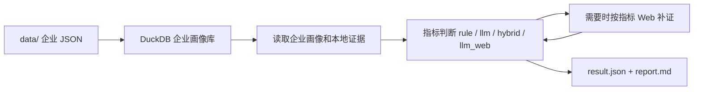

# XFT 企业推荐工具

XFT 根据本地企业画像、业务规则、LLM 和可选的公开 Web 证据，为销售/业务人员生成企业适配的产品模块推荐结果。

业务人员通常只需要关注三件事：

1. 企业画像库是否已构建到 DuckDB。
2. 推荐场景配置是否正确。
3. `result.json` 和 `report.md` 是否能解释推荐结论。

## 推荐流程



当前默认场景：

```text
config/recommender/xft
```

当前推荐主链路：

```text
data_gather -> recommend -> save
```

`--with-web` 开启后，Web 不再先把所有指标搜一遍，而是在每个指标计算到证据不足、规则未命中或 `llm_web` 必须取公开证据时才搜索。

## 快速开始

### 1. 安装依赖

```bash
uv sync
```

### 2. 准备企业画像库

把企业 JSON 目录放到 `data/`，目录名格式通常是：

```text
统一社会信用代码_企业名称/
```

构建 DuckDB：

```bash
uv run xft warehouse build --input data --output cache/company_warehouse.duckdb
```

### 3. 检查推荐配置

```bash
uv run xft scenario validate config/recommender/xft
```

正常情况下会看到类似结果：

```json
{
  "scenario_id": "sales_recommendation",
  "scenario_name": "销售产品推荐",
  "root": "config/recommender/xft",
  "web_enabled": true,
  "modules": 7
}
```

### 4. 跑一家公司

离线模式，不调用 LLM、不搜索 Web，适合快速检查本地规则：

```bash
uv run xft recommend --no-llm "企业名称"
```

启用 LLM：

```bash
uv run xft recommend "企业名称"
```

启用 Web 补证：

```bash
uv run xft recommend --with-web "企业名称"
```

刷新 Web 缓存：

```bash
uv run xft recommend --with-web --web-refresh "企业名称"
```

指定 Web provider：

```bash
uv run xft recommend --with-web --web-provider minimax_search "企业名称"
```

## 常用参数

| 参数 | 用途 | 什么时候用 |
| --- | --- | --- |
| `--warehouse` | 指定 DuckDB 文件，默认 `cache/company_warehouse.duckdb` | 有多份企业画像库时 |
| `--scenario` | 指定场景目录，默认 `config/recommender/xft` | 跑非默认场景时 |
| `--output-dir` | 指定输出目录，默认来自 `scenario.yaml` | 临时试跑或隔离结果时 |
| `--no-llm` | 关闭 LLM，只跑规则和兜底判断 | 快速冒烟、排查规则配置时 |
| `--with-web` | 启用指标级 Web 补证 | 需要公开网页证据时 |
| `--web-refresh` | 忽略已有 Web 查询缓存，重新搜索 | 调整查询词或怀疑缓存过旧时 |
| `--web-provider` | 指定 Web 搜索 provider，逗号分隔 | 对比 `minimax_search` / `metaso_search` 时 |
| `--llm-debug` | 打印 LLM 调用耗时、错误和响应预览 | 调试 prompt、证据不足、LLM 失败时 |
| `--llm-concurrency` | 设置 LLM 并发数，默认 4 | 批量跑且需要控制成本/限流时 |
| `--company-list` | 批量读取企业名单文件 | 批量推荐时 |
| `--limit` | 只跑名单前 N 家 | 小样本验证时 |
| `--skip-existing` | 已有 `result.json` 的企业跳过 | 断点续跑批量任务时 |

批量推荐示例：

```bash
uv run xft recommend \
  --company-list company.txt \
  --with-web \
  --limit 10
```

## 运行结果怎么看

每次推荐会写入：

```text
outputs/recommender/xft/<run_id>/
```

核心文件：

| 文件 | 业务用途 |
| --- | --- |
| `result.json` | 最终推荐交付结果，业务系统优先读取这个 |
| `report.md` | 人类可读报告，适合人工检查 |
| `label_result.json` | 模块、标签、指标的完整判断明细 |
| `indicator_evidence.json` | 每个指标使用的本地证据和 Web 证据 |
| `profile.json` | 本次读取到的企业画像 |
| `decision_trace.json` | 规则、Web、LLM 的决策过程 |
| `llm_calls.jsonl` | LLM 调用记录 |
| `llm_metrics.json` | LLM 调用统计 |
| `web_queries.jsonl` | Web 查询记录，仅启用 `--with-web` 时生成 |
| `web_results.jsonl` | Web 搜索结果，仅启用 `--with-web` 时生成 |
| `web_trace.json` | Web 补证 trace |
| `scenario_resolved.json` | 本次运行解析后的场景配置 |
| `config_manifest.json` | 本次运行使用的配置文件和哈希 |

判断一次推荐是否可用，建议按顺序看：

1. `result.json` 的 `Module`、`AcceptanceResult`、`Conclusion`。
2. `report.md` 是否能解释推荐理由。
3. `indicator_evidence.json` 是否有足够证据支撑命中指标。
4. 如启用 LLM，检查 `llm_metrics.json` 是否有失败调用。
5. 如启用 Web，检查 `web_trace.json` 中查询词和结果是否与指标相关。

## 配置文件怎么改

默认场景目录：

```text
config/recommender/xft/
  scenario.yaml
  modules.yaml
  modules.d/
    个税管理.yaml
    假勤管理.yaml
    对公报账.yaml
    差旅报销.yaml
    日常报销.yaml
    进项发票.yaml
    销项发票.yaml
  web_search.yaml
```

### `scenario.yaml`

声明场景入口、输出目录和 Web 缓存目录：

```yaml
version: "1.0"
id: sales_recommendation
name: 销售产品推荐
description: 面向企业软件销售线索的产品模块推荐场景

web_search_config: web_search.yaml
modules_config: modules.yaml

output_dir: ../../../outputs/recommender/xft
web_cache_root: ../../../data/web/recommender/xft
```

常调参数：

| 字段 | 含义 |
| --- | --- |
| `modules_config` | 指向主模块配置，默认 `modules.yaml` |
| `web_search_config` | 指向 Web provider 配置，默认 `web_search.yaml` |
| `output_dir` | 推荐结果输出目录 |
| `web_cache_root` | Web 查询缓存目录 |

### `modules.yaml`

配置全局分数、接受策略和模块目录：

```yaml
version: "1.0"
scenario: sales_recommendation
scoring:
  indicator_scores:
    matched: 10
    possible: 5
    unknown: 0
    not_matched: 0
  label_scores:
    matched: 30
    possible: 15
    unknown: 0
    not_matched: 0
acceptance_policy:
  levels:
    - result: 高
      min_matched_labels: 3
      conclusion: 企业满足{attributes_number}个属性标签及{indicators_number}个指标，接受度为高。
    - result: 中高
      min_matched_labels: 2
      conclusion: 企业满足{attributes_number}个属性标签及{indicators_number}个指标，接受度为中高。
    - result: 低
      min_matched_labels: 0
      conclusion: 企业满足{attributes_number}个属性标签及{indicators_number}个指标，接受度为低。
modules_dir: modules.d
```

常调参数：

| 字段 | 调整效果 |
| --- | --- |
| `indicator_scores` | 控制单个指标对结果的贡献 |
| `label_scores` | 控制标签命中对模块分的贡献 |
| `acceptance_policy.levels` | 控制“高 / 中高 / 低”的门槛和结论文案 |
| `modules_dir` | 指定模块文件目录 |

### `modules.d/*.yaml`

一个模块一个文件。新增模块就是新增 YAML 文件；删除模块就是删除文件。

模块示例：

```yaml
module_id: 日常报销
module_name: 日常报销
priority: 50
base_score: 0
labels:
  - label_id: 销售属性
    label_name: 销售属性
    min_matched_indicators: 1
    indicators:
      - indicator_id: 渠道销售岗位
        indicator_name: 渠道销售岗位
        evaluator: rule
        standard: 招聘标题包含销售或渠道
        data_sources:
          - type: table
            table: recruitments
            field: title
            op: text_contains
            keywords:
              - 销售
              - 渠道
```

每个指标最重要的字段：

| 字段 | 用途 |
| --- | --- |
| `evaluator` | 判断方式：`rule`、`llm`、`hybrid`、`llm_web` |
| `standard` | 业务判断标准 |
| `rule` | 直接读取企业画像字段进行判断 |
| `data_sources` | 从 DuckDB 明细表取本地证据 |
| `prompt` | LLM 判断时的任务说明 |
| `evidence_hints` | LLM 关注的证据线索 |
| `web_search` | 指标级 Web 补证策略 |

### evaluator 怎么选

| evaluator | 适合场景 | 是否需要 LLM | Web 角色 |
| --- | --- | ---: | --- |
| `rule` | 结构化字段明确，例如招聘标题、资质、分支机构 | 否 | 可选，最多补到 `possible` |
| `llm` | 需要综合文本和证据推理 | 是 | 可选，通常证据不足时补证 |
| `hybrid` | 先用规则判断硬证据，再让 LLM 处理模糊判断 | 可选 | 可选，推荐的增强方式 |
| `llm_web` | 必须依赖公开网页才能判断 | 是 | 必须，Web-first |

推荐顺序：

1. 能用本地字段或明细表判断，优先 `rule`。
2. 有本地信号但需要解释或补证，优先 `hybrid`。
3. 只有公开网页才可能判断，才用 `llm_web`。

### 本地证据怎么配

当前表级 `data_sources` 支持：

```text
recruitments
branches
qualifications
outbound_investments
key_personnel
```

`text_contains` 必须写具体 `keywords`，不要留空：

```yaml
data_sources:
  - type: table
    table: recruitments
    field: title
    op: text_contains
    keywords:
      - 销售
      - 渠道
```

如果只是判断是否存在记录，用 `op: exists`，不要用空关键词模拟存在性。

### Web 补证怎么配

指标级 `web_search` 常用字段：

| 字段 | 可选值 / 含义 |
| --- | --- |
| `when` | `always`、`insufficient`、`rule_not_matched`、`never` |
| `effect` | `llm_evidence`、`evidence_only`、`possible_on_evidence` |
| `fixed_queries` | 固定查询词，支持 `{company_name}` |
| `auto.enabled` | 是否让 LLM 生成少量补充查询 |
| `auto.max_queries` | 自动查询数量上限 |
| `auto.intent` | 自动查询目标 |
| `max_results` | 每个查询最多保留的结果数 |

示例：

```yaml
evaluator: hybrid
merge_policy: rule_first
web_search:
  when: insufficient
  effect: llm_evidence
  fixed_queries:
    - "{company_name} 差旅 报销 制度"
  auto:
    enabled: true
    max_queries: 2
    intent: 判断企业是否有差旅、商旅、报销、费控管理需求
```

查询词要带指标词，不要只写 `{company_name} 官网` 或 `{company_name} 新闻`。

执行时机是 lazy 的：系统先使用本地画像和 DuckDB 证据判断当前指标；只有该指标的 `when` 条件满足时才搜索。常见选择：

- `llm_web` 默认 `when: always`，因为它本来就依赖公开网页。
- `llm` / `hybrid` 常用 `when: insufficient`，本地证据足够时不搜索。
- `rule` 常用 `when: rule_not_matched` + `effect: possible_on_evidence`，规则已命中时不搜索，规则未命中时 Web 线索最多提升为 `possible`。

### `web_search.yaml`

配置 Web provider 和查询上限：

```yaml
version: "1.1"
enabled: true
cache_root: data/web
default_providers:
  - minimax_search

providers:
  minimax_search:
    type: minimax
    enabled: true
    max_results: 5
    timeout_seconds: 30

  metaso_search:
    type: metaso
    enabled: true
    mode: search
    search_size: 3
    timeout_seconds: 30

execution:
  max_results_per_query: 5
```

场景里的 `web_cache_root` 会覆盖这里的 `cache_root`。

## LLM 和 Web Key

`.env` 支持：

```text
LLM_API_KEY=...
LLM_BASE_URL=https://api.minimax.io/v1
LLM_MODEL=MiniMax-M2.7-Highspeed

MINIMAX_API_KEY=...
METASO_API_KEY=...
METASO_ENABLED=true
```

也可以用 SM4 前缀保存 key：

```bash
python -m xft.keys encode <plaintext_key>
```

## 调优建议

### 推荐结果不准

1. 先看 `label_result.json`，确认误命中的模块、标签和指标。
2. 再看 `indicator_evidence.json`，确认证据是否真的支持指标。
3. 如果本地证据误命中，优先调整 `data_sources.keywords` 或 `rule`。
4. 如果 Web 噪声误导，调整对应指标的 `fixed_queries`、`when`、`effect`。
5. 如果接受度过高或过低，调整 `modules.yaml` 的 `acceptance_policy`。

### LLM 成本或速度有问题

- 冒烟时用 `--no-llm`。
- 批量时降低 `--llm-concurrency`。
- 能写成 `rule` 的指标不要写成 `llm`。
- `hybrid` 建议使用 `merge_policy: rule_first`，规则命中时可跳过 LLM。

### Web 证据噪声大

- 固定查询词必须包含指标词。
- Web 是按指标缺口触发的；如果查询过多，优先检查哪些指标配置了 `when: always` 或泛化查询词。
- `llm_web` 没有实际 Web 证据时会输出 `unknown`，不会空证据调用 LLM。
- `rule` 配 `effect: possible_on_evidence` 时，Web 证据最多提升为 `possible`，不会直接变成 `matched`。
- 抽查 `web_trace.json`，确认过滤后的结果既属于目标公司，也与指标相关。

## 校准

准备企业名单：

```text
company.txt
```

准备人工标注 CSV：

```csv
company_name,expected_top_module,acceptable_modules,comment
某公司,日常报销,日常报销；差旅报销,人工标注说明
```

运行校准：

```bash
uv run xft calibrate \
  --company-list company.txt \
  --labels calibration_labels.csv \
  --limit 10
```

启用 LLM 和 Web：

```bash
uv run xft calibrate \
  --company-list company.txt \
  --labels calibration_labels.csv \
  --with-llm \
  --with-web \
  --limit 10
```

校准结果会输出 top1 命中率、可接受命中率、Web 覆盖率和需要人工复核的样本。

## Docker

构建镜像：

```bash
docker build -t xft-dd .
```

查看帮助：

```bash
docker run --rm xft-dd uv run xft --help
```

挂载数据、缓存和输出目录后运行：

```bash
docker run --rm \
  -v "$PWD/data:/app/data" \
  -v "$PWD/cache:/app/cache" \
  -v "$PWD/outputs:/app/outputs" \
  xft-dd uv run xft recommend --no-llm "企业名称"
```

## 技术文档

- [架构说明](docs/ARCHITECTURE.md)
- [评分与指标配置](docs/SCORING.md)
- [冒烟验收](docs/SMOKE.md)
- [下一步计划](docs/NEXT.md)
- [技术债](docs/TECH_DEBT.md)
- [DuckDB 数据流](docs/duckdb_data_flow_design.md)
