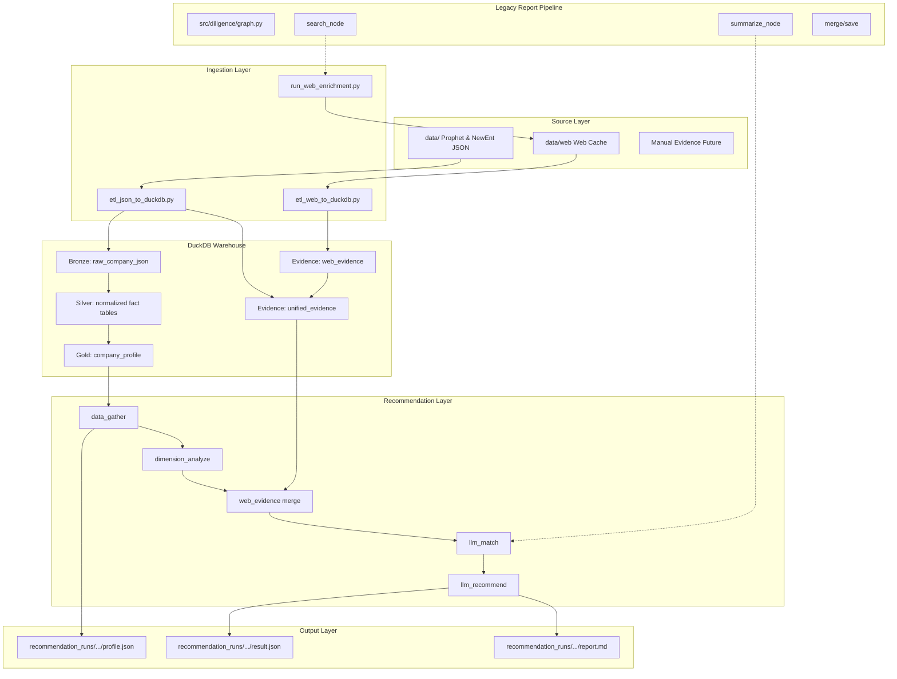
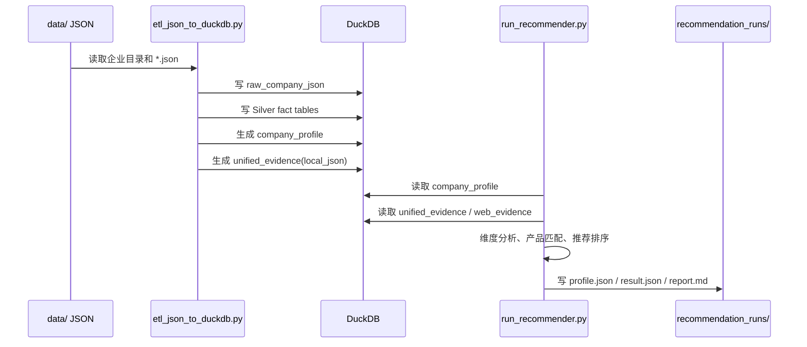
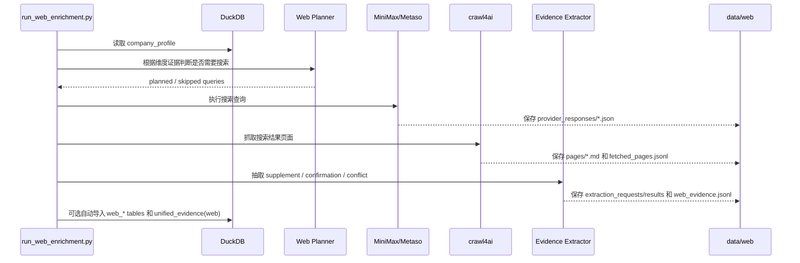
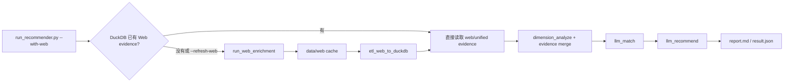

# xft-dd-craw4ai 当前架构

本项目已经从早期“搜索 -> 总结 -> 合并报告”的单一路线，重构为以 DuckDB 事实层为中心的企业画像与产品推荐架构。旧报告流水线仍保留，主要作为 MiniMax Search、Metaso、crawl4ai、LLM 结构化抽取等能力的复用来源；新的主链路以本地 JSON 和 Web evidence 入库后的结构化证据为基础。

## 总体架构图



核心原则：

- `DuckDB` 是事实中心，推荐流程不直接读取零散 JSON 或临时搜索结果。
- `company_profile` 提供快速企业画像，适合推荐和筛选。
- `unified_evidence` 承接本地 JSON 证据、Web 补证和后续人工证据，是长期证据接口。
- Web 搜索结果必须先缓存到 `data/web/`，再经过抽取和 ETL 入库，最后才进入推荐。
- 旧报告流水线不再是新主线，但其中搜索、抓取、结构化抽取、来源判断能力会继续复用。

## 当前主链路

```text
data/ Prophet/NewEnt JSON
  -> etl_json_to_duckdb.py
  -> DuckDB warehouse
  -> company_profile / unified_evidence
  -> run_recommender.py
  -> recommendation_runs/.../report.md
```

可选 Web 补证链路：

```text
run_web_enrichment.py
  -> data/web 原始响应、页面正文、中间抽取文件、web_evidence.jsonl
  -> etl_web_to_duckdb.py
  -> web_* tables / unified_evidence
  -> run_recommender.py --with-web-evidence
```

也可以让推荐流程在缺少 Web 证据时自动补证：

```bash
uv run python run_recommender.py --with-web "企业名称"
```

默认会复用已有 `data/web/` 缓存；如需强制刷新：

```bash
uv run python run_recommender.py --with-web --refresh-web "企业名称"
```

## 数据流向图

### 本地 JSON 到推荐报告



这条链路可以完全离线运行。`data/` 中 JSON 不完整也可以导入，缺失文件会记录在 `company_import_status` 和 `company_profile.missing_v1_files`，推荐阶段会把证据不足显式暴露出来，而不是让模型补造事实。

### Web 补证到 DuckDB



Web 补证遵循“本地 JSON 优先”：

- 如果本地画像已经覆盖某个维度，planner 默认跳过该维度的 Web 搜索。
- 如果 Web 信息与 JSON 信息冲突，`relation_to_profile=conflict`，并默认 `resolution=use_local`。
- 原始响应、页面正文、中间抽取请求和抽取结果都会保留在 `data/web/`，便于审计和重放。
- 默认复用已有缓存，除非显式传 `--refresh` 或 `--refresh-web`。

### 自动 Web 推荐链路



这条链路适合日常生成报告；如果需要更强可控性，则建议分三步执行：先 `run_web_enrichment.py --no-etl` 准备缓存，再 `etl_web_to_duckdb.py --rebuild` 手工入库，最后 `run_recommender.py --with-web-evidence` 生成推荐。

## 核心原理

### 1. Bronze / Silver / Gold

`etl_json_to_duckdb.py` 对 `data/` 做分层入库：

- Bronze：`raw_company_json` 保留每个原始 JSON 文件、文件 hash、抓取时间、解析状态。
- Silver：把常用实体解析为结构化表，例如企业主体、股东、人员、风险、招聘、招投标、资质。
- Gold：`company_profile` 把推荐常用字段压成一张宽表，作为推荐主入口。

这样做的好处是，原始数据永远可追溯；业务推荐不需要知道每个 Prophet/NewEnt JSON 的复杂路径；后续新增字段时可以先落 Bronze，再逐步提取到 Silver 或 Evidence。

### 2. 统一证据层

`unified_evidence` 是当前新架构的关键表。它把不同来源的信息统一成类似下面的形状：

```text
evidence_id
company_name / credit_code
dimension_id
source_type: local_json | web | manual | rule
source_name / source_path / source_url / source_field
claim
value
confidence
authority_level
relation_to_profile: primary | supplement | confirmation | conflict | inference
conflict_note
resolution
raw_ref
created_at
```

本地 JSON 画像会写成 `source_type=local_json`、`relation_to_profile=primary`；Web 抽取会写成 `source_type=web`，并区分补充、佐证和冲突。推荐侧以后只需要理解 evidence，不需要关心底层来自 JSON、搜索摘要还是网页正文。

### 3. 维度分析

`dimension_analyze` 根据 `analysis_dimensions.yaml` 或 bundle 中的 `dimensions/*.yaml` 工作。每个维度定义：

- 读取哪些本地字段。
- 如何把字段格式化为事实证据。
- 哪些证据不足需要 Web 或人工补充。
- 本地规则如何产生弱推断。
- Web 查询模板是什么。

维度分析会输出结构化 `DimensionAnalysis`，其中保留：

```text
facts                 兼容旧输出的人类可读事实
inferences            兼容旧输出的人类可读推断
local_evidence        本地 JSON 证据
inference_evidence    规则推断证据
web_evidence          Web 补证/佐证
conflicts             Web 与本地画像冲突
missing_evidence      仍缺失的证据项
```

### 4. 产品匹配与推荐

推荐分两步：

1. `llm_match`：判断每个产品模块是否匹配企业当前需求，输出分数、置信度、理由和缺失证据。
2. `llm_recommend`：基于匹配结果生成最终推荐列表、切入话术和报告摘要。

如果 LLM 不可用，系统会走 deterministic fallback，仍能生成可运行的 MVP 报告。LLM prompt 明确要求基于证据，不允许把 `web_search_queries` 或缺失证据当成事实。

### 5. 旧报告流水线的定位

旧入口 `src/diligence/graph.py` 仍然保留，流程是：

```text
init -> search/summarize -> collect -> merge -> save
```

它不再是推荐主链路，但其中的能力被拆给新架构复用：

- `utils/minimax_search.py`：MiniMax Search。
- `utils/metaso.py`：Metaso search/chat。
- `utils/fetch.py`：crawl4ai 页面抓取。
- `utils/source_registry.py`：来源可信度分类。
- `src/diligence/ai/`：公共 LLM client 和 JSON 提取工具。

## 关键入口

```text
etl_json_to_duckdb.py                         # data/ JSON -> DuckDB
run_web_enrichment.py                         # Web 搜索、抓取、抽取、缓存
etl_web_to_duckdb.py                          # data/web -> DuckDB Web 表
run_recommender.py                            # 推荐主入口

src/diligence/warehouse/                      # DuckDB 本地仓库
src/diligence/evidence/                       # 统一证据模型
src/diligence/ai/                             # 公共 LLM client / JSON 抽取工具
src/diligence/recommender/                    # 推荐图、维度分析、报告渲染
src/diligence/recommender/web/                # Web enrichment 服务
src/diligence/nodes/                          # legacy 报告流水线节点，可复用但非新主线
```

## DuckDB 分层

当前 DuckDB 包含三类稳定接口：

```text
Bronze
  raw_company_json
  company_import_status

Silver
  companies
  company_labels
  key_personnel
  shareholders
  ip_summary
  risk_features
  recruitments
  bidding_summary
  qualifications
  branches
  financing_events
  outbound_investments

Gold / Evidence
  company_profile
  web_search_runs
  web_search_queries
  web_search_results
  web_pages
  web_evidence
  unified_evidence
```

`company_profile` 是推荐的快速画像宽表；`unified_evidence` 是本地 JSON 证据与 Web 证据的统一事实入口。后续新增字段时，优先沉淀为事实或证据，再进入推荐逻辑。

## 常用命令

初始化或重建本地 JSON 仓库：

```bash
uv run python etl_json_to_duckdb.py --input data --output cache/company_warehouse.duckdb
```

离线跑推荐：

```bash
uv run python run_recommender.py --no-llm "企业名称"
```

单独准备 Web 缓存但不入库：

```bash
uv run python run_web_enrichment.py --no-etl "企业名称"
```

从 Web 缓存重建 DuckDB Web 表：

```bash
uv run python etl_web_to_duckdb.py --input data/web --warehouse cache/company_warehouse.duckdb --rebuild
```

读取已有 Web 证据生成推荐：

```bash
uv run python run_recommender.py --with-web-evidence "企业名称"
```

## 配置

当前兼容两种配置方式：

```text
config/recommender/analysis_dimensions.yaml
config/recommender/products.yaml
```

以及目录 bundle：

```text
config/recommender/
  products.yaml
  analysis_dimensions.yaml
```

如果没有 `analysis_dimensions.yaml`，也支持：

```text
config/recommender/
  products.yaml
  dimensions/
    basic_profile.yaml
    compliance_risk.yaml
```

Web 与抽取配置：

```text
config/recommender/web_search.yaml
config/recommender/web_extract_llm.yaml
config/recommender/prompts/extract_evidence_system.md
```

更详细的架构、配置和后续计划见 `DUCK.md`。

---

# Prophet 数据目录

## 目录结构

```
data/
  {统一社会信用代码}_{企业名称}/
    .meta.json        # 查询元数据（企业名、信用代码、各 fetcher 获取时间与缓存状态）
    *.json            # 各数据类型的 API 返回结果
```

`.meta.json`：
```json
{
  "company_name": "安徽扬山联合精密技术有限公司",
  "credit_code": "91340521MA2TQP1G4L",
  "fetchers": {
    "info":            {"fetched_at": "2026-05-14T...", "from_cache": false},
    "risk_insight":    {"fetched_at": "2026-05-14T...", "from_cache": true}
  }
}
```

## API 响应格式

两类上游系统，响应结构不同：

| 系统 | 路径前缀 | 成功标志 | 空数据标志 |
|------|----------|----------|------------|
| Prophet | `/prophet/` | `"success": true, "code": 200` | `data.list: null` 或 `data: {}` |
| NewEnt | `/newEnt/` | `"code": 200` | `"code": 100` 或 `data: null` |

---

## 数据分类速查

### 基本信息

| 文件 | 来源 | 描述 |
|------|------|------|
| `info.json` | prophet | 企业工商基本信息，含 companyId（其他接口的 eid） |
| `ext.json` | prophet | 企业联系方式（电话、邮箱、网站） |
| `slow.json` | prophet | 企业主要成员（董监高） |
| `getbasinf.json` | newEnt | 企业详细信息（newEnt 源，字段与 info 互补，上市公司尤其丰富） |
| `intellectual.json` | prophet | 知识产权概要：各项知识产权的消息数 |
| `background.json` | prophet | 背景信息概要：各背景维度的消息数 |

### 风险洞察

| 文件 | 来源 | 描述 |
|------|------|------|
| `risk_insight.json` | prophet | 风险汇总：自身/关联/历史风险数量 + 各类风险命中情况 |
| `annoucement.json` | prophet | 法院公告列表（起诉状副本、开庭传票、执行通知等） |
| `judgement_doc.json` | prophet | 裁判文书列表（文书号、类型、标题） |
| `judgement_detail.json` | prophet | 裁判文书详情（需传文书 key，当前固定返回空） |
| `break_faith.json` | prophet | 失信被执行人信息 |

### 经营动态

| 文件 | 来源 | 描述 |
|------|------|------|
| `business_info.json` | prophet | 开庭公告（案号、法院、法庭、日期、案由） |
| `business_scope.json` | prophet | 经营范围（纯文本） |
| `check.json` | prophet | 行政检查记录（检查机关、日期、结果） |
| `certification.json` | prophet | 企业资质认证（ISO 等） |
| `change.json` | prophet | 工商变更记录（变更项、变更前后值、变更时间） |
| `land.json` | prophet | 土地信息（坐落、面积、出让方式、使用年限等） |
| `recruit_message.json` | prophet | 招聘信息（职位、薪资、学历、经验要求、来源） |
| `tax.json` | prophet | 税务评级信息（年度 A/B/C/D 级纳税人） |

### 知识产权

| 文件 | 来源 | 描述 |
|------|------|------|
| `brand.json` | prophet | 商标信息（名称、注册号、国际分类、状态、申请日期） |
| `copyright.json` | prophet | 作品著作权信息 |
| `software.json` | prophet | 软件著作权（全称、简称、版本号、登记号、登记日期） |
| `partner.json` | prophet | 知识产权合作方（专利申请人/发明人/代理机构等） |

### 背景关联

| 文件 | 来源 | 描述 |
|------|------|------|
| `equityStructure.json` | prophet | 股权结构（股东、出资金额、出资比例） |
| `equity_penetration_d.json` | prophet | 股权穿透图（多层投资关系） |
| `investorInfo.json` | prophet | 对外投资（被投企业、出资金额、出资比例） |
| `shareholder_info.json` | prophet | 股东个人信息（当前固定传空，返回 `{}`） |
| `branch.json` | prophet | 分支机构（分公司名称、注册号、经营状态） |
| `staff.json` | prophet | 主要人员（姓名、职务） |
| `insurances.json` | prophet | 社保参保人数（按年份） |
| `relationship.json` | prophet | 关联关系概览（股权穿透图/投融资/对外投资/分支机构/交易链） |
| `pledgee.json` | prophet | 动产抵押/质押信息 |

### 资本市场

| 文件 | 来源 | 描述 |
|------|------|------|
| `query_bond_new.json` | newEnt | 债券信息（名称、类型、发行额、利率、评级、到期日等） |
| `queryFCNew.json` | newEnt | 融资事件（融资轮次、金额、投资方、日期、来源） |
| `queryInvestor.json` | newEnt | 对外投资企业列表（被投企业、出资额、出资比例） |
| `queryInvestmentEventNew.json` | newEnt | 企业作为投资方的投资事件 |
| `queryBiddingTotal.json` | newEnt | 招投标总数 |

### 招投标

| 文件 | 来源 | 描述 |
|------|------|------|
| `queryCompanyBiddingNewInviting.json` | newEnt | 招标公告（公司作为招标方） |
| `queryCompanyBiddingNewWinner.json` | newEnt | 中标结果（公司作为中标方，含项目名、金额、地区、日期） |

### 标签画像

| 文件 | 来源 | 描述 |
|------|------|------|
| `label.json` | newEnt | **已加工**：queryCompany 标签翻译为中文 |
| `queryCompany.json` | newEnt | 企业工商画像（联系方式、地址、行业、标签 PNG、智能评级） |
| `queryBaseLabel.json` | newEnt | 企业基础标签（专精特新、高新、园区等） |
| `query_risk_rating.json` | newEnt | 风险评分（税务/质押/司法/经营/财务 5 维分值） |
| `querySameTelEnt.json` | newEnt | 相同电话关联企业 |
| `queryActualControl.json` | newEnt | 实际控制权链（持股路径、控制比例） |

### 其他

| 文件 | 来源 | 描述 |
|------|------|------|
| `licence.json` | prophet | 行政许可（许可证名称、编号、颁发机构、有效期） |
| `queryQualification.json` | newEnt | 企业资质认定（专精特新、高新技术企业等含有效期） |

---

## 全部文件字段详解

### info.json — 企业基本信息

所有查询的入口。其他 newEnt 接口需要从中提取 `data.info.info.companyId` 作为 `eid`。

```
code                            响应码 (200=成功)
data.info.info
  name                          企业名称
  unifiedSocialCreditCode       统一社会信用代码
  companyId                     企业唯一标识（其他接口的 eid 来源）
  legalPersonName               法定代表人
  legalPersonType               法定代表人类型（1=自然人）
  regCapital                    注册资本（含币种，如 "5000.000000万人民币"）
  regLocation                   注册地址
  regStatus                     经营状态（存续/注销/吊销等）
  regStatusCode                 经营状态码（2=存续）
  regNumber                     工商注册号
  estiblishTime                 成立日期（"YYYY-MM-DD HH:mm:ss"）
  businessScope                 经营范围（完整文本）
  companyOrgType                企业类型（有限责任公司/股份有限公司等）
  cate1 / cate2 / cate3         行业分类（大类/中类/小类）
  base                          地区代码（如 "ah"）
  baseChinese                   地区中文名
  chinameabbr                   企业简称
  formerName                    曾用名
  companycode                   企业编码
  innercode                     内部编码
  listedCompanyState            上市状态（0=非上市, 1=上市）
  secucode / secuabbr / secumainid / secumarket  证券代码/简称/主板代码/市场
  pictureurl                    企业照片 URL
  staffTypeName                 人员规模分类
  sum                           关联数量
data.info.geoPoint              GPS 坐标 {lat, lon}
data.info.partner[]             股东列表
  name                          股东名称
  amount                        出资金额
  putCapitalProportion          出资比例（如 "100.00%"）
  investorType                  投资者类型（2=法人）
  certName / certNo             证照名称/编号
  capital[]                     实缴明细
    amomon                      实缴金额
    paymet                      出资方式（货币/实物等）
    time                        实缴日期
  capitalActl                   实缴信息（JSON 字符串）
data.info.listPartner           合伙人列表（合伙企业专用）
data.background                 （固定 null，见 background.json）
data.folloed                    关注状态
```

### ext.json — 企业联系方式

```
code / message / success / url  标准 prophet 响应头
data
  businessPhone[]               企业联系电话
  email                         企业邮箱
  phones[]                      其他电话
  website                       企业网站 URL
```

### slow.json — 企业主要成员

```
data.staffExts[]
  name                          人员姓名
  staffTypeName                 职务（执行董事兼总经理/监事/财务负责人等）
  affiliateCompany              关联公司数量
```

### getbasinf.json — 企业详细信息 (newEnt)

上市公司信息尤其丰富，包含证券代码、交易所、主营业务、企业简介。

```
msg / code                      newEnt 响应头
data
  zaxUid                        企业唯一标识
  custUid                       客户标识
  custNm                        企业名称
  chnShtNm                      中文简称
  entpTypNm                     企业类型名称（其他公司/上市公司等）
  swFrsIdtNm / swScdIdtNm / swThdIdtNm  行业分类（一级/二级/三级）
  exgCd                         交易所（深圳证券交易所等）
  lstBrdNm / lstBrdCd           上市板块/板块代码（创业板/主板）
  scrShtNm                      证券简称
  stkCd                         股票代码
  entpEngNm                     英文全称
  engShtNm                      英文简称
  foundDt                       成立日期
  lstDt                         上市日期
  dlstDt                        退市日期（1900-01-01=未退市）
  regCpt                        注册资本（万元）
  pvcCty                        所在省市
  ofcAdr                        办公地址
  lglRprsPsn                    法定代表人
  chrm                          董事长
  indptDirLst                   独立董事列表（逗号分隔）
  brdScrty                      董事会秘书
  genMng                        总经理
  cmpTel                        公司电话
  cmpFax                        公司传真
  cmpMbx                        公司邮箱
  cmpHmpg                       公司主页
  ofcPstCd                      办公邮编
  empQty                        员工数量
  actFirmNm                     会计师事务所
  mainBus                       主营业务描述
  entpIntro                     企业简介
  oprScp                        经营范围
```

### intellectual.json — 知识产权概要

与 risk_insight.json、background.json、relationship.json 结构相同，是一类"概览"响应。

```
data.intellectual[]             知识产权各项
  name                          名称（商标查询/专利查询/软件著作权/作品著作权/网站备案）
  no                            编号
  legal                         是否法律相关
  messageNo                     消息数量
data.background / .info / .marketing / .operation / .relationship / .riskCount / .riskInsight
                                其他维度（均为 null，对应各自的独立 JSON）
```

### background.json — 背景信息概要

```
data.background[]               背景各项
  name                          名称（工商信息/主要成员/股东信息/变更信息/主营构成/企业年报/股权结构/最终受益人/实际控制权/附近企业/经营范围/公司规模）
  no                            编号
  legal                         是否法律相关
  messageNo                     消息数量
```

### risk_insight.json — 风险洞察汇总

```
data.riskCount
  selfRisk                      自身风险总数
  selfRiskList[]                自身风险分类 [{name: "被执行人", total: 1}, ...]
  arroundRisk                   关联风险总数
  arroundRiskList[]             关联风险明细
  preRisk                       历史风险总数
  preRiskMap                    历史风险分布（key-value map）
data.riskInsight[]              风险项明细
  name                          风险名称（失信信息/被执行人/关联被执行人/案件流程/股权冻结/司法拍卖/司法协助等）
  no                            风险项编号
  legal                         是否法律风险
  messageNo                     风险消息数
```

### annoucement.json — 法院公告

```
data.list[]                     公告列表（null=无数据）
  bltntypename                  公告类型（起诉状副本及开庭传票/其他/裁判文书等）
  content                       公告全文
  courtcode                     法院名称
  province                      省份
  publishdate                   发布日期（毫秒时间戳）
  party2                        当事人
data.pageNo / pageSize / total  分页信息
```

### judgement_doc.json — 裁判文书

```
data.list[]
  key                           文书唯一标识（用于 judgement_detail 查询）
  wenshuhao                     文书号（如 "（2024）粤01民终828号"）
  wenshuming                    文书名称
  type                          案件类型（民事案件/非诉保全审查案件等）
  city                          城市/省份
```

### judgement_detail.json — 裁判文书详情

当前实现固定返回 `data: {}`，文件存在但无实际内容。

### break_faith.json — 失信被执行人

```
data.list[]                     失信记录（null=无数据）
data.pageNo / total             分页
```

### business_info.json — 开庭公告

```
data.list[]
  caseNo                        案号（如 "（2026）粤0307民初257号"）
  caseReason                    案由（合同纠纷/劳动争议/买卖合同纠纷等）
  court                         法院
  courtroom                     法庭
  startDate                     开庭日期（毫秒时间戳）
  area                          地区
  judge                         法官
  plaintiff[]                   原告
  defendant[]                   被告
  litigant[]                    当事人
  contractors                   承办人
```

### business_scope.json — 经营范围

```
data.info                       经营范围纯文本
```

### check.json — 行政检查

```
data.list[]
  checkDate                     检查日期
  checkOrg                      检查机关
  checkResult                   检查结果（合格/符合要求/发现问题...）
  checkType                     检查类型
  companyName                   被检查企业名称
data.pageNo / total             分页
```

### certification.json — 企业资质认证

```
data.list[]                     认证记录（null=无数据）
data.pageNo / total             分页
```

### change.json — 工商变更

```
data.list[]
  changeItem                    变更事项（董事备案/注册资本变更/章程备案/住所变更等）
  changeTime                    变更时间（毫秒时间戳）
  contentAfter                  变更后内容
  contentBefore                 变更前内容
data.pageNo / pageSize / total  分页
```

### land.json — 土地信息

```
data.list[]
  projectName                   项目名称
  projectLocation               项目坐落
  landUseRightPerson            土地使用权人
  landUseType                   土地用途（工业用地等）
  landSupplyMethod              供地方式（挂牌出让等）
  landLevel                     土地级别
  landUsePeriod                 使用年限（年）
  area                          面积（公顷）
  contractedVolumeRate          约定容积率
  contractedVolumeRateCeiling   容积率上限
  district                      区县
  category                      行业类别
  electronicRegulatoryNumber    电子监管号
  agreementStartTime            约定开工时间
  committedTime                 约定交地时间
  contractDate                  合同签订日期
  scheduledCompletion           约定竣工时间（毫秒时间戳）
  instalmentPayment[]           分期付款明细
    instalment_payment_agreed_payment_amount     约定付款金额
    instalment_payment_convention_payment_date   约定付款日期
    instalment_payment_contract_payment_period_number  付款期数
  authority                     批准机关
  id                            记录 ID
```

### recruit_message.json — 招聘信息

```
data.list[]
  title                         职位名称
  companyName                   招聘企业
  city                          城市
  district                      区县
  class                         工作性质（全职/兼职）
  education                     学历要求
  experience                    经验要求
  oriSalary                     薪资范围（如 "15-22k"）
  location                      工作地点
  description                   职位描述（HTML）
  source                        招聘来源（Boss直聘/猎聘等）
  startdate                     发布日期
  enddate                       截止日期
  employerNumber                雇主编号
  fromUrl                       来源链接
```

### tax.json — 税务评级

```
data.list[]
  name / companyName            企业名称
  idNumber                      纳税人识别号
  year                          评价年度
  grade                         纳税信用等级（A/B/C/D）
  evalDepartment                评价机关
  base                          地区
  type                          类型
  source                        数据来源 URL
data.pageNo / total             分页
```

### brand.json — 商标信息

```
data.list[]
  tmName                        商标名称
  regNo                         注册号/申请号
  intCls                        国际分类号
  clsName                       分类名称（交通工具/科研服务等）
  status                        状态（2/3 等）
  appDate                       申请日期（毫秒时间戳）
  regDate                       注册日期
  applicantCn                   申请人中文名
  addressCn                     申请人地址
  agent                         代理机构
  announcementDate              公告日期
  announcemenIssue              公告期号
  gjzcrq / hqzdrq / yxqrq       国际注册日期/后期指定日期/优先权日期
  privateDateStart              专用权开始日期
  tmGoods[]                     商品/服务列表
  tmFlowCat[]                   流程分类
  category                      分类
```

### copyright.json — 作品著作权

```
data.list[]                     著作权记录（null=无数据）
data.pageNo / total             分页
```

### software.json — 软件著作权

```
data.list[]
  fullName                      软件全称
  simpleName                    软件简称
  version                       版本号
  regNum                        登记号（如 "2026SR0586432"）
  regTime                       登记日期（毫秒时间戳）
  authorNationality             著作权人
  catNum                        分类号
  publishTime                   首次发表日期
  entName / entId               企业名称/ID
  softwareId                    软件 ID
```

### partner.json — 知识产权合作方

专利的申请人、发明人、代理机构等信息。

```
data.list[]
  title                         专利名称
  abs                           专利摘要
  appnumber                     专利申请号
  pubnumber                     专利公开号
  appdate                       申请日期
  pubDate                       公开日期
  applicantname[]               申请人
  inventroName[]                发明人
  agencyName                    代理机构
  agentName[]                   代理人
  address                       地址
  mainipc                       主 IPC 分类号
  ipc[]                         全部 IPC 分类号
  patType                       专利类型（1=发明专利等）
  createTime                    创建时间
```

### equityStructure.json — 股权结构

```
data[]
  name                          股东名称
  amomon                        出资金额
  investmentRate                出资比例（0-1 小数）
  investorType                  投资者类型（2=法人）
  listed                        是否上市
  hOLDSUM                       持股总数
  pCTOFTOTALSHARES              占总股比
```

### equity_penetration_d.json — 股权穿透

```
data[]
  companyName                   企业名称（被投资方/投资方）
  amount                        出资金额
  putCapitalProportion          出资比例
  spreadOut                     -1=向下穿透（子公司），1=向上穿透（股东）
  unit                          金额单位（万元）
```

### investorInfo.json — 对外投资

```
data.data[]
  name                          被投资企业名称
  parentEnterprise              投资方（本企业）
  amount                        出资金额
  putCapitalProportion          出资比例
  investorType                  投资者类型
  investorInfo[]                出资明细
    amomon                      出资金额
    investmentRate              出资比例
    paymet                      出资方式
    time                        出资时间
    virtualId                   虚拟 ID
data.pageNum / pageSize / totalCounts  分页
```

### shareholder_info.json — 股东个人信息

当前实现传空 name，固定返回空对象 `{}`。

### branch.json — 分支机构

```
data.list[]
  name                          分公司名称
  unifiedSocialCreditCode       统一社会信用代码
  regNumber                     注册号
  regStatus                     经营状态
  regInstitute                  登记机关
  estiblishTime                 成立日期
  legalPersonName               负责人
```

### staff.json — 主要人员

```
data.list[]
  name                          姓名
  staffTypeName                 职务（执行董事兼总经理/监事/财务负责人等）
data.pageNo / pageSize / total  分页
```

### insurances.json — 社保参保人数

```
data[]
  year                          年份
  people                        参保人数
```

### relationship.json — 关联关系

```
data.relationship[]
  name                          关系类型（股权穿透图/投融资/对外投资/分支机构/交易链）
  no                            编号
  legal                         是否法律相关
  messageNo                     消息数
  tradingName                   交易链名称
```

### pledgee.json — 动产抵押/质押

```
data.list[]                     抵押/质押记录（null=无数据）
data.pageNo / total             分页
```

### query_bond_new.json — 债券信息 (newEnt)

```
data.list[]
  objId / windCd                债券 Wind 代码
  custNm                        发行主体
  bndNm                         债券全称
  bndShtNm                      债券简称
  espBndTypNm                   债券类型（可转债/公司债等）
  isuAncDt                      发行公告日
  lstDt                         上市日
  mtuDt                         到期日
  dlstDt                        退市日
  bndTrmYear                    债券期限（年）
  intrMth                       计息方式（单利/复利）
  crdRatLvl                     信用评级
  ratDt                         评级日期
  ratOrgNm                      评级机构
  parVal                        面值
  parIntrRat                    票面利率（%）
  actIsuAmt                     实际发行额（亿元）
  plnIsuAmt                     计划发行额
  isuPrc                        发行价格
  sprd                          利差
  payIntrFrq                    付息频率
  rpayMthNm                     偿付方式
  isuObj                        发行对象
data.total / pageNum / pageSize 分页
```

### queryFCNew.json — 融资事件 (newEnt)

```
data.list[]
  id                            事件 ID
  companyId                     企业标识
  entName                       企业名称
  financingRounds               融资轮次（IPO上市/战略融资/A轮...）
  financingAmount               融资金额（如 "4.43亿人民币"）
  releaseDate                   发布日期
  investor[]                    投资方列表
  investorFull / investorName   投资方全称/名称
  financingProduct              融资产品/项目名
  financingTitle                融资标题
  financingMsg                  融资描述
  financingSource               融资来源描述（含 URL 文本）
  financingSourceList[]         融资来源 [{title, url}]
  province / city / county      省/市/区县
  statusAccount                 账户状态
  creditGrantingCustomer        授信客户标识
  intelligentAtarRating         智能星级（L1-L6）
  insideLabel[]                 行内标签
  industryMax / industryBig / industryMid  行业代码
  idtCtgNm / idtBigClsNm / idtMidClsNm / idtSmlClsNm  行业分类名
```

### queryInvestor.json — 对外投资 (newEnt)

```
data.list[]
  companyName                   被投资企业名称
  amount                        出资金额
  proportion                    出资比例（0-1 小数）
  putCapitalProportion          出资比例（字符串，如 "100.00%"）
  regStatus                     被投企业状态
  companyOrgType                被投企业类型
  estiblishTime                 成立日期
  legalPersonName               法定代表人
  proCiCo                       所在省市
  capital[]                     实缴明细
    unit                        币种
    amomon                      金额
    paymet                      出资方式
    time                        出资时间
  uid / eid / investorId        各类标识
data.total / pageNo / pageSize  分页
```

### queryInvestmentEventNew.json — 投资事件 (newEnt)

本企业作为投资方参与的投资事件。

```
data.list[]
  id                            事件 ID
  companyId                     被投企业标识
  entName                       被投企业名称
  investor[]                    投资方列表（含本企业）
  financingRounds               融资轮次
  financingAmount               融资金额
  releaseDate                   发布日期
  financingProduct              产品名
  financingSource               来源描述
  financingSourceList[]         来源列表 [{title, url}]
  province / city / county      省/市/区县
  (其他字段同 queryFCNew)
```

### queryBiddingTotal.json — 招投标总数 (newEnt)

```
data.total                      招投标总次数
```

### queryCompanyBiddingNewInviting.json — 招标公告 (newEnt)

```
code / total                    响应码 / 总数
list[]                          招标项目列表
  title                         项目标题
  province / city / county      省/市/区县
  pubTime                       发布时间
  typeNm                        类型名称（招标）
  dataType                      数据类型
  moneyStr / money              金额
  bidNo                         项目编号
  caller                        招标方
  bidSubtype                    子类型
  (字段结构同 Winner，但数据为招标视角)
```

### queryCompanyBiddingNewWinner.json — 中标结果 (newEnt)

```
code / total                    响应码 / 总数
list[]
  title                         项目标题（如 "当自然资规出让告字[2022]第13号中标公示"）
  province / city / county      省/市/区县
  pubTime                       公示时间
  typeNm                        类型（中标）
  dataType                      数据类型（土地拍卖/工程招标等）
  moneyStr / money              金额
  bidNo                         项目编号
  bidType                       招标类型
  bidSubtype                    子类型
  caller                        招标方
  callerPerson / callerPhone    招标方联系人/电话
  winnersStr                    中标方（逗号分隔）
  winners[]                     中标方列表
  winnerProvinceStr / winnerProvince[]     中标方省份
  winnerCityStr / winnerCity[]             中标方城市
  winnerMoneysStr / winnerMoneys[]         中标金额
  winnerPersonStr / winnerPerson[]         中标方联系人
  entpName                      本企业名称（用于匹配）
  agency / agencyPerson / agencyPhone      代理机构信息
  projectType / projectPerson / projectPhone  项目类型/联系人/电话
  busName                       业务名称
  process                       处理状态
```

### label.json — 标签映射（已加工）

从 queryCompany 的 `insideLabel` 和 `crossBorderLabel` 翻译为中文。

```
company_name                    企业名称
labels[]                        中文标签列表
raw_label_codes[]               PNG 原始编码列表
```

已知标签映射（`_LABEL_MAP`，未映射的显示为 `未知标签:<code>`）：

| PNG 编码 | 中文标签 |
|----------|----------|
| `inside.png` | 行内客户 |
| `total.png` | 总战客户 |
| `high_value.png` | 高质量客户 |
| `retail_card.png` | 零售卡/零售关联客户 |
| `star5.png` | 综合星级标签 |
| `star5Tech.png` | 科技企业资质5星 |
| `chrFinInd.png` | 特色金融客户 |
| `chrFinHiQltCustAcqInd.png` | 特色金融高质量获客客户 |
| `techFinInd.png` | 科技金融客户 |
| `digitalFinInd.png` | 数字金融客户 |
| `hiOprValCustInd.png` | 高经营价值客户 |
| `smallService.png` | 跨境小额服务贸易 |

### queryCompany.json — 企业工商画像 (newEnt)

与 info.json 字段互补，包含联系方式、标签、智能评级。

```
data
  entName                       企业名称
  legalName                     法定代表人
  regNo                         工商注册号
  orgNo                         组织机构代码
  regCapCur                     注册资本币种
  employeeNum                   员工数量（年报填报数）
  empNum                        参保人数
  establishDate                 成立日期
  orgType                       机构类型（企业/个体工商户等）
  province / county             省/区县
  industryBig                   行业大类
  idtCtgNm / idtSmlClsNm        行业分类名称
  phoneList[]                   联系电话
  emailList[]                   企业邮箱
  yearRptCmnAddr                年报通讯地址
  formerName                    曾用名
  source                        数据来源（如 "企业填报工商年报"）
  dataType                      数据类型
  statusAccount                 账户状态（A=正常）
  insideLabel[]                 行内标签（PNG 文件名列表）
  crossBorderLabel[]            跨境标签
  highQualityCustomer           高质量客户（Y/N）
  intelligentAtarRating         智能星级评级（L1-L6）
  chrFinInd                     特色金融标识（Y/N）
  techFinInd                    科技金融标识（Y/N）
  digitalFinInd                 数字金融标识（Y/N）
  phFinInd                      普惠金融标识（Y/N）
  hiOprValCustInd               高经营价值客户标识（Y/N）
  divideBattle                  分战标识（Y/N）
  crossBorderServiceTradeMark / crossBorderSmallServiceTradeMark / crossBorderSmallExportSalesMark / crossBorderCapitalProjectMark  跨境标识
  coordinate                    GPS {lat, lon}
  rtlCmNmLst                    零售客户名单
  idtCtgNm / idtBigClsNm / idtMidClsNm / idtSmlClsNm  行业分类
```

### queryBaseLabel.json — 企业基础标签 (newEnt)

```
potentialRating                 潜在评级（可为 null）
data[]
  labelName                     标签名称（如 "专精特新中小企业(省级)"/"高新技术企业认定"/"创新型中小企业"/"园区企业"）
  labelClass                    标签分类（return-rate / company-info）
  labelType                     标签类型（1/2/null）
  parkName                      园区名称（园区企业时返回园区列表）
```

### query_risk_rating.json — 风险评分 (newEnt)

```
data
  taxRisk                       税务风险分值
  pledgeRisk                    质押风险分值
  judicialRisk                  司法风险分值
  businessRisk                  经营风险分值
  financialRisk                 财务风险分值
  totalScore                    综合风险总分
```

### querySameTelEnt.json — 相同电话关联企业 (newEnt)

```
data.list[]
  entName                       关联企业名称
  entStatus                     经营状态
  establishDate                 成立日期
  legalName                     法定代表人
  phoneList                     电话列表（空格分隔）
  regCap                        注册资本
  uid                           企业标识
data.total / pageNo / pageSize  分页
```

### queryActualControl.json — 实际控制权 (newEnt)

展示企业的控制链（谁通过什么路径控制谁）。

```
data.list[]
  name                          企业名称
  alias                         企业别名
  cid                           企业标识
  percent                       最终受益比例
  regStatus                     经营状态
  regCapital                    注册资本
  estiblishTime                 成立日期（毫秒时间戳）
  legalPersonName               法定代表人
  chainList[]                   控制链路（二维数组，每条链路是一个节点序列）
    [][]
      type                      节点类型（percent=持股比例, company=企业）
      value                     节点值（比例百分比或企业名称）
      cid                       企业标识（type=company 时）
```

### licence.json — 行政许可

```
data.list[]
  licenceName                   许可证名称
  licenceNumber                 许可证编号
  department                    颁发机关
  fromDate                      生效日期
  toDate                        截止日期
  scope                         许可范围
  grade                         等级
  state                         状态
  type                          类型
  issuedate                     签发日期
  entName                       企业名称
data.pageNo / total             分页
```

### queryQualification.json — 企业资质认定 (newEnt)

```
data[]
  labNm                         资质名称（专精特新中小企业/高新技术企业认定/创新型中小企业等）
  labId                         资质编号
  custNm                        企业名称
  eftDt                         生效日期
  nvldDt                        失效日期
  quaYear                       认定年度
  pblhDt                        认定日期
  revOrPblhOrg                  评定/颁发机构
  lvlNm                         等级名称
  rnk                           排名
  busAmtInc / busAmtIncStr      营业收入/字符串
  incYear                       收入年度
  taxAmt / taxAmtStr            纳税额/字符串
  taxYear                       纳税年度
  idStsNm                       状态
  datSrc                        数据来源
  url                           来源 URL
  zaxUid / custUid / unqKey     各类标识
  ancNm                         曾用名
  lstNm                         名单名称
  prodPrjPplNm                  产品/项目/人员名
  lstYearOrBch                  名单年度/批次
  idtNm                         行业名称
```

---

## 读取建议

1. **先传 `.meta.json`** — 了解哪些数据已获取、是否来自缓存
2. **按分析目标选 JSON** — 参考分类速查表，不需要全部传入
3. **最小高价值组合**：`info.json` + `label.json` + `risk_insight.json` + `query_risk_rating.json`
4. **`label.json` 是已加工的**，直接用 `labels[]`，不需要自行解析 PNG 文件名
5. **空数据不是错误**：文件为 `{}`、`data.list: null`、`data: null` 表示该维度无数据
6. **时间戳格式**：prophet 系统返回两种 — 字符串 `"YYYY-MM-DD HH:mm:ss"` 和毫秒时间戳整数，按上下文区分
