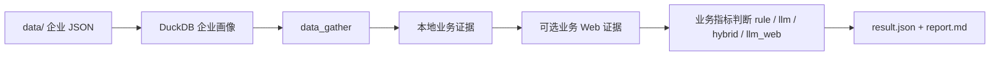

# XFT 企业产品推荐工具

XFT 用本地企业画像、业务规则、LLM 和可选的业务指标级 Web 搜索，生成面向销售/业务人员的产品推荐结果。

当前产品推荐的配置文件聚焦到 `business_modules.yaml` + `business_modules.d/*.yaml`。

## 一句话流程



推荐图：

```text
data_gather -> business_web_evidence -> business_recommend -> save
```

## 快速运行

### 1. 安装依赖

```bash
uv sync
```

### 2. 构建本地企业画像库

把企业 JSON 放到 `data/` 后执行：

```bash
uv run xft warehouse build --input data --output cache/company_warehouse.duckdb
```

### 3. 验证推荐场景配置

```bash
uv run xft scenario validate config/recommend/sales_recommendation
```

正常会看到类似：

```json
{
  "scenario_id": "sales_recommendation",
  "scenario_name": "销售产品推荐",
  "root": "config/recommend/sales_recommendation",
  "web_enabled": true,
  "business_modules": 7
}
```

### 4. 离线跑推荐

`--scenario` 默认为 `config/recommend/sales_recommendation`，日常可省略：

```bash
uv run xft recommend --no-llm "企业名称"
```

### 5. 启用 LLM

配置 `.env` 中的 LLM key 后执行：

```bash
uv run xft recommend "企业名称"
```

### 6. 启用业务 Web 证据

业务 Web 服务 `business_modules.d` 中配置了 `web_search` 的指标。`llm_web` 默认 Web-first，`llm/hybrid/rule` 可按 `web_search.when` 在证据不足或规则未命中时补证。

```bash
uv run xft recommend --with-business-web "企业名称"
```

刷新业务 Web 缓存：

```bash
uv run xft recommend --with-business-web --business-web-refresh "企业名称"
```

指定 provider：

```bash
uv run xft recommend --with-business-web --business-web-provider minimax_search "企业名称"
```

## 输出文件

每次运行会写入 `recommendation_runs/sales_recommendation/<run_id>/`：

| 文件 | 用途 |
| --- | --- |
| `result.json` | 最终业务交付结果，业务人员优先看这个 |
| `report.md` | 人类可读推荐报告 |
| `business_label_result.json` | 全量模块、标签、指标判断明细 |
| `business_indicator_evidence.json` | 本地证据和业务 Web 证据合并后的指标证据 |
| `business_web_queries.jsonl` | 业务 Web 查询记录，仅启用业务 Web 时生成 |
| `business_web_results.jsonl` | 业务 Web 搜索结果，仅启用业务 Web 时生成 |
| `business_web_trace.json` | 业务 Web 执行 trace，仅启用业务 Web 时生成 |
| `profile.json` | 企业画像 |
| `decision_trace.json` | 规则、LLM、业务 Web 决策过程 |
| `llm_calls.jsonl` | LLM 原始调用记录 |
| `llm_metrics.json` | LLM 调用统计 |
| `scenario_resolved.json` | 本次运行解析后的场景配置 |
| `config_manifest.json` | 本次运行使用的配置文件及其哈希 |

## 配置目录

推荐主场景目录：

```text
config/recommend/sales_recommendation/
  scenario.yaml
  business_modules.yaml
  business_modules.d/
    个税管理.yaml
    假勤管理.yaml
    对公报账.yaml
    差旅报销.yaml
    日常报销.yaml
    进项发票.yaml
    销项发票.yaml
  web_search.yaml
```

### `scenario.yaml`

场景入口只声明主配置、Web provider 配置、输出目录和业务 Web 缓存目录：

```yaml
version: "1.0"
id: sales_recommendation
name: 销售产品推荐
description: 面向企业软件销售线索的产品模块推荐场景

web_search_config: web_search.yaml
business_modules_config: business_modules.yaml

output_dir: ../../../recommendation_runs/sales_recommendation
web_cache_root: ../../../data/web_business/sales_recommendation
```

### `business_modules.yaml`

全局配置文件只放版本、场景、评分、全局接受策略和模块目录：

```yaml
version: "1.0"
scenario: sales_recommendation
scoring:
  indicator_scores:
    matched: 10
    possible: 5
    unknown: 0
    not_matched: 0
  label_scores:
    matched: 30
    possible: 15
    unknown: 0
    not_matched: 0
acceptance_policy:
  levels:
    - result: 高
      min_matched_labels: 3
      conclusion: 企业满足{attributes_number}个属性标签及{indicators_number}个指标，接受度为高。
    - result: 中高
      min_matched_labels: 2
      conclusion: 企业满足{attributes_number}个属性标签及{indicators_number}个指标，接受度为中高。
    - result: 低
      min_matched_labels: 0
      conclusion: 企业满足{attributes_number}个属性标签及{indicators_number}个指标，接受度为低。
modules_dir: business_modules.d
```

### `business_modules.d/*.yaml`

一个业务模块一个文件。新增模块时添加一个 YAML 文件，删除模块时删除对应文件，系统会动态识别 `modules_dir` 下所有 `*.yaml`。

模块文件示例：

```yaml
module_id: 日常报销
module_name: 日常报销
priority: 50
base_score: 0
labels:
  - label_id: 销售属性
    label_name: 销售属性
    min_matched_indicators: 1
    indicators:
      - indicator_id: 渠道销售岗位
        indicator_name: 渠道销售岗位
        evaluator: rule
        standard: 招聘标题包含销售或渠道
        data_sources:
          - type: table
            table: recruitments
            field: title
            op: text_contains
            keywords:
              - 销售
              - 渠道
```

### evaluator

| evaluator | 适合场景 | 是否需要 LLM | Web 角色 |
| --- | --- | ---: | --- |
| `rule` | 结构化字段明确，例如资质、标签、招聘表字段 | 否 | 可选，仅补线索；配置 `possible_on_evidence` 时最多提升到 `possible` |
| `llm` | 需要综合企业画像文本和本地证据推理 | 是 | 可选，通常 `when: insufficient` |
| `hybrid` | 规则先处理硬证据，LLM 补充模糊判断 | 可选 | 可选，通常在规则/本地证据不足时补证 |
| `llm_web` | 本地库基本不可能有、必须查公开网页的信息 | 是 | 必选，默认 `when: always` |

配置优先级建议：

1. 能用 `profile` 字段或 DuckDB 明细表判断的指标，优先配置成 `rule`。
2. 有明确本地信号、但需要补充解释或公开证据的指标，配置成 `hybrid` + `merge_policy: rule_first`。
3. 只有公开网页才可能判断的指标，才配置成 `llm_web`。

`rule` 可以使用 `rule.source_field` 直接读画像字段，也可以用 `data_sources` 从画像字段或 DuckDB 明细表取证据。当前表级 `data_sources` 支持：

```text
recruitments.title/city/district/education/experience/salary_text/employer_number/source
branches.branch_name/reg_status/legal_person
qualifications.qualification_name/qualification_type/level_name/issuing_org
outbound_investments.invested_company_name/proportion/reg_status
key_personnel.person_name/role/affiliate_company_count
```

`web_search` 是指标级 Web policy，所有 evaluator 都可以配置；`llm_web` 必须配置。常用字段：

- `when`: `always`、`insufficient`、`rule_not_matched`、`never`
- `effect`: `llm_evidence`、`evidence_only`、`possible_on_evidence`
- `fixed_queries`: 固定搜索词，支持 `{company_name}`
- `auto`: 可选 LLM 自动生成少量补充搜索词
- `max_results`: 每个查询最多保留结果数

重要约束：

- `data_sources` 的 `text_contains` 必须配置具体 `keywords`，不要留空；否则本地证据会退化成“只要有记录就像命中”。
- `fixed_queries` 应该带指标词，例如“海外出差”“售后派驻”“开票专员”，不要只写 `{company_name} 官网` / `{company_name} 新闻`。
- Web 结果进入证据前会同时检查目标公司和指标相关词；`llm_web` 没有实际 Web 证据时会返回 `unknown`，不会空证据调用 LLM。

Web-first 指标：

```yaml
evaluator: llm_web
standard: 企业公开信息显示存在海外业务
prompt: 请判断企业是否存在海外业务，只能基于证据判断，不得编造。
web_search:
  when: always
  effect: llm_evidence
  fixed_queries:
    - "{company_name} 官网"
    - "{company_name} 海外业务"
  auto: false
  max_results: 5
```

本地证据不足时补证：

```yaml
evaluator: hybrid
web_search:
  when: insufficient
  effect: llm_evidence
  fixed_queries:
    - "{company_name} 差旅 报销 制度"
  auto:
    enabled: true
    max_queries: 2
    intent: 判断企业是否有差旅、商旅、报销、费控管理需求
```

规则未命中时只补线索：

```yaml
evaluator: rule
web_search:
  when: rule_not_matched
  effect: possible_on_evidence
  fixed_queries:
    - "{company_name} 工厂 分支机构"
```

## `web_search.yaml`

`web_search.yaml` 只配置业务指标级 Web 搜索 provider，不再承担旧的抓取、抽取、入库链路。

```yaml
version: "1.1"
enabled: true
cache_root: data/web
default_providers:
  - minimax_search

providers:
  minimax_search:
    type: minimax
    enabled: true
    max_results: 5
    timeout_seconds: 30

execution:
  max_results_per_query: 5
```

场景里的 `web_cache_root` 会覆盖 `cache_root`，销售推荐默认写到 `data/web_business/sales_recommendation`。

## LLM 调试

测试阶段建议加上：

```bash
uv run xft recommend --llm-debug "企业名称"
```

运行产物里会保留：

```text
llm_calls.jsonl
llm_metrics.json
decision_trace.json
```

## 批量与校准

准备企业名单：

```text
company.txt
```

批量推荐：

```bash
uv run xft recommend --company-list company.txt --no-llm --limit 10
```

批量校准：

```bash
uv run xft calibrate \
  --company-list company.txt \
  --labels calibration_labels.csv \
  --limit 10
```

标注 CSV 推荐字段：

```csv
company_name,expected_top_module,acceptable_modules,comment
某公司,日常报销,日常报销；差旅报销,人工标注说明
```

启用业务 Web 校准：

```bash
uv run xft calibrate \
  --company-list company.txt \
  --labels calibration_labels.csv \
  --with-business-web \
  --limit 10
```

## Docker

构建镜像：

```bash
docker build -t xft-dd .
```

运行帮助：

```bash
docker run --rm xft-dd uv run xft --help
```

挂载本地数据和输出目录后运行推荐：

```bash
docker run --rm \
  -v "$PWD/data:/app/data" \
  -v "$PWD/cache:/app/cache" \
  -v "$PWD/recommendation_runs:/app/recommendation_runs" \
  xft-dd uv run xft recommend --no-llm "企业名称"
```

## 更多文档

- [架构说明](docs/ARCHITECTURE.md)
- [业务评分规则](docs/SCORING.md)
- [冒烟验证](docs/SMOKE.md)
- [下一步计划](docs/NEXT.md)
- [技术债](docs/TECH_DEBT.md)
