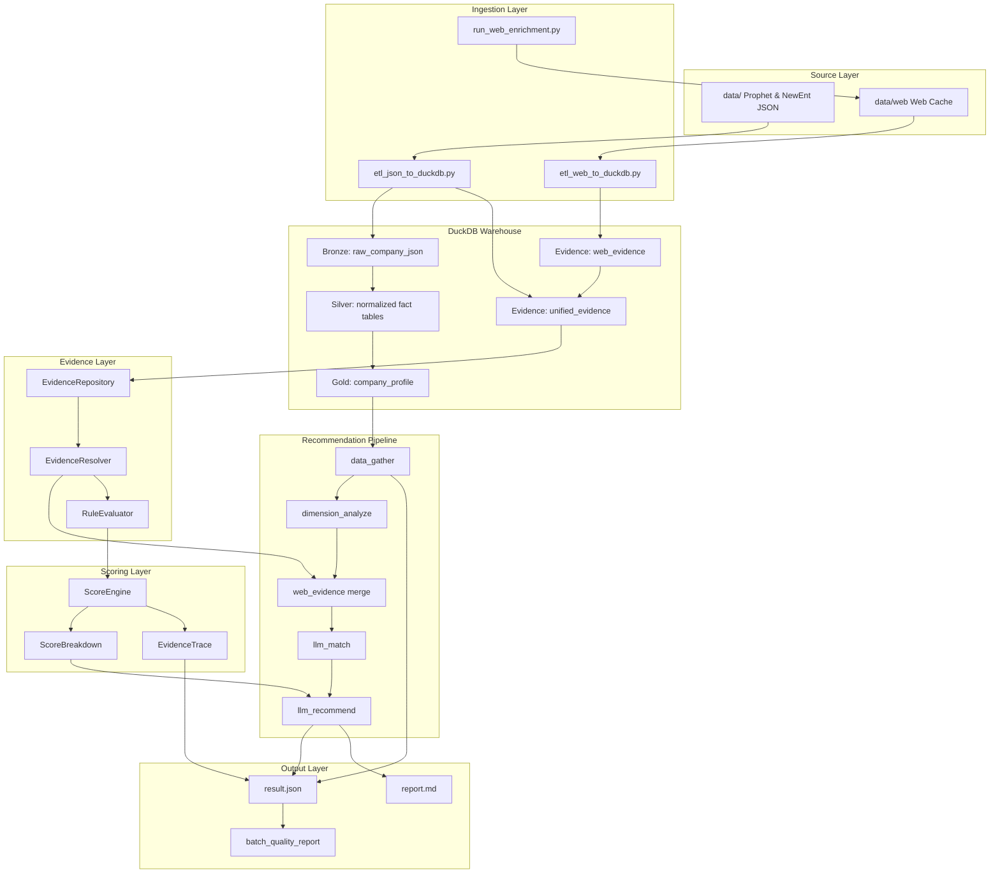
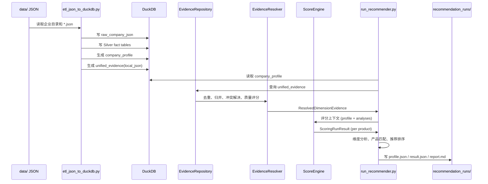
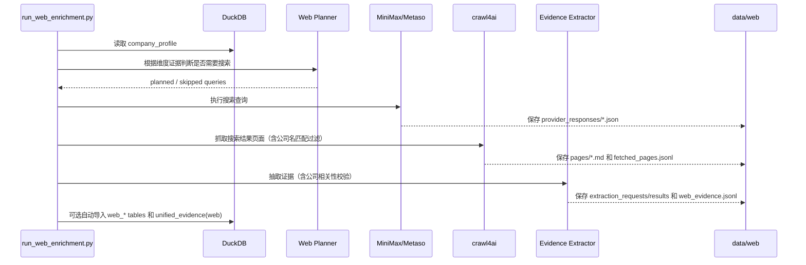

# xft-dd-craw4ai 当前架构

本项目已经从早期"搜索 -> 总结 -> 合并报告"的单一路线，重构为以 DuckDB 事实层为中心的企业画像与产品推荐架构。旧报告流水线仍保留，主要作为 MiniMax Search、Metaso、crawl4ai、LLM 结构化抽取等能力的复用来源；新的主链路以本地 JSON 和 Web evidence 入库后的结构化证据为基础。

## 总体架构图



核心原则：

- `DuckDB` 是事实中心，推荐流程不直接读取零散 JSON 或临时搜索结果。
- `company_profile` 提供快速企业画像，适合推荐和筛选。
- `unified_evidence` 承接本地 JSON 证据、Web 补证和后续人工证据，是长期证据接口。
- `EvidenceRepository` + `EvidenceResolver` 提供统一的证据查询、去重、冲突解决和质量评分。
- `ScoreEngine` 基于配置规则（positive/negative/exclusion）对产品做可追溯评分。
- Web 搜索结果必须先缓存到 `data/web/`，再经过抽取和 ETL 入库，最后才进入推荐。
- 旧报告流水线不再是新主线，但其中搜索、抓取、结构化抽取、来源判断能力会继续复用。

## 当前主链路

```text
data/ Prophet/NewEnt JSON
  -> etl_json_to_duckdb.py
  -> DuckDB warehouse
  -> company_profile / unified_evidence
  -> run_recommender.py
  -> recommendation_runs/.../report.md
```

推荐流水线（6 节点）：

```text
data_gather → dimension_analyze → web_evidence → llm_match → llm_recommend → save
```

可选 Web 补证链路：

```text
run_web_enrichment.py
  -> data/web 原始响应、页面正文、中间抽取文件、web_evidence.jsonl
  -> etl_web_to_duckdb.py
  -> web_* tables / unified_evidence
  -> run_recommender.py --with-web-evidence
```

也可以让推荐流程在缺少 Web 证据时自动补证：

```bash
uv run python run_recommender.py --with-web "企业名称"
```

默认会复用已有 `data/web/` 缓存；如需强制刷新：

```bash
uv run python run_recommender.py --with-web --refresh-web "企业名称"
```

## 核心原理

### 1. Bronze / Silver / Gold

`etl_json_to_duckdb.py` 对 `data/` 做分层入库：

- Bronze：`raw_company_json` 保留每个原始 JSON 文件、文件 hash、抓取时间、解析状态。
- Silver：把常用实体解析为结构化表，例如企业主体、股东、人员、风险、招聘、招投标、资质。
- Gold：`company_profile` 把推荐常用字段压成一张宽表，作为推荐主入口。

原始数据永远可追溯；业务推荐不需要知道每个 Prophet/NewEnt JSON 的复杂路径；后续新增字段时可以先落 Bronze，再逐步提取到 Silver 或 Evidence。

### 2. 统一证据层

`unified_evidence` 把不同来源的信息统一成标准形状：

```text
evidence_id
company_name / credit_code
dimension_id
source_type: local_json | web | manual | rule
source_name / source_path / source_url / source_field
claim / value
confidence
authority_level
relation_to_profile: primary | supplement | confirmation | conflict | inference
conflict_note / resolution
raw_ref / created_at
```

本地 JSON 画像写成 `source_type=local_json`、`relation_to_profile=primary`；Web 抽取写成 `source_type=web`，并区分补充、佐证和冲突。推荐侧只需要理解 evidence，不需要关心底层来自 JSON、搜索摘要还是网页正文。

### 3. 证据仓库与冲突解决 (EvidenceRepository & Resolver)

`EvidenceRepository` 提供按企业、维度、来源类型、冲突关系查询的统一入口。`EvidenceResolver` 在每次推荐运行时对证据做实时处理：

- **去重**：按 `(claim, source_type, source_field, source_url)` 去重。
- **归并**：按 `source_field` 分组，同一字段上的多条证据合并比较。
- **冲突解决**：Web 与本地 JSON 冲突时，默认 `resolution=use_local`（本地优先）。
- **来源权威度 boost**：高权威来源（政府网站、官方备案）自动提升置信度一级。
- **质量评分 (0-100)**：综合 primary、confirmation、supplement、inference、conflict 数量计算维度证据质量分。
- **兜底提升**：当某维度无 primary 证据时，最好的 Web 证据自动提升为 primary。

推荐报告和 `result.json` 会输出每条证据的归属（本地/Web）、冲突标注和解决策略。

### 4. 配置驱动的产品评分引擎 (ScoreEngine)

产品评分从硬编码规则升级为配置驱动。每个产品模块可在 `products.yaml` 中定义：

```yaml
positive_rules:       # 命中加分
  - id: procurement_signal
    dimension_id: supply_chain_procurement
    evidence_type: supported
    weight: 20
    reason: 供应链维度已有证据支持
negative_rules:       # 命中扣分
  - id: missing_amount
    missing_evidence: 年采购金额
    penalty: 8
    reason: 缺少年采购金额
exclusion_rules:      # 命中降权（分数封顶 20）
  - id: inactive_company
    source_field: reg_status
    op: "!="
    value: 存续
    reason: 企业状态非存续
```

每条推荐输出完整的 `ScoreBreakdown`：

```text
base_priority         基础优先级分
dimension_support     维度覆盖分
evidence_support      本地证据分
web_support           Web 补证分
positive_score        命中正向规则加分
negative_score        命中负向规则扣分
missing_evidence_penalty  缺失证据扣分
conflict_penalty      冲突扣分
final_score           最终得分 (0-100)
matched_rules         命中的正向规则及证据 ID
penalty_rules         命中的扣分规则
exclusion_rules       命中的排除规则
```

同时输出 `evidence_trace`，每条推荐可追溯到具体证据 ID、来源、声明和置信度。LLM 路径的输出也会被评分引擎重新校准（`_with_explainability`），确保排序稳定、分数可解释。

### 5. 维度分析

`dimension_analyze` 根据 `analysis_dimensions.yaml` 工作。每个维度定义：

- 读取哪些本地字段。
- 如何把字段格式化为事实证据。
- 哪些证据不足需要 Web 或人工补充。
- 本地规则如何产生弱推断（`support_rules`）。
- Web 查询模板是什么。

维度分析输出结构化 `DimensionAnalysis`，包含：

```text
facts                 人类可读事实
inferences            规则推断
local_evidence        本地 JSON 证据 (EvidenceRecord)
inference_evidence    规则推断证据
web_evidence          Web 补证/佐证
conflicts             Web 与本地画像冲突
missing_evidence      仍缺失的证据项
status                supported | partial | insufficient
confidence            高 | 中 | 低 | 待补充
```

### 6. 产品匹配与推荐

推荐分两步：

1. `llm_match`：判断每个产品模块是否匹配企业当前需求，输出分数、置信度、理由和缺失证据。fallback 使用结构化 evidence 和冲突数量调整分数。
2. `llm_recommend`：基于匹配结果和评分引擎生成最终推荐列表、切入话术和报告摘要。LLM 输出会被评分引擎校准排序和分数。

如果 LLM 不可用，系统走 deterministic fallback，仍能生成可运行的 MVP 报告。LLM prompt 明确要求基于证据，不允许把 `web_search_queries` 或缺失证据当成事实。

### 7. Web 缓存与重放 (Multi-Level Cache)

Web enrichment 实现了多级缓存，支持选择性失效和重放：

```text
cache_index.json (v1.1)
  runs/{run_id}/
    queries[]          cache_key, provider_params_hash, result_count
    pages[]            url, content_hash, page_path
    extractions[]      extraction_cache_key, prompt_hash, evidence_count
```

缓存策略：

- **搜索缓存**：key 包含 provider 参数哈希、max_results、cache policy version。provider 配置变化自动失效。
- **抓取缓存**：按 content hash 复用 `pages/*.md`。同一 URL 跨 run 命中时复制页面文件。
- **抽取缓存**：key 包含结果指纹、prompt 版本、prompt 文件 hash、抽取模型、抽取配置 hash。prompt 或模型变化自动失效。

CLI 支持细粒度刷新：

```bash
run_web_enrichment.py --refresh-search       # 仅重搜
run_web_enrichment.py --refresh-fetch        # 仅重抓
run_web_enrichment.py --refresh-extraction   # 仅重抽
run_web_enrichment.py --extract-only --source-run-id web_xxx  # 从已有搜索结果重放抽取
```

每个 Web run 生成 `web_cache_report.json/md`，记录搜索/抓取/抽取的复用与重跑计数。

### 8. 场景 Bundle (Scenario)

支持不同业务场景拥有独立的产品、维度、prompt、Web provider 策略：

```text
config/scenarios/sales_recommendation/
  scenario.yaml              # 场景入口（id, name, 路径配置）
  products.yaml              # 场景专属产品
  analysis_dimensions.yaml   # 场景专属维度
  web_search.yaml            # 场景专属 Web 搜索
  web_extract_llm.yaml       # 场景专属抽取配置
  prompts/                   # 场景专属 prompt
```

CLI 使用：

```bash
run_recommender.py --scenario config/scenarios/sales_recommendation "企业名称"
run_web_enrichment.py --scenario config/scenarios/sales_recommendation "企业名称"
```

场景会自动切换产品、维度、prompt、Web 配置、推荐输出目录和 Web cache root。旧配置路径继续兼容。

### 9. 批量运行与质量报告 (Batch Runner)

支持从企业列表批量运行推荐并生成交付产物：

```bash
uv run python run_recommender.py \
  --scenario config/scenarios/sales_recommendation \
  --company-list company.txt \
  --with-web-evidence \
  --batch-id batch_sales_demo \
  --batch-output recommendation_runs/batches \
  --skip-existing
```

批量模式产出：

```text
recommendation_runs/batches/{batch_id}/
  batch_manifest.json         # 批次元信息
  companies.txt               # 企业清单
  runs/{company}/             # 每家企业独立目录
    report.md
    result.json
  batch_summary.json          # 汇总表（含证据计数、评分规则、冲突数）
  batch_summary.csv
  batch_quality_report.json   # 质量指标
  batch_quality_report.md     # 人类可读质量报告
  failed_companies.txt        # 失败清单（可做 --rerun-failed）
  delivery_manifest.json      # 交付文件清单
```

质量报告指标：

- 成功/部分成功/失败/跳过数量。
- 平均画像完整度、平均 Top 推荐分。
- Top 产品分布。
- 高冲突企业（冲突 ≥3 处）。
- 低完整度企业（完整度 < 60%）。
- 失败企业清单及错误原因。

`--skip-existing` 按稳定的企业目录名判断，可安全中断和续跑。

### 10. 人类可读进度输出

CLI 默认输出结构化中文进度，显示流水线各阶段的关键决策：

```text
═══ 开始分析：广东信华电器有限公司 ═══

📊 阶段 1/5: 加载企业画像
  ✓ DuckDB → company_profile 表 → 命中 (行业: 制造业, 完整度: 87%)
📊 阶段 2/5: 维度分析
  ✓ 10 个维度, 28 条事实 (supported:7 partial:3)
  ├─ hr_workforce: partial (需Web补充)
📊 阶段 3/5: Web 证据采集
  ✓ unified_evidence 表 → 22 条证据 → 3 个维度
  ├─ hr_workforce: 5条Web → 质量 75 (high)
📊 阶段 4/5: 产品匹配
  ✓ LLM 分析完成 → 8 个候选产品
📊 阶段 5/5: 生成报告
  ✓ report.md
```

Web 搜索时展示搜索查询、结果数、页面抓取状态、LLM 提取统计和相关性过滤。使用 `--verbose` 可同时输出 structlog 详细日志。

### 11. Web 证据相关性过滤

三层公司验证，确保 Web 证据确实关于目标企业：

1. **LLM prompt**：在 `extract_evidence_system.md` 中明确要求"先判断每个 Web 来源是否确实关于该目标企业"，不相关的返回空 claims。
2. **抓取前过滤** (`_should_fetch`)：提取公司核心名称（如"广东信华电器有限公司" → "信华电器"），页面标题或摘要不含核心名称的跳过抓取。
3. **抽取后过滤** (`_is_relevant_claim`)：claim 中必须出现公司全名或核心名称，否则丢弃。

同一 URL 只抓取一次（按 URL 去重）。

## 数据流向图

### 本地 JSON 到推荐报告



### Web 补证到 DuckDB



Web 补证遵循"本地 JSON 优先"：

- 如果本地画像已经覆盖某个维度，planner 默认跳过该维度的 Web 搜索。
- 如果 Web 信息与 JSON 信息冲突，`relation_to_profile=conflict`，并默认 `resolution=use_local`。
- 原始响应、页面正文、中间抽取请求和抽取结果都会保留在 `data/web/`，便于审计和重放。

## DuckDB 分层

```text
Bronze
  raw_company_json
  company_import_status

Silver
  companies / company_labels / key_personnel / shareholders
  ip_summary / risk_features / recruitments / bidding_summary
  qualifications / branches / financing_events / outbound_investments

Gold / Evidence
  company_profile
  web_search_runs / web_search_queries / web_search_results
  web_pages / web_evidence
  unified_evidence
```

## 关键入口

```text
etl_json_to_duckdb.py              # data/ JSON -> DuckDB
run_web_enrichment.py              # Web 搜索、抓取、抽取、缓存
etl_web_to_duckdb.py               # data/web -> DuckDB Web 表
run_recommender.py                 # 推荐主入口

src/xft/warehouse/                 # DuckDB 本地仓库
src/xft/evidence/                  # 统一证据模型、仓库、冲突解决
src/xft/ai/                        # 公共 LLM client / JSON 抽取工具
src/xft/web/                       # Web enrichment 服务与缓存
src/xft/scoring/                   # 配置驱动评分引擎
src/xft/pipeline/recommender/      # 推荐图、维度分析、报告渲染
src/xft/nodes/                     # legacy 报告流水线节点（待迁入 pipeline/diligence）

src/diligence/                     # 兼容期旧包名，暂时保留
```

当前新入口脚本已经使用 `xft.*` import；`diligence.*` 仍作为兼容路径保留，后续会逐步迁移到 `xft.pipeline.diligence`。

## 常用命令

初始化或重建本地 JSON 仓库：

```bash
uv run python etl_json_to_duckdb.py --input data --output cache/company_warehouse.duckdb
```

离线跑推荐：

```bash
uv run python run_recommender.py --no-llm "企业名称"
```

单独准备 Web 缓存但不入库：

```bash
uv run python run_web_enrichment.py --no-etl "企业名称"
```

选择性重跑 Web enrichment：

```bash
uv run python run_web_enrichment.py --refresh-search "企业名称"
uv run python run_web_enrichment.py --refresh-extraction "企业名称"
uv run python run_web_enrichment.py --extract-only --source-run-id web_xxx "企业名称"
```

从 Web 缓存重建 DuckDB Web 表：

```bash
uv run python etl_web_to_duckdb.py --input data/web --warehouse cache/company_warehouse.duckdb --rebuild
```

读取已有 Web 证据生成推荐：

```bash
uv run python run_recommender.py --with-web-evidence "企业名称"
```

自动补证并推荐（缓存缺失时触发搜索）：

```bash
uv run python run_recommender.py --with-web "企业名称"
```

按场景运行推荐：

```bash
uv run python run_recommender.py \
  --scenario config/scenarios/sales_recommendation \
  "企业名称"
```

批量运行并生成交付产物：

```bash
uv run python run_recommender.py \
  --scenario config/scenarios/sales_recommendation \
  --company-list company.txt \
  --with-web-evidence \
  --batch-id batch_sales_demo \
  --batch-output recommendation_runs/batches \
  --skip-existing
```

## 配置

兼容三种配置方式：

**1. 传统平铺配置：**

```text
config/recommender/products.yaml
config/recommender/analysis_dimensions.yaml
config/recommender/web_search.yaml
config/recommender/web_extract_llm.yaml
config/recommender/prompts/
```

**2. 场景 Bundle：**

```text
config/scenarios/sales_recommendation/
  scenario.yaml
  products.yaml
  analysis_dimensions.yaml
  web_search.yaml
  web_extract_llm.yaml
  prompts/
```

`--scenario` 会同时切换产品、维度、prompt、Web 配置、推荐输出目录和 Web cache root。

**3. 产品评分规则（在 products.yaml 中）：**

```yaml
- module_id: procurement_srm
  module_name: 供应商关系管理(SRM)
  priority: 90
  base_score: 45
  target_needs: [supply_chain_procurement, business_product]
  match_rule: 制造业、采购链条较长的企业...
  positive_rules:
    - id: procurement_signal
      dimension_id: supply_chain_procurement
      evidence_type: supported
      weight: 20
      reason: 供应链维度已有证据支持
  negative_rules:
    - id: missing_amount
      missing_evidence: 年采购金额
      penalty: 8
      reason: 缺少年采购金额
  exclusion_rules:
    - id: inactive_company
      source_field: reg_status
      op: "!="
      value: 存续
      reason: 企业状态非存续
```

### 维度配置 (`analysis_dimensions.yaml`)

每个维度是一个独立条目，完整字段如下：

```yaml
dimensions:
  - id: supply_chain_procurement     # 唯一标识 (snake_case)
    level1: 供应链与采购管理          # 一级分类
    level2: 采购规模与特征            # 二级分类
    level3: 供应链复杂度              # 三级分类
    role: 供应链管理与商业调研专家     # LLM 角色描述
    local_fields:                    # 从 company_profile 读取的字段
      - industry
      - employee_count
      - business_scope
      - bidding_total
      - qualification_count
    evidence_templates:              # 报告中展示的证据项 (字段→中文标签)
      - field: industry
        label: 行业
      - field: employee_count
        label: 员工规模
      - field: bidding_total
        label: 招投标数量
    insufficient_evidence:           # 预期但缺失的证据，报告标记为"数据缺口"
      - 供应商数量
      - 前五大供应商集中度
      - 年采购金额
    analysis_prompt: |               # LLM 维度分析系统提示词
      判断企业是否存在采购协同、供应商准入、供应商绩效等数字化需求。
      只能基于已提供证据分析，不得编造供应商数量、采购金额。
    evidence_policy: |               # 证据强度说明
      直接采购数据优先于行业和规模推断。制造业、员工规模只能作为间接线索。
    support_rules:                   # 可选：本地自动推断规则
      - field: employee_count
        op: ">="
        value: 200
        claim: 员工规模较大，可能存在采购流程协同与供应商管理需求。
        confidence: 低
      - field: bidding_total
        op: ">"
        value: 0
        claim: 存在招投标记录，可作为项目型采购管理复杂度线索。
        confidence: 低
    web_search_queries:              # 可选：Web 搜索查询模板
      - "{company_name} 供应商"       # {company_name} 运行时自动替换
      - "{company_name} 采购"
      - "{company_name} 招投标"
```

**字段说明：**

| 字段 | 必填 | 说明 |
|------|:----:|------|
| `id` | ✓ | 唯一标识，被 `products.yaml` 的 `target_needs` 和 `dimension_id` 引用 |
| `level1/2/3` | ✓ | 三级分类，用于报告分组展示 |
| `local_fields` | ✓ | 必须与 `company_profile` 表列名一致，支持嵌套路径如 `ip_counts.patent` |
| `evidence_templates` | | 字段到中文标签的映射，报告展示用 |
| `insufficient_evidence` | | 缺失证据列表，报告会输出为"建议进一步核实" |
| `support_rules` | | 本地规则推断，fallback 模式下自动执行，LLM 模式作为参考上下文 |
| `web_search_queries` | | 使用 `{company_name}` 占位符，同时支持 `{industry}` 和 `{industry_big}` |

**`op` 操作符：** `==` `!=` `>` `>=` `<` `<=` `contains` `exists`

**`confidence` 取值：** `高` `中` `低`

新增维度只需在 YAML 中添加一个条目，无需改代码。维度会自动出现在报告和 `result.json` 中。

### 产品规则配置 (`products.yaml`)

每个产品模块支持三种规则：

```yaml
products:
  - module_id: procurement_srm             # 唯一标识
    module_name: 供应商关系管理(SRM)        # 展示名称
    priority: 90                           # 基础优先级 (0-100)
    base_score: 50                         # 基础分
    target_needs:                          # 关联维度 (引用 dimension.id)
      - supply_chain_procurement
      - business_product
    match_rule: 制造业、采购链条较长的企业...  # LLM 匹配规则描述

    # ── 正向规则：命中加分 ──
    positive_rules:
      # 维度状态匹配
      - id: procurement_dimension_supported
        dimension_id: supply_chain_procurement
        evidence_type: supported            # supported | partial | insufficient
        weight: 18                          # 加分值
        reason: 供应链维度已有证据支持
      # 画像字段条件
      - id: bidding_signal
        source_field: bidding_total          # company_profile 字段名
        op: ">"                              # 操作符
        value: 0                             # 阈值
        weight: 10
        reason: 存在招投标记录

    # ── 负向规则：命中扣分 ──
    negative_rules:
      # 证据缺失
      - id: missing_supplier_count
        missing_evidence: 供应商数量
        penalty: 5                           # 扣分值
        reason: 缺少供应商数量
      # 存在冲突
      - id: conflict_penalty
        relation_to_profile: conflict
        penalty: 8
        reason: 存在 Web 与本地画像冲突

    # ── 排除规则：命中排除该产品 ──
    exclusion_rules:
      - id: inactive_company
        source_field: reg_status
        op: "!="
        value: 存续
        reason: 企业状态非存续
```

**规则类型一览：**

| 规则类型 | 触发条件 | 效果 |
|----------|----------|------|
| `positive_rules` | `dimension_id` + `evidence_type` 匹配 | 加 `weight` 分 |
| `positive_rules` | `source_field` + `op` + `value` 匹配 | 加 `weight` 分 |
| `negative_rules` | `missing_evidence` 命中 | 扣 `penalty` 分 |
| `negative_rules` | `relation_to_profile: conflict` 存在冲突 | 扣 `penalty` 分 |
| `exclusion_rules` | `source_field` + `op` + `value` 匹配 | 产品被排除 (`excluded: true`) |

**`source_field` 支持嵌套路径**，例如 `ip_counts.patent`、`bank_flags.high_quality_customer`、`risk_counts.self`、`cross_border_flags.labels`。

**评分公式：**

```text
final_score = base_score
            + dimension_support      # 关联维度覆盖分
            + evidence_support       # 本地证据分
            + web_support            # Web 补证分
            + positive_score         # 命中 positive_rules 加分总和
            - negative_score         # 命中 negative_rules 扣分总和
            - missing_evidence_penalty  # 缺失证据扣分
            - conflict_penalty       # 冲突扣分
```

修改 YAML 后重新跑推荐即可看到评分变化。`result.json` 中 `score_breakdown.matched_rules` / `penalty_rules` / `exclusion_rules` 会列出每条命中的规则及证据 ID，`report.md` 会展示分项得分和命中规则。修改规则不影响 LLM 匹配逻辑，但会影响最终排序和分数。

## 输出文件

每次推荐运行生成：

```text
recommendation_runs/{run_id}/
  profile.json               # 企业画像
  dimension_analysis.json    # 维度分析（含 evidence）
  match_results.json         # 产品匹配结果
  result.json                # 结构化推荐结果
  report.md                  # Markdown 推荐报告
```

`result.json` 结构：

```text
company_name / scenario / scenario_name
summary
recommendations[]
  rank / module_id / module_name / score / priority
  business_need / reason / suggested_pitch
  evidence_dimensions / data_gaps
  score_breakdown            # 完整分项得分
    base_priority / dimension_support / evidence_support
    web_support / positive_score / negative_score
    missing_evidence_penalty / conflict_penalty
    final_score / excluded
    matched_rules[] / penalty_rules[] / exclusion_rules[]
  evidence_trace[]           # 每条推荐的证据溯源
    evidence_id / dimension_id / source_type
    source_name / source_url / source_field
    claim / confidence / relation_to_profile
evidence_summary             # 全局证据统计
  local_evidence_count / web_evidence_count
  conflict_count / missing_evidence_count
  by_dimension[]
conflict_summary[]           # 冲突清单
scoring_summary              # 评分运行统计
needs_web_enrichment / profile_completeness
```

## 设计原则

- 本地事实层优先，Web search 后补。
- 原始数据完整保留，结构化解析逐步推进。
- 推荐模块只依赖稳定 Gold 层，不直接绑定 JSON 文件形状。
- 配置优先：产品规则、维度、评分策略全部外置到 YAML。
- 证据不足要显式表达，不用模型想象补齐。
- 评分可追溯：每条推荐可追溯到具体证据和规则。
- 场景隔离：不同业务场景的产品、维度、prompt 独立配置。
- 批量可交付：一次运行产出报告、质量指标和交付清单。

## 当前限制

- Web 抽取 LLM 底层 client 暂时复用项目现有 OpenAI-compatible client。
- `dimension_analyze` 的本地推断规则较轻量，适合作为 MVP，不等于完整专家判断。
- 复杂字段还没有全部从 47 类 JSON 中解析出来。
- `company_profile` 是当前唯一稳定 Gold 接口，未来可以增加更多 Gold 表。
- 当前报告是 Markdown 简报，不是最终商业交付版报告。
- 场景继承和 overlay 尚未支持，每个场景需独立维护完整配置。

## 后续计划

- 增加第二个真实业务场景（如 `bank_marketing`），验证场景隔离设计的完备性。
- 支持场景配置继承或 overlay，减少跨场景复制。
- 将 `score_levels`、报告结构也纳入场景配置。
- 增加 `.xlsx` 汇总交付和 `.zip` 交付包。
- 扩展更多 JSON 文件到 Silver 表。
- 增加 DuckDB schema version 和 migration 策略。
- 增加 `--rerun-failed` 直接读取上一批 `failed_companies.txt`。

更详细的技术文档见 `DUCK.md`，Prophet 数据字段参考见 `docs/prophet-data-catalog.md`。
