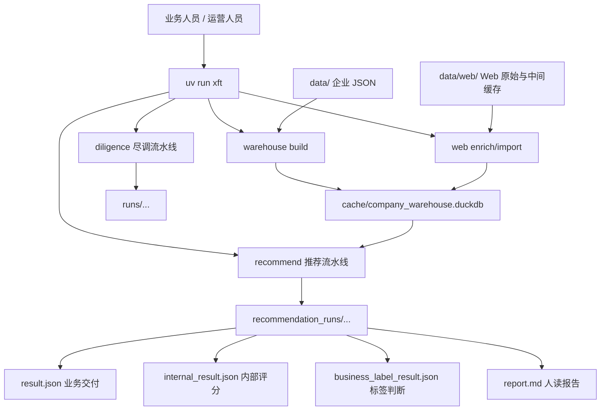
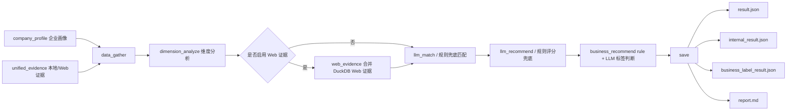
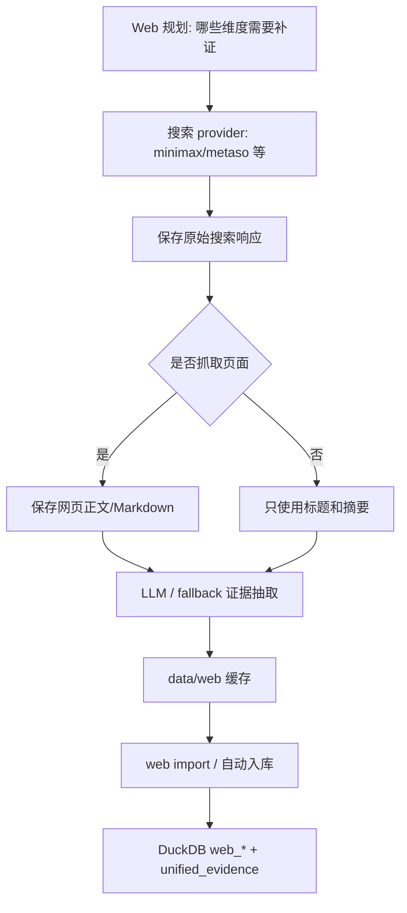
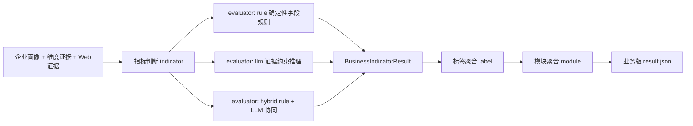

# XFT 当前架构说明

本文档面向开发者，记录当前真实架构。业务人员使用说明请看根目录 [README.md](../README.md)。

## 当前定位

XFT 当前是一个 **命令行驱动的企业分析与推荐平台**。

当前优先级是：

1. 保证两条现有流水线正确运行。
2. 让业务人员主要通过配置完成验证和调优。
3. 保持 README 和 docs 与代码真实状态一致。

暂时不追求复杂抽象和更多扩展点，先保证架构简洁、稳健、可验证。

## 两条流水线

## 总体架构图



核心原则：

- `warehouse` 负责把本地 JSON 沉淀成可查询的 DuckDB 企业画像。
- `web` 负责搜索、抓取、抽取、缓存和入库，不直接决定最终推荐。
- `recommend` 负责把企业画像、证据和场景配置转成业务推荐结果。
- `business_modules.yaml` 是业务交付层配置，`products.yaml` 是内部评分和兜底配置。

### 1. 产品推荐流水线

入口：

```bash
uv run xft recommend "企业名称"
uv run xft recommend --no-llm "企业名称"
uv run xft recommend --with-web "企业名称"
```

主要流程：

```text
DuckDB company_profile
  -> data_gather
  -> dimension_analyze
  -> web_evidence（可选）
  -> llm_match / 规则兜底
  -> llm_recommend / 规则兜底
  -> business_recommend（rule + LLM 标签判断）
  -> save
  -> recommendation_runs/.../report.md + result.json + internal_result.json
```

代码位置：

```text
src/xft/pipeline/recommender/
  graph.py
  batch.py
  config_loader.py
  models.py
  state.py
  nodes/
  report_renderer.py
  recommendation_normalizer.py
  business_models.py
  business_evaluator.py
  business_result_renderer.py
```

这是当前主力流水线。

**推荐原理（规则引擎与 LLM 分工）见 [SCORING.md](SCORING.md)。**

### 产品推荐详细数据流



推荐流水线里有两套互相对齐的结果：

```text
internal_result.json
  来自 products.yaml + scoring_policy.yaml
  用于内部评分、排序、证据链、调试和兜底

result.json
  来自 business_modules.yaml
  用于业务交付、前端展示、销售话术和 KYC 问题
```

二者通过同一个 `module_id` 对齐。例如：

```text
products.yaml              module_id: attendance
business_modules.yaml      module_id: attendance
result.json                Module: 假勤管理
```

### 2. 企业尽调流水线

入口：

```bash
uv run xft diligence "企业名称"
uv run xft diligence "企业名称" --dry-run
uv run xft diligence --batch company.txt
```

主要流程：

```text
config dimensions
  -> search
  -> summarize
  -> collect
  -> merge
  -> save
  -> runs/.../report.md
```

代码位置：

```text
src/xft/pipeline/diligence/
  graph.py
  batch.py
  config.py
  crawler_mode.py
  models.py
  state.py
  nodes/
```

这是保留的尽调场景，仍需要保证可运行，但当前产品化优先级低于推荐流水线。

## 命令入口

唯一用户入口是：

```bash
uv run xft <command>
```

当前命令：

| 命令 | 用途 |
|------|------|
| `xft recommend` | 产品推荐流水线 |
| `xft diligence` | 企业尽调流水线 |
| `xft calibrate` | 推荐规则和业务标注校准 |
| `xft web enrich` | Web 搜索、抓取、抽取、缓存 |
| `xft web import` | Web 缓存导入 DuckDB |
| `xft warehouse build` | 本地 JSON 构建 DuckDB 仓库 |
| `xft scenario validate` | 校验场景配置 |
| `xft scenario inspect` | 查看场景解析结果 |
| `xft runs inspect` | 检查已有推荐结果 |
| `xft cache sync-remote` | 远程缓存同步到本地 DuckDB |

CLI 代码位置：

```text
src/xft/cli/
```

## 数据流

### 本地 JSON 到 DuckDB

```text
data/ Prophet/NewEnt JSON
  -> xft warehouse build
  -> cache/company_warehouse.duckdb
  -> company_profile
  -> unified_evidence(local_json)
```

相关模块：

```text
src/xft/warehouse/
  adapters.py
  prophet_loader.py
  duckdb_client.py
  profile_repository.py
  schema.py
```

### Web 补证

```text
xft web enrich
  -> provider search responses
  -> fetched pages
  -> LLM/fallback evidence extraction
  -> data/web/... cache
  -> xft web import
  -> DuckDB web_* tables + unified_evidence(web)
```

相关模块：

```text
src/xft/web/
src/xft/utils/
src/xft/ai/
```

Web 子系统的原则：



- 本地 JSON 信息充足时，Web 可以按策略跳过。
- Web 原始搜索、抓取正文、抽取结果都会缓存，避免反复抓取。
- Web 与本地 JSON 冲突时，默认以本地 JSON 为准，并在证据中提示冲突。
- 推荐时使用的是入库后的 Web 证据，不直接把大量原始网页塞进最终报告。

### 推荐报告

```text
company_profile + unified_evidence + scenario config
  -> xft recommend
  -> recommendation_runs/<scenario>/<run_id>/
       profile.json
       internal_result.json
       business_label_result.json
       result.json
       report.md
       config_manifest.json
       scenario_resolved.json
```

输出文件分工：

| 文件 | 说明 |
|------|------|
| `internal_result.json` | 内部推荐结果，保留原规则引擎/LLM 推荐、分数、证据链和评分摘要 |
| `business_label_result.json` | 业务标签判断中间结果，记录每个指标由 `rule` 还是 `llm` 判断 |
| `llm_calls.jsonl` | LLM 调用明细，记录阶段、模型、耗时、完整响应和错误 |
| `llm_metrics.json` | LLM 调用汇总，供批量质量报告聚合 |
| `decision_trace.json` | 决策审计链，汇总 Web plan、搜索结果取舍、Rule 评分过程和 LLM prompt/响应 |
| `result.json` | 面向业务/前端的最终格式，包含 `Module`、`LabelResult`、`MarketingPoint`、`AcceptanceResult` |

## 配置体系

业务人员优先只改 `config/scenarios/<scenario>/`。

当前推荐主场景：

```text
config/scenarios/sales_recommendation/
  scenario.yaml
  products.yaml
  business_modules.yaml
  analysis_dimensions.yaml
  scoring_policy.yaml
  evidence_policy.yaml
  web_search.yaml
  web_extract_llm.yaml
  prompts/
```

示例 patch 场景：

```text
config/scenarios/bank_marketing/scenario.yaml
```

配置职责：

| 文件 | 业务含义 |
|------|----------|
| `scenario.yaml` | 场景入口，声明配置文件和输出目录 |
| `products.yaml` | 产品模块、权重、命中规则、排除规则 |
| `business_modules.yaml` | 业务版结果配置：模块、标签、指标、rule/LLM 判断、营销点、KYC 问题 |
| `analysis_dimensions.yaml` | 分析维度、本地字段、Web 搜索词 |
| `scoring_policy.yaml` | 全局评分策略 |
| `evidence_policy.yaml` | 证据优先级、质量分、Web 跳过策略、冲突策略 |
| `web_search.yaml` | Web provider、搜索页数、抓取和缓存策略 |
| `web_extract_llm.yaml` | Web 证据抽取模型配置 |
| `prompts/*.md` | LLM 提示词 |

目标是：业务人员可以通过配置验证和调优大部分推荐逻辑，不需要改 Python 代码。

### 业务标签层

`business_modules.yaml` 是当前新增的业务交付层配置。它不替代原 `products.yaml`，而是在同一个推荐链路中使用相同的 `module_id` 补充业务结果：

```text
products.yaml
  -> internal_result.json（工程评分、证据链、兜底）

business_modules.yaml
  -> result.json（业务标签、营销点、KYC 问题）
```

在配置层面，两者的 `module_id` 必须一一对应。`xft scenario validate` 会校验：

- `business_modules.yaml` 里的业务模块必须能在 `products.yaml` 中找到同名 `module_id`。
- `products.yaml` 不应保留业务模块之外的旧候选产品。

这样可以避免内部匹配阶段仍然使用旧产品池，而最终业务结果却只展示新业务模块。

其中每个指标可以选择判断器：

| evaluator | 用途 |
|-----------|------|
| `rule` | 字段明确、阈值明确的判断，例如 `ip_counts.patent > 0` |
| `llm` | 需要综合行业、经营范围、标签、招聘和证据语义的业务判断 |

运行 `--no-llm` 时，`llm` 指标会使用配置里的 `evidence_hints` 做本地兜底判断，保证离线烟测可运行。

业务标签判断原理：



每个指标统一输出：

```json
{
  "result": "matched / possible / not_matched / unknown",
  "confidence": "高 / 中 / 低",
  "current_status": "当前企业实际情况",
  "evidence": ["支撑证据"],
  "evaluator": "rule / llm"
}
```

当前销售推荐业务层覆盖 7 个模块：

```text
attendance              假勤管理
travel_reimbursement    差旅报销
corporate_payment       对公报账
personal_tax            个税管理
daily_reimbursement     日常报销
input_invoice           进项发票
output_invoice          销项发票
```

## 共享基础设施

```text
src/xft/core/        通用模型、场景配置、维度分析、搜索模型
src/xft/warehouse/   DuckDB 仓库与 Prophet JSON adapter
src/xft/evidence/    统一证据模型、证据仓库、冲突消解
src/xft/web/         Web enrichment、缓存、入库
src/xft/scoring/     配置驱动评分引擎
src/xft/ai/          LLM client、JSON 抽取、置信度工具
src/xft/cache/       SQL 缓存层
src/xft/runtime/     artifacts、calibration、config_manifest
```

注意：当前 `xft.runtime` 不是通用 pipeline runner。它只承载运行产物、校准和配置审计等支撑能力。

## 正确性验证

当前建议的基础验证命令：

```bash
uv run xft --help
uv run xft scenario validate config/scenarios/sales_recommendation
uv run xft scenario validate config/scenarios/bank_marketing
uv run xft recommend --no-llm --scenario config/scenarios/sales_recommendation "企业名称"
uv run xft diligence --dry-run "企业名称"
uv run pytest tests/test_recommender.py tests/test_graph.py tests/test_cli.py tests/test_xft_cli.py tests/test_scenario_bundle.py -q
```

完整验证命令：

```bash
uv run pytest -q
uv run mypy src
uv run ruff check src tests
```

当前基线：`pytest`、`mypy`、`ruff` 均可通过。更完整的日常冒烟流程见 [SMOKE.md](SMOKE.md)。

## 当前设计取舍

当前不优先做：

- 恢复 `xft pipeline` 通用入口。
- 恢复根目录脚本或兼容 wrapper。
- 继续抽象通用 pipeline runner。
- 立刻扩展更多 Web provider。
- 立刻重做报告样式。

当前优先做：

- 保证 `recommend` 和 `diligence` 两条流水线稳定可运行。
- 保证业务配置可校验、可调优、可复现。
- 保证文档和代码真实状态一致。
