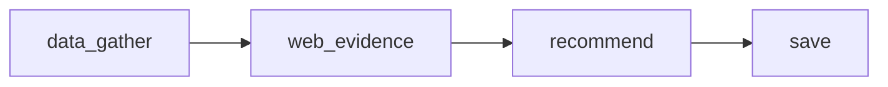
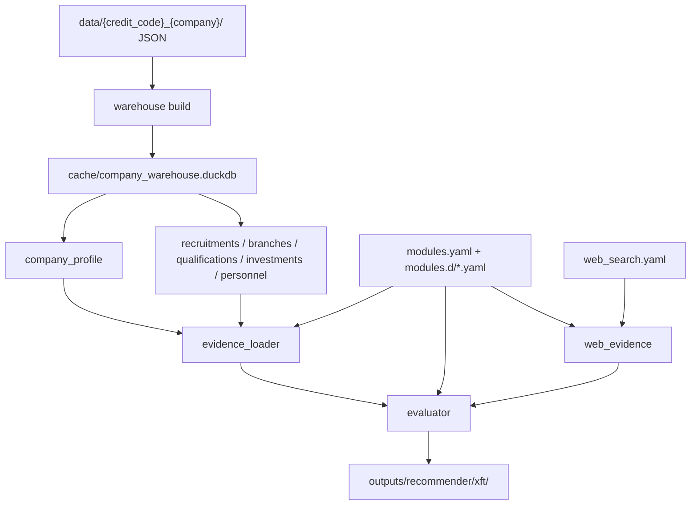

# 架构说明

本文档面向开发和维护人员，描述当前代码仓库的推荐架构。

当前仓库只保留了一条主线：本地 DuckDB 企业画像、模块配置、可选 Web 补证、规则/LLM 指标判断和运行产物审计。

## 顶层能力

```text
uv run xft recommend   推荐单家公司或批量企业
uv run xft calibrate   用人工标注样本校准推荐效果
uv run xft warehouse   从 data/ 企业 JSON 构建 DuckDB
uv run xft scenario    校验或审计场景配置
uv run xft runs        汇总推荐运行产物
uv run xft cache       管理远端/本地搜索缓存
```

默认路径：

```text
DEFAULT_SCENARIO  = config/recommender/xft
DEFAULT_WAREHOUSE = cache/company_warehouse.duckdb
```

## 推荐流水线

LangGraph 图在 `src/xft/pipeline/recommender/graph.py` 中组装，当前节点固定为：



| 节点 | 文件 | 职责 |
| --- | --- | --- |
| `data_gather` | `nodes/data_gather_node.py` | 从 DuckDB 读取 `company_profile`，并根据指标 `data_sources` 加载本地证据 |
| `web_evidence` | `nodes/web_evidence_node.py` | 仅在 `with_web=True` 时，按指标 `web_search` 执行查询并转成 Web 证据 |
| `recommend` | `nodes/recommend_node.py` | 合并本地证据和 Web 证据，调用 evaluator 生成模块/标签/指标结果 |
| `save` | `nodes/save_node.py` | 写入 `result.json`、`label_result.json`、`indicator_evidence.json`、`report.md` 等产物 |

公开入口：

```text
src/xft/pipeline/recommender/graph.py::run_recommendation
```

CLI 入口：

```text
src/xft/cli/recommend.py
```

## 数据流



DuckDB 的 Gold 层是 `company_profile`。推荐主线也会读取若干明细表作为指标本地证据：

```text
recruitments
branches
qualifications
outbound_investments
key_personnel
```

## 配置体系

默认场景目录：

```text
config/recommender/xft/
  scenario.yaml
  modules.yaml
  modules.d/
  web_search.yaml
```

| 文件 | 作用 |
| --- | --- |
| `scenario.yaml` | 场景入口，声明模块配置、Web 配置、输出目录、Web 缓存目录 |
| `modules.yaml` | 全局评分、全局接受策略、模块目录 |
| `modules.d/*.yaml` | 一个文件一个推荐模块 |
| `web_search.yaml` | Web provider、默认 provider、查询数量上限 |

`src/xft/core/scenario.py` 负责解析场景路径。`ScenarioConfig.modules_config` 指向 `modules.yaml`，`ScenarioBundle.modules_path` 会解析成绝对路径。

模块配置由 `src/xft/pipeline/recommender/config_loader.py` 加载：

- 先读取 `modules.yaml`。
- 如果存在内联 `modules`，先加载内联模块。
- 如果配置 `modules_dir`，按文件名排序加载目录下所有 `*.yaml`。
- `module_id` 全局唯一。
- 同一模块下 `label_id` 唯一。
- 同一标签下 `indicator_id` 唯一。

## 核心模型与判断

核心模型在 `src/xft/pipeline/recommender/models.py`。

结果层级：

```text
RecommendationResult
  -> ModuleResult
    -> LabelResult
      -> IndicatorResult
```

指标支持四类 evaluator：

| evaluator | 实现位置 | 说明 |
| --- | --- | --- |
| `rule` | `evaluator.py` | 用 `rule` 或 `data_sources` 做确定性判断 |
| `llm` | `evaluator.py` | 用企业画像、本地证据和 prompt 交给 LLM 判断 |
| `hybrid` | `evaluator.py` | 先 rule，再按 `merge_policy` 决定是否调用 LLM |
| `llm_web` | `evaluator.py` + `web_evidence.py` | Web-first；没有实际 Web 证据时返回 `unknown`，不空证据调用 LLM |

`EvaluationContext` 收拢 evaluator 内部共享参数，避免在模块、标签、指标多层函数间重复传递配置、画像、证据、LLM 事件和并发控制。

## Web 补证

Web 补证只服务指标判断，不再承担独立抽取入库。

入口：

```text
src/xft/pipeline/recommender/web_evidence.py::run_web_evidence
```

执行过程：

1. 读取场景 `web_search.yaml`。
2. 过滤启用的 provider。
3. 遍历配置了 `web_search` 的指标。
4. 根据 `when` 和本地证据决定是否搜索。
5. 执行固定查询和可选自动查询。
6. 过滤非目标公司或非指标相关结果。
7. 写入 Web 查询、结果、trace 和指标证据。

输出文件：

```text
web_queries.jsonl
web_results.jsonl
web_trace.json
indicator_evidence.json
```

## 运行产物

单次推荐输出目录：

```text
outputs/recommender/xft/<run_id>/
```

| 文件 | 内容 |
| --- | --- |
| `result.json` | 最终业务交付 JSON |
| `report.md` | 人类可读报告 |
| `label_result.json` | 模块、标签、指标完整结果 |
| `indicator_evidence.json` | 本地证据和 Web 证据 |
| `profile.json` | 本次读取的企业画像 |
| `decision_trace.json` | Web trace、规则 trace、LLM trace |
| `llm_calls.jsonl` | LLM 调用明细 |
| `llm_metrics.json` | LLM 调用统计 |
| `web_queries.jsonl` | Web 查询记录 |
| `web_results.jsonl` | Web 查询结果 |
| `web_trace.json` | Web 查询 trace |
| `scenario_resolved.json` | 解析后的场景配置 |
| `config_manifest.json` | 参与本次运行的配置文件和哈希 |

批量运行会额外生成 batch summary、quality report、delivery manifest 和 failed companies 文件，逻辑在 `src/xft/pipeline/recommender/batch.py` 与 `src/xft/runtime/artifacts.py`。

## 质量门禁

常用验证命令：

```bash
uv run xft scenario validate config/recommender/xft
uv run xft recommend --no-llm --scenario config/recommender/xft "企业名称"
uv run ruff check src tests scripts
uv run mypy src
uv run pytest -q
```

涉及 Web/LLM 的配置变更，额外跑：

```bash
uv run xft recommend --with-web --llm-debug --scenario config/recommender/xft "企业名称"
```
