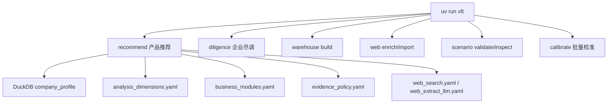
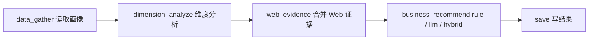
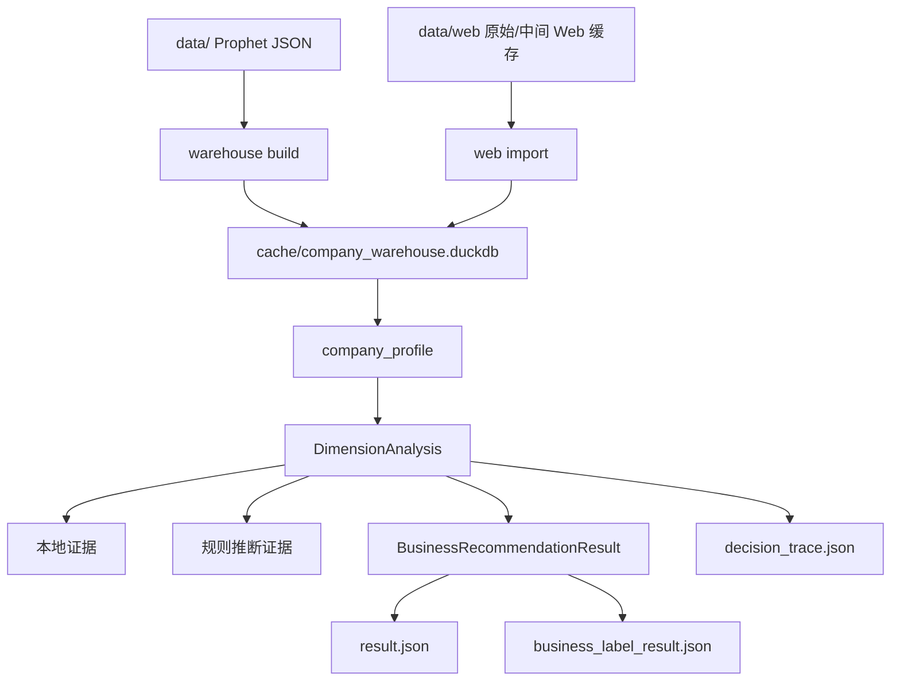
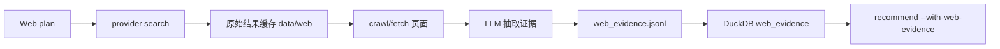

# 架构说明

本文档面向开发和维护人员，描述当前真实架构。推荐流水线已删除旧的 `llm_match + llm_recommend + scoring/` 链路，主线只保留业务指标推荐。

## 总览



## 推荐流水线

当前推荐图是 5 个节点：



节点职责：

| 节点 | 职责 |
| --- | --- |
| `data_gather` | 从 DuckDB 读取企业画像 |
| `dimension_analyze` | 根据 `analysis_dimensions.yaml` 生成维度证据 |
| `web_evidence` | 读取已入库 Web 证据，合并到维度分析 |
| `business_recommend` | 根据 `business_modules.yaml` 判断业务模块、标签、指标 |
| `save` | 写入 `result.json`、`business_label_result.json`、`report.md` 等产物 |

已删除：

```text
src/xft/pipeline/recommender/nodes/llm_match_node.py
src/xft/pipeline/recommender/nodes/llm_recommend_node.py
src/xft/pipeline/recommender/recommendation_normalizer.py
src/xft/scoring/
```

## 数据流



## 配置体系

当前 `config/` 按业务入口分两层：

```text
config/
  recommend/   推荐场景配置
  diligence/   尽调流水线配置
```

推荐主场景：

```text
config/recommend/sales_recommendation/
  scenario.yaml
  business_modules.yaml
  analysis_dimensions.yaml
  evidence_policy.yaml
  web_search.yaml
  web_extract_llm.yaml
  prompts/extract_evidence_system.md
```

核心配置：

| 文件 | 作用 |
| --- | --- |
| `scenario.yaml` | 场景入口，声明配置文件、输出目录、Web 缓存目录 |
| `business_modules.yaml` | 业务推荐模块、标签、指标、rule/llm/hybrid 判断 |
| `analysis_dimensions.yaml` | 企业维度分析、本地证据字段、Web 搜索词 |
| `evidence_policy.yaml` | 证据优先级、Web 跳过、冲突处理 |
| `web_search.yaml` | Web provider、抓取、缓存、屏蔽域名 |
| `web_extract_llm.yaml` | Web 抽取 LLM 配置 |

旧配置已移除：

```text
products.yaml
scoring_policy.yaml
config/recommender/
config/evidence_policy.yaml
```

`config/diligence/` 是独立的尽调配置包：

```text
config/diligence/app.yaml
config/diligence/dimensions/
config/diligence/prompts/
```

这套配置只服务 `uv run xft diligence --config config/diligence ...`，不参与当前产品推荐主线。各文件职责：

| 文件/目录 | 作用 |
| --- | --- |
| `config/diligence/app.yaml` | 尽调流水线并发、抓取、输出和报告参数 |
| `config/diligence/dimensions/` | 尽调维度定义、MiniMax/Metaso 查询词、结构化抽取字段 |
| `config/diligence/prompts/` | 尽调摘要、字段抽取、合并报告和各维度提示词 |

## 产物

推荐运行目录包含：

| 文件 | 内容 |
| --- | --- |
| `result.json` | 最终业务交付结果 |
| `business_label_result.json` | 全量业务模块、标签、指标结果 |
| `profile.json` | 企业画像 |
| `dimension_analysis.json` | 维度证据分析 |
| `decision_trace.json` | Web、业务规则、LLM 决策过程 |
| `llm_calls.jsonl` | LLM 调用明细 |
| `llm_metrics.json` | LLM 统计 |
| `config_manifest.json` | 配置审计清单 |
| `report.md` | 人类可读报告 |

不再生成：

```text
match_results.json
internal_result.json
```

## Web 子系统

Web 子系统仍然支持独立准备数据、入库和在推荐时自动补证。



推荐时：

- `--with-web-evidence`：只复用已有 DuckDB Web 证据。
- `--with-web`：缺少缓存时搜索、抓取、抽取并入库。
- `--refresh-web`：忽略已有缓存重新抓取。

## 尽调流水线

`xft diligence` 仍保留为企业尽调场景，不属于当前推荐主线。当前策略是保持 dry-run 和既有测试稳定，不把新增推荐能力继续塞回尽调链。

## 质量门禁

推荐重构后基础门禁：

```bash
uv run ruff check src tests
uv run mypy src
uv run pytest -q
uv run xft scenario validate config/recommend/sales_recommendation
uv run xft recommend --no-llm --scenario config/recommend/sales_recommendation "企业名称"
```
