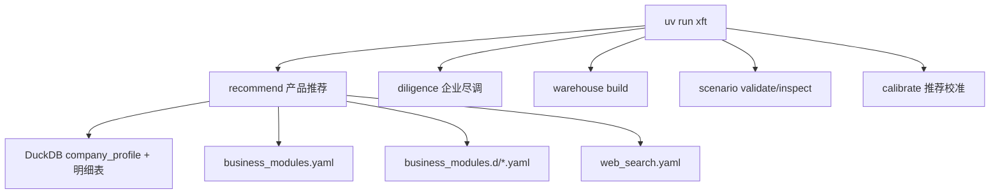
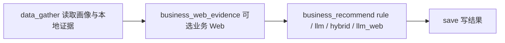
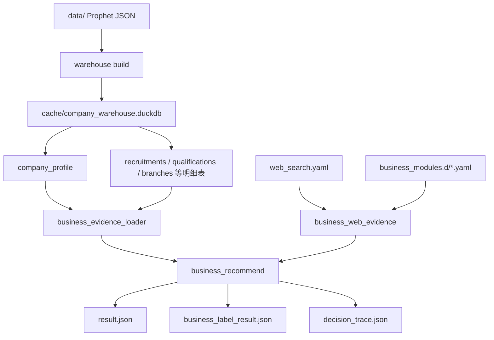

# 架构说明

本文档面向开发和维护人员，描述当前真实架构。推荐主线已经聚焦为业务指标推荐，不再包含旧维度分析、旧 Web enrichment、旧产品评分引擎。

## 总览



顶层 CLI 当前包含：

```text
recommend
diligence
calibrate
warehouse
scenario
runs
cache
```

已删除 `xft web` 和 `warehouse web-import`。

## 推荐流水线

当前推荐图是 4 个节点：



节点职责：

| 节点 | 职责 |
| --- | --- |
| `data_gather` | 从 DuckDB 读取 `company_profile`，并按指标 `data_sources` 加载本地证据 |
| `business_web_evidence` | 仅在 `--with-business-web` 时，按指标 `web_search` policy 执行固定查询和可选自动查询 |
| `business_recommend` | 根据业务模块、标签、指标配置生成推荐结果 |
| `save` | 写入 `result.json`、`business_label_result.json`、`report.md` 等产物 |

不再存在：

```text
dimension_analyze
web_evidence
run_web_enrichment
load_web_cache_to_duckdb
EvidencePolicy
analysis_dimensions.yaml
web_extract_llm.yaml
evidence_policy.yaml
```

## 数据流



## 推荐配置体系

推荐主场景：

```text
config/recommend/sales_recommendation/
  scenario.yaml
  business_modules.yaml
  business_modules.d/
    个税管理.yaml
    假勤管理.yaml
    对公报账.yaml
    差旅报销.yaml
    日常报销.yaml
    进项发票.yaml
    销项发票.yaml
  web_search.yaml
```

核心配置：

| 文件 | 作用 |
| --- | --- |
| `scenario.yaml` | 场景入口，声明业务模块配置、Web provider 配置和输出目录 |
| `business_modules.yaml` | 全局评分、全局接受策略、`modules_dir` |
| `business_modules.d/*.yaml` | 一个文件一个业务模块，动态发现 |
| `web_search.yaml` | 业务指标级 Web 搜索 provider 配置 |

`config/diligence/` 是独立的尽调配置包，只服务 `uv run xft diligence`，不参与推荐主线。

## 业务模块配置加载

`business_modules.yaml` 可以继续兼容单文件 `modules`，但正式销售场景使用目录化模块：

```yaml
modules_dir: business_modules.d
```

加载规则：

- loader 先读取 `business_modules.yaml` 的全局配置。
- 如果存在 `modules`，会先加载内联模块。
- 如果存在 `modules_dir`，会按文件名排序加载目录下所有 `*.yaml`。
- 每个模块文件可以是单个模块映射，也可以包含 `modules: [...]`。
- `module_id` 必须全局唯一；同一模块下 `label_id`、同一标签下 `indicator_id` 必须唯一。

这意味着增减模块只需要增删 `business_modules.d/*.yaml` 文件。

## 业务 Web

业务 Web 与旧 Web enrichment 不同：

| 项 | 旧 Web enrichment | 当前业务 Web |
| --- | --- | --- |
| 入口 | `xft web enrich` / `--with-web` | `xft recommend --with-business-web` |
| 粒度 | 维度分析 | 业务指标 |
| 查询来源 | `analysis_dimensions.yaml` | 指标 `web_search.fixed_queries`，必要时由 LLM 生成少量补充查询 |
| 抽取方式 | 独立 Web 抽取 LLM | 作为指标证据交给业务 evaluator |
| 入库 | `web_evidence` DuckDB 表 | 运行目录 JSON/JSONL |

`web_search.yaml` 只保留 provider 和每次查询结果数量等执行参数。是否搜索由指标自己的 `web_search.when/effect` 决定：

- `llm_web`: Web-first，默认 `when: always`
- `llm/hybrid`: 通常本地证据不足时补证，`when: insufficient`
- `rule`: 通常规则未命中时补线索，`when: rule_not_matched`

业务 Web 输出：

```text
business_web_queries.jsonl
business_web_results.jsonl
business_web_trace.json
business_indicator_evidence.json
```

## 产物

推荐运行目录包含：

| 文件 | 内容 |
| --- | --- |
| `result.json` | 最终业务交付结果 |
| `business_label_result.json` | 全量业务模块、标签、指标结果 |
| `business_indicator_evidence.json` | 指标证据 |
| `profile.json` | 企业画像 |
| `decision_trace.json` | 规则、LLM、业务 Web 决策过程 |
| `llm_calls.jsonl` | LLM 调用明细 |
| `llm_metrics.json` | LLM 统计 |
| `scenario_resolved.json` | 场景解析结果 |
| `config_manifest.json` | 配置审计清单 |
| `report.md` | 人类可读报告 |

不再生成：

```text
dimension_analysis.json
match_results.json
internal_result.json
```

## 质量门禁

基础门禁：

```bash
uv run ruff check src tests scripts
uv run mypy src
uv run pytest
uv run xft scenario validate config/recommend/sales_recommendation
uv run xft recommend --no-llm --scenario config/recommend/sales_recommendation "企业名称"
```
