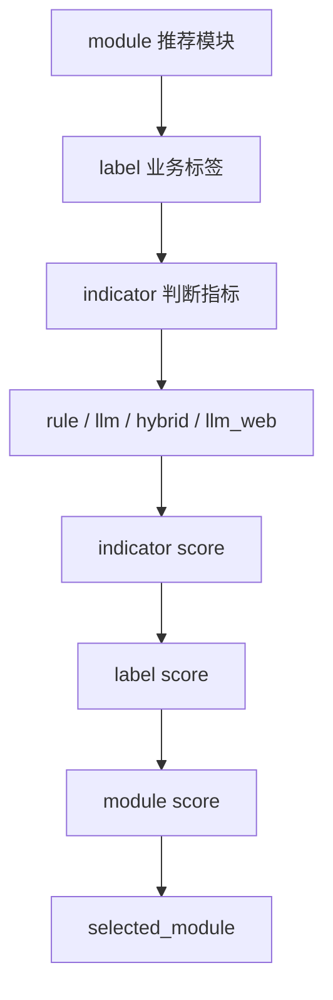

# 评分与指标配置

本文档面向配置维护人员和开发人员，说明推荐结果如何由 `modules.yaml` 与 `modules.d/*.yaml` 生成。

## 结果层级



## 结果值

每个指标的 `result` 只允许四种值：

| 值 | 含义 |
| --- | --- |
| `matched` | 证据足够，判断命中 |
| `possible` | 有线索但证据不足，判断可能命中 |
| `not_matched` | 有证据或规则显示不命中 |
| `unknown` | 证据不足，无法判断 |

`confidence` 只允许：

```text
高 / 中 / 低
```

## 分数配置

`modules.yaml` 中的全局评分：

```yaml
scoring:
  indicator_scores:
    matched: 10
    possible: 5
    unknown: 0
    not_matched: 0
  label_scores:
    matched: 30
    possible: 15
    unknown: 0
    not_matched: 0
```

## 业务分计算

业务分按 **Indicator → Label → Module** 三层逐级累加。每个模块的业务分：

```text
module.score = module.base_score + Σ(label.score)
```

Label 分数已包含其下所有 indicator 的贡献，不重复累加 indicator 分数。

### 第一层：Indicator 得分

每个 indicator 评估后得到一个结果值（`matched` / `possible` / `unknown` / `not_matched`），
映射为 indicator 分数：

```text
indicator.score = indicator_scores[indicator.result]
```

| result | 分数 |
| --- | ---: |
| `matched` | 10 |
| `possible` | 5 |
| `unknown` | 0 |
| `not_matched` | 0 |

### 第二层：Label 得分

一个 label 的得分取决于它下面所有 indicator 的评估结果汇总：

1. 统计 matched 和 possible 的 indicator 数量
2. 判定 label 结果：

```text
如果 matched >= label.min_matched_indicators → "matched"
否则如果 (possible > 0 或 matched > 0)          → "possible"
否则如果 全部 indicator 都是 unknown             → "unknown"
否则                                              → "not_matched"
```

3. 将 label 结果映射为 label 分数：

```text
label.score = label_scores[label.result]
```

| result | 分数 |
| --- | ---: |
| `matched` | 30 |
| `possible` | 15 |
| `unknown` | 0 |
| `not_matched` | 0 |

关键点：`min_matched_indicators` 是 label 的命中门槛，定义在 `modules.d/*.yaml` 中。
例如 `min_matched_indicators: 2` 表示该 label 下至少要有 2 个 indicator 为 matched 才算命中。

### 第三层：Module 业务分

```text
module.score = module.base_score + Σ(label.score)
```

`base_score` 定义在每个 `modules.d/*.yaml` 中，用于区分模块的基础权重。
不同模块即使 label 命中情况相同，base_score 高的模块排前面。

### 计算示例

假设"日常报销"模块（`base_score: 40`），包含 3 个 label：

| Label | min_matched | indicator 结果 | label 结果 | label 得分 |
| --- | --- | --- | --- | ---: |
| 企业规模 | 1 | matched × 1 | matched | 30 |
| 多地经营 | 2 | matched × 1, possible × 1 | possible | 15 |
| 信息化程度 | 1 | unknown × 2 | unknown | 0 |

```text
module.score = 40 + 30 + 15 + 0 = 85
```

## 接受度

接受度由 `acceptance_policy.levels` 决定，仅看 **matched 的 label 数量**（`attributes_number`），
不看分数：

```yaml
acceptance_policy:
  levels:
    - result: 高
      min_matched_labels: 3
      conclusion: 企业满足{attributes_number}个属性标签及{indicators_number}个指标，接受度为高。
    - result: 中高
      min_matched_labels: 2
      conclusion: 企业满足{attributes_number}个属性标签及{indicators_number}个指标，接受度为中高。
    - result: 低
      min_matched_labels: 0
      conclusion: 企业满足{attributes_number}个属性标签及{indicators_number}个指标，接受度为低。
```

`attributes_number` 是命中的标签数量，`indicators_number` 是命中的指标数量。

## 模块文件结构

每个 `modules.d/*.yaml` 文件定义一个推荐模块：

```yaml
module_id: 差旅报销
module_name: 差旅报销
priority: 40
base_score: 0
labels:
  - label_id: 多地经营
    label_name: 多地经营
    min_matched_indicators: 1
    indicators:
      - indicator_id: 分支机构
        indicator_name: 分支机构
        evaluator: rule
        standard: 企业存在分支机构或多地经营线索
```

唯一性约束：

- `module_id` 全局唯一。
- 同一模块下 `label_id` 唯一。
- 同一标签下 `indicator_id` 唯一。

## Rule

`rule` 适合结构化证据明确的指标。

直接读取 `company_profile` 字段：

```yaml
evaluator: rule
standard: 企业标签包含高新技术企业
rule:
  source_field: labels
  op: contains
  value: 高新技术企业
```

支持的 `op`：

| op | 含义 |
| --- | --- |
| `exists` | 字段存在且非空 |
| `contains` | 字符串或列表包含某个值 |
| `contains_any` | 包含列表中的任一值 |
| `==` / `!=` | 等于 / 不等于 |
| `>` / `>=` / `<` / `<=` | 数值比较 |

从 DuckDB 明细表取证据：

```yaml
evaluator: rule
standard: 招聘标题包含销售或渠道
data_sources:
  - type: table
    table: recruitments
    field: title
    op: text_contains
    keywords:
      - 销售
      - 渠道
```

当前表级 `data_sources` 支持：

```text
recruitments
branches
qualifications
outbound_investments
key_personnel
```

注意：

- `text_contains` 必须配置具体 `keywords`。
- 判断是否有记录时使用 `op: exists`。
- 不要用空 `keywords` 表示存在性，否则容易把任意记录误判为命中。

## LLM

`llm` 适合需要综合企业画像、证据和业务标准的判断：

```yaml
evaluator: llm
standard: 企业存在跨区域经营、项目制管理或复杂报销场景
prompt: 判断企业是否可能存在复杂日常报销需求。
evidence_hints:
  - 企业规模
  - 分支机构
  - 招聘信息
```

LLM 输入包含企业画像摘要、指标证据、Web trace、模块/标签/指标配置。调用记录写入：

```text
llm_calls.jsonl
llm_metrics.json
decision_trace.json
```

## Hybrid

`hybrid` 推荐用于“本地证据优先，LLM 补充判断”的指标。

```yaml
evaluator: hybrid
merge_policy: rule_first
standard: 企业具备高新技术企业、专精特新、科技型中小企业等资质
rule:
  source_field: labels
  op: contains_any
  value:
    - 高新技术企业
    - 专精特新
    - 科技型中小企业
prompt: 判断企业是否具备科技型企业资质。
```

合并策略：

| `merge_policy` | 逻辑 |
| --- | --- |
| `rule_first` | 规则命中直接 `matched`，不调用 LLM；规则未命中再调用 LLM |
| `llm_confirm` | 规则给候选信号，LLM 负责确认；如 LLM 否定则降级 |
| `require_both` | 规则和 LLM 都命中才 `matched` |

## LLM Web

`llm_web` 是 Web-first 指标，适合必须依赖公开网页才能判断的场景。

```yaml
evaluator: llm_web
standard: 企业公开信息显示存在海外客户、海外业务或跨境服务
prompt: 请判断企业是否存在海外业务，只能基于证据判断，不得编造。
web_search:
  when: always
  effect: llm_evidence
  fixed_queries:
    - "{company_name} 海外业务"
    - "{company_name} 海外客户"
  auto: false
  max_results: 5
```

约束：

- `llm_web` 必须配置 `web_search`。
- 没有实际 Web 证据时直接返回 `unknown`。
- 不会在空 Web 证据下调用 LLM。

## Web Policy

`web_search` 是指标级补证策略。只有命令带 `--with-web` 时才执行，并且是 lazy 的：系统不会预先搜索所有指标，而是在当前指标本地证据不足、规则未命中或 `llm_web` 必须取公开证据时才搜索。

常用字段：

| 字段 | 含义 |
| --- | --- |
| `when` | `always`、`insufficient`、`rule_not_matched`、`never` |
| `effect` | `llm_evidence`、`evidence_only`、`possible_on_evidence` |
| `fixed_queries` | 固定查询词，支持 `{company_name}` |
| `auto.enabled` | 是否用 LLM 自动生成补充查询 |
| `auto.max_queries` | 自动查询数量上限 |
| `auto.intent` | 自动查询目标 |
| `max_results` | 每个查询最多保留的结果数 |

不同 evaluator 的建议：

| evaluator | 建议 |
| --- | --- |
| `rule` | 如需 Web，仅用 `rule_not_matched` + `possible_on_evidence` 补线索 |
| `llm` | 可用 `insufficient` + `llm_evidence` 增加 LLM 证据 |
| `hybrid` | 可用 `insufficient` + `llm_evidence` 补充模糊判断 |
| `llm_web` | 使用 `always` + `llm_evidence` |

`rule_not_matched` 只有在规则已经实际跑出 `not_matched` 或 `unknown` 后才会触发；规则已命中或规则尚未执行时不会搜索。

Web 结果进入证据前会检查：

- 是否属于目标公司。
- 是否与指标关键词相关。

只有公司相关但指标不相关的泛页面会被过滤。

## 配置调优顺序

建议按这个顺序调优一个模块：

1. 查看 `label_result.json`，定位误命中的模块、标签、指标。
2. 查看 `indicator_evidence.json`，确认误命中来自本地证据、Web 证据还是 LLM 推理。
3. 能用本地结构化证据判断的 `llm_web` 指标，改为 `rule` 或 `hybrid`。
4. 检查所有 `text_contains` 是否有具体 `keywords`。
5. 检查所有 `fixed_queries` 是否包含指标词。
6. 用 `--no-llm` 验证规则稳定性。
7. 用 `--with-web --llm-debug` 抽查 Web 和 LLM 行为。
8. 用 `calibrate` 对人工标注样本做整体评估。

校准命令：

```bash
uv run xft calibrate \
  --scenario config/recommender/xft \
  --company-list company.txt \
  --labels calibration_labels.csv \
  --with-llm \
  --with-web \
  --limit 10
```
