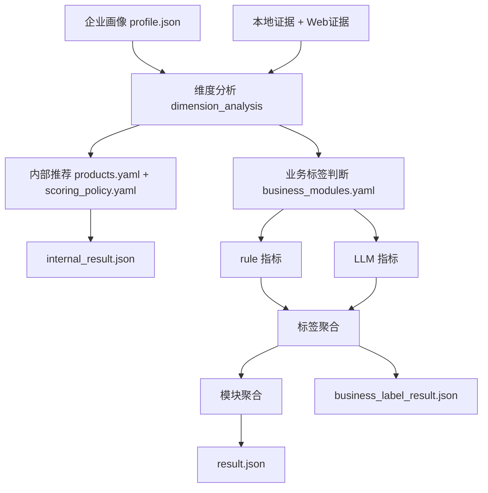

# 推荐原理：rule + LLM 混合判断

本文档解释当前推荐系统如何做出判断、哪些地方靠规则、哪些地方靠 LLM，以及业务人员应该改哪些配置。

## 一句话说明

当前推荐不是“纯规则”，也不是“纯 LLM”，而是：

```text
确定的字段判断 → 用 rule
需要业务语义理解 → 用 LLM
最终业务输出 → 用配置聚合
```

最终会同时生成三类结果：

| 文件 | 用途 |
|------|------|
| `result.json` | 业务交付结果，给前端、业务人员和销售使用 |
| `business_label_result.json` | 标签和指标判断过程，解释每个结论怎么来 |
| `internal_result.json` | 内部评分、证据链和调试结果 |

## 总体流程



## 两套配置，各自负责什么

### `business_modules.yaml`

这是业务人员最常改的文件，负责最终业务版 `result.json`。

它描述：

```text
模块 → 标签 → 指标 → 判断方式(rule/llm) → 营销点/KYC问题
```

例如：

```yaml
modules:
  - module_id: daily_reimbursement
    module_name: 日常报销
    labels:
      - label_id: tech_attribute
        label_name: 科技属性
        min_matched_indicators: 1
        indicators:
          - indicator_id: ip_assets
            indicator_name: 知识产权数量多
            evaluator: rule
            standard: 存在专利、软著或其他知识产权资产。
            rule:
              source_field: ip_counts.patent
              op: ">"
              value: 0
          - indicator_id: tech_certification
            indicator_name: 科技企业-科技资质认证
            evaluator: llm
            standard: 企业具备高新技术企业、专精特新、科技型中小企业等资质。
            evidence_hints:
              - 高新技术企业
              - 专精特新
```

### `products.yaml`

这是内部评分文件，负责 `internal_result.json`。

它描述：

```text
候选产品 → 关注哪些维度 → 哪些规则加分/扣分/排除
```

`products.yaml` 的结果主要用于：

- 内部排序和兜底推荐。
- 解释工程评分。
- 保证没有 LLM 时系统仍可运行。

### 两者如何对齐

两者通过同一个 `module_id` 对齐：

```text
products.yaml             module_id: attendance
business_modules.yaml     module_id: attendance
result.json               Module: 假勤管理
```

如果新增一个业务模块，建议同时在两个文件里添加同一个 `module_id`。

当前场景要求两边的模块集合一一对应。`xft scenario validate` 会把不一致作为配置错误处理，例如：

- `business_modules.yaml` 有模块，但 `products.yaml` 没有对应产品。
- `products.yaml` 还残留业务模块之外的旧产品，导致“产品匹配”候选数异常变多。

## rule 指标

`rule` 适合字段明确、阈值明确的判断。

示例：

```yaml
evaluator: rule
standard: 存在专利、软著或其他知识产权资产。
rule:
  source_field: ip_counts.patent
  op: ">"
  value: 0
```

含义：

```text
如果企业画像中的 ip_counts.patent > 0
则该指标满足
```

支持的常见操作符：

| 操作符 | 含义 | 示例 |
|--------|------|------|
| `exists` | 字段有值 | `website exists` |
| `==` | 等于 | `is_listed == true` |
| `!=` | 不等于 | `reg_status != 注销` |
| `>` | 大于 | `ip_counts.patent > 0` |
| `>=` | 大于等于 | `employee_count >= 200` |
| `<` | 小于 | `employee_count < 50` |
| `<=` | 小于等于 | `branch_count <= 1` |
| `contains` | 包含文字 | `industry contains 制造` |
| `contains_any` | 包含任意一个关键词 | `business_scope contains_any [出口, 外贸]` |

rule 输出稳定、可复现，适合离线校准。

## LLM 指标

`llm` 适合无法只靠一个字段判断的业务语义。

例如：

- 企业是否属于“产销一体属性”
- 是否存在“售后属性”
- 是否适合从“出口海外”切入
- 是否存在“渠道维护”或“海外拓展”线索

示例：

```yaml
evaluator: llm
standard: 存在区域销售、渠道维护、客户拜访或经销商管理线索。
prompt: |
  请判断企业是否存在经销商维护、区域销售、渠道维护或业务员外勤销售特征。
  只能基于证据判断，不得编造。
evidence_hints:
  - 区域销售
  - 经销商
  - 渠道维护
```

LLM 必须输出结构化判断：

```json
{
  "result": "matched",
  "confidence": "中",
  "current_status": "招聘信息中出现区域销售、渠道维护等岗位线索。",
  "evidence": ["近期招聘岗位包含区域销售、渠道经理"]
}
```

### `--no-llm` 时怎么办

运行：

```bash
uv run xft recommend --no-llm "企业名称"
```

此时不会调用 LLM。配置为 `llm` 的指标会使用 `evidence_hints` 在本地企业画像中做保守兜底：

```text
命中关键词 → matched / 中置信
没有命中 → unknown / 低置信
```

这保证了：

- 没有 API Key 也能跑。
- 离线验收可复现。
- 业务人员改配置后可以快速验证。

## 指标结果怎么聚合成标签

每个指标输出统一结构：

```json
{
  "module_id": "daily_reimbursement",
  "label_id": "tech_attribute",
  "indicator_id": "ip_assets",
  "indicator_name": "知识产权数量多",
  "result": "matched",
  "confidence": "高",
  "score": 10,
  "current_status": "知识产权数量满足：12",
  "standard": "存在专利、软著或其他知识产权资产。",
  "evidence": ["ip_counts.patent = 12"],
  "evaluator": "rule"
}
```

`result` 的含义：

| result | 业务含义 |
|--------|----------|
| `matched` | 满足 |
| `possible` | 可能满足 |
| `not_matched` | 不满足 |
| `unknown` | 证据不足 |

一个标签下有多个指标，配置中用 `min_matched_indicators` 决定标签是否满足：

```yaml
label_name: 科技属性
min_matched_indicators: 1
```

含义：

```text
科技属性下面只要有 1 个指标 matched
这个标签就算 matched
```

## 标签怎么聚合成模块

模块接受度按命中的标签数量计算。

默认策略在 `business_modules.yaml` 的 `acceptance_policy` 中：

```yaml
acceptance_policy:
  levels:
    - result: 高
      min_matched_labels: 3
      conclusion: 企业满足{attributes_number}个属性标签及{indicators_number}个指标，接受度为高。
    - result: 中高
      min_matched_labels: 2
      conclusion: 企业满足{attributes_number}个属性标签及{indicators_number}个指标，接受度为中高。
    - result: 低
      min_matched_labels: 0
      conclusion: 企业满足{attributes_number}个属性标签及{indicators_number}个指标，接受度为低。
```

其中：

| 模板变量 | 来源 |
|----------|------|
| `{attributes_number}` | 当前模块下 `matched` 的标签数量 |
| `{indicators_number}` | 当前模块下 `matched` 的指标数量 |

例如命中 3 个标签、6 个指标：

```text
企业满足3个属性标签及6个指标，接受度为高。
```

## 内部评分怎么算

内部评分仍由 `products.yaml` 和 `scoring_policy.yaml` 负责，写入 `internal_result.json`。

简化公式：

```text
内部产品分 = 基础分 + 维度支持分 + 证据分 + Web补证分 + 正向规则 - 缺失扣分 - 冲突扣分
```

内部评分用于：

- 没有业务配置时的兜底结果。
- 工程调试和证据审计。
- 批量质量统计。

业务版 `result.json` 不直接展示完整内部评分，但 `business_label_result.json` 和 `internal_result.json` 可以一起用于排查。

## Web 证据如何参与

Web 不是直接替代本地数据，而是补充证据。

```text
本地 JSON 事实充足 → 可跳过 Web
本地证据不足或强制开启 → Web 搜索、抓取、抽取、入库
推荐时 → 从 DuckDB 读取 Web 证据
```

原则：

- 原始搜索结果和抓取正文会缓存到 `data/web/`。
- 抽取后的 Web 证据会导入 DuckDB。
- Web 与本地 JSON 冲突时，默认以本地 JSON 为准。
- Web 证据可以提高维度证据质量，也可以被 LLM 指标作为判断依据。

常用命令：

```bash
# 本地不足时自动搜索
uv run xft recommend --with-web "企业名称"

# 强制所有维度搜索，适合验证 Web 链路
uv run xft recommend --with-web --force-web-dimensions "企业名称"

# 只复用已有 Web 证据
uv run xft recommend --with-web-evidence "企业名称"

# 忽略缓存重新搜索
uv run xft recommend --with-web --refresh-web "企业名称"
```

测试验证期可以加 LLM 诊断参数：

```bash
uv run xft recommend --with-web --llm-debug --llm-concurrency 4 "企业名称"
```

每次运行会额外写入：

- `llm_calls.jsonl`：逐次 LLM 调用明细。
- `llm_metrics.json`：调用次数、成功/失败数和累计耗时。

批量运行时，`batch_summary.csv` 和 `batch_quality_report.md` 会聚合这些 LLM 指标，方便定位是模型超时、限流、返回格式错误，还是业务规则本身需要调整。

## 怎么调优

### 结果模块不对

优先看：

```text
business_label_result.json
```

检查：

- 哪些模块分高。
- 哪些标签被 matched。
- 哪些指标被 matched。
- 指标是 `rule` 命中还是 `llm` 命中。

然后改：

```text
config/scenarios/sales_recommendation/business_modules.yaml
```

常见调整：

- 提高 `min_matched_indicators`，让标签更严格。
- 删除噪声大的 `evidence_hints`。
- 把过于宽泛的 `llm` 指标改成 `rule`。
- 修改 `marketing_points` 的话术。

### 内部分数不对

看：

```text
internal_result.json
```

然后改：

```text
products.yaml
scoring_policy.yaml
```

### 证据不足

看：

```text
dimension_analysis.json
```

然后改：

```text
analysis_dimensions.yaml
evidence_policy.yaml
web_search.yaml
```

### Web 噪声太大

优先改：

```text
analysis_dimensions.yaml 的 web_search_queries
web_search.yaml 的 blocked_domains / max_results_per_query
prompts/extract_evidence_system.md
```

## 推荐验证流程

单家公司快速验证：

```bash
uv run xft recommend --no-llm \
  --scenario config/scenarios/sales_recommendation \
  "企业名称"
```

Web 小批次验证：

```bash
uv run xft recommend --with-web \
  --scenario config/scenarios/sales_recommendation \
  "企业名称"
```

批量校准：

```bash
uv run xft calibrate \
  --scenario config/scenarios/sales_recommendation \
  --company-list company.txt \
  --labels calibration_labels.csv \
  --limit 10
```

## 变更日志

| 日期 | 说明 |
|------|------|
| 2026-05-18 | 更新为 rule + LLM 混合判断说明，补充业务版 `result.json`、`business_modules.yaml` 和 Web 证据路径 |
