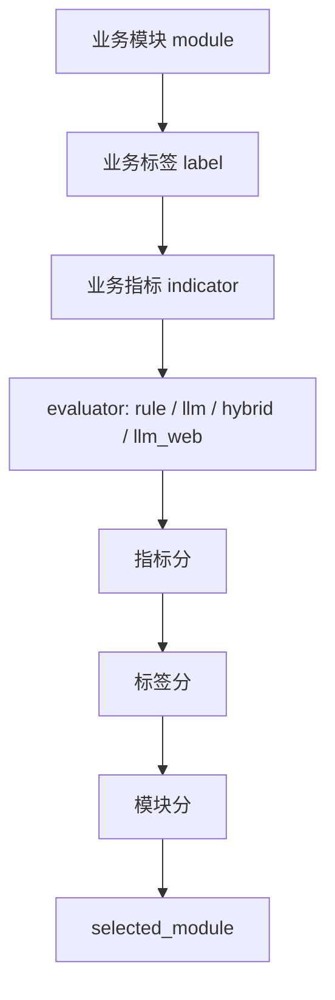

# 业务评分规则

当前推荐结果完全由 `modules.yaml` 和 `modules.d/*.yaml` 驱动。旧的产品评分引擎 `xft.scoring`、`products.yaml`、`scoring_policy.yaml` 已删除。

## 结果层级



## 指标结果

每个指标输出：

```json
{
  "module_id": "daily_reimbursement",
  "label_id": "tech_attribute",
  "indicator_id": "tech_certification",
  "indicator_name": "科技企业-科技资质认证",
  "result": "matched",
  "confidence": "中",
  "score": 10,
  "current_status": "企业持有高新技术企业证书",
  "standard": "企业具备高新技术企业、专精特新、科技型中小企业等资质",
  "evidence": ["企业标签包含高新技术企业"],
  "evaluator": "hybrid",
  "hybrid_trace": {}
}
```

字段说明：

| 字段 | 含义 |
| --- | --- |
| `result` | `matched`、`possible`、`not_matched`、`unknown` |
| `confidence` | `高`、`中`、`低` |
| `score` | 指标分，由 `scoring.indicator_scores` 映射 |
| `current_status` | 当前证据下的企业状态 |
| `standard` | 配置中的判断标准 |
| `evidence` | 支撑判断的证据摘要 |
| `evaluator` | 采用 `rule`、`llm` 或 `hybrid` |
| `hybrid_trace` | hybrid 的规则/LLM 合并过程 |

## 分数配置

`modules.yaml` 配置全局分数映射：

```yaml
scoring:
  indicator_scores:
    matched: 10
    possible: 5
    unknown: 0
    not_matched: 0
  label_scores:
    matched: 30
    possible: 15
    unknown: 0
    not_matched: 0
```

模块分数由：

```text
module.score = module.base_score + sum(label.score) + sum(indicator.score)
```

再限制在 0-100。

正式销售场景的模块定义在 `modules.d/*.yaml`：

```text
modules.yaml        全局 scoring、acceptance_policy、modules_dir
modules.d/假勤管理.yaml   单个业务模块
modules.d/差旅报销.yaml   单个业务模块
```

新增模块时添加一个模块 YAML 文件；删除模块时删除对应文件。loader 会动态加载 `modules_dir` 下所有 `*.yaml`。

## Rule

`rule` 适合结构化字段明确的指标。可以直接读取 `company_profile` 字段：

```yaml
evaluator: rule
standard: 企业标签包含高新技术企业
rule:
  source_field: labels
  op: contains
  value: 高新技术企业
```

常用操作符：

| op | 含义 |
| --- | --- |
| `exists` | 字段存在且非空 |
| `contains` | 字符串或列表包含某个值 |
| `contains_any` | 包含列表中的任一值 |
| `==` / `!=` | 等于 / 不等于 |
| `>` / `>=` / `<` / `<=` | 数值比较 |

也可以通过 `data_sources` 从画像字段或 DuckDB 明细表取证据：

```yaml
evaluator: rule
standard: 招聘标题包含销售或渠道
data_sources:
  - type: table
    table: recruitments
    field: title
    op: text_contains
    keywords:
      - 销售
      - 渠道
```

`text_contains` 类型的数据源必须配置具体 `keywords`。不要把 `keywords` 留空来表示“存在招聘记录”，存在性判断应使用 `op: exists`；否则指标会把任意招聘标题都当成命中，直接污染推荐结果。

当前表级 `data_sources` 支持：

```text
recruitments
branches
qualifications
outbound_investments
key_personnel
```

## LLM

`llm` 适合需要综合文本、证据和业务标准推理的指标：

```yaml
evaluator: llm
standard: 企业存在跨区域经营、项目制管理或复杂报销场景
prompt: 判断企业是否可能存在复杂日常报销需求。
evidence_hints:
  - 企业规模
  - 分支机构
  - 招聘信息
  - 企业画像
```

LLM 输出会写入：

```text
label_result.json
decision_trace.json
llm_calls.jsonl
llm_metrics.json
```

## Hybrid

`hybrid` 是推荐的默认增强方式：先用规则处理硬证据，再让 LLM 处理模糊证据。

```yaml
evaluator: hybrid
merge_policy: rule_first
standard: 企业具备高新技术企业、专精特新、科技型中小企业等资质
rule:
  source_field: labels
  op: contains_any
  value:
    - 高新技术企业
    - 专精特新
    - 科技型中小企业
prompt: 判断企业是否具备科技型企业资质。
```

合并策略：

| `merge_policy` | 逻辑 |
| --- | --- |
| `rule_first` | 规则命中直接 `matched`，不调用 LLM；规则未命中再调用 LLM |
| `llm_confirm` | 规则给候选信号，LLM 负责确认；如 LLM 否定则降级 |
| `require_both` | 规则和 LLM 都命中才 `matched` |

当一个指标已经有 `data_sources`，但仍需要公开网页辅助判断时，优先使用 `hybrid`，不要直接写成 `llm_web`。常见配置：

```yaml
evaluator: hybrid
merge_policy: rule_first
standard: 招聘 JD 或公开信息显示存在境外出差、海外驻点、全球出差
rule:
  source_field: recent_recruitment_titles
  op: contains_any
  value:
    - 境外出差
    - 海外驻点
    - 全球出差
data_sources:
  - type: table
    table: recruitments
    field: title
    op: text_contains
    keywords:
      - 境外出差
      - 海外驻点
      - 全球出差
web_search:
  when: insufficient
  effect: llm_evidence
  fixed_queries:
    - "{company_name} 境外出差 海外驻点"
```

## 指标级 Web Policy

`web_search` 是指标级补证策略。它只在推荐命令带 `--with-web` 时执行。

`llm_web` 适合必须查公开网页才能判断的指标，默认 Web-first；`llm/hybrid` 可在本地证据不足时补证；`rule` 可在规则未命中时补线索，但不能直接从 Web 证据变成 `matched`。

```yaml
indicator_id: 海外业务
indicator_name: 海外业务
evaluator: llm_web
standard: 企业公开信息显示存在海外客户、海外业务或跨境服务
prompt: 请判断企业是否存在海外业务，只能基于证据判断，不得编造。
evidence_hints:
  - 海外业务
  - 海外客户
web_search:
  when: always
  effect: llm_evidence
  fixed_queries:
    - "{company_name} 官网"
    - "{company_name} 海外业务"
  auto: false
  max_results: 5
```

注意：

- `llm_web` 必须配置 `web_search`。
- `fixed_queries` 优先执行；`auto.enabled: true` 时可由 LLM 生成少量补充查询。
- 搜索结果会作为 `source_type=web` 的指标证据进入 `indicator_evidence.json`。
- `rule` 使用 `effect: possible_on_evidence` 时，Web 证据最多把结果提升到 `possible`，不会变成 `matched`。
- Web 证据入库前会同时检查目标公司名/统一社会信用代码和指标相关词；只有公司相关但指标无关的泛页面会被过滤。
- `llm_web` 没有实际 Web 证据时直接输出 `unknown`，不调用 LLM。

## 配置治理顺序

优化一个模块时，建议按这个顺序处理：

1. 先列出所有 `llm_web` 指标，检查是否已经有 `data_sources`。
2. 有本地结构化证据的指标改为 `rule` 或 `hybrid`，并补齐 `text_contains.keywords`。
3. 保留为 `llm_web` 的指标，必须把 `fixed_queries` 改成指标专用查询。
4. 跑 `scenario validate` 和一家公司样本，检查 `indicator_evidence.json` 是否能解释每个命中。
5. 用 `calibrate` 对业务标注样本做错配复盘，再调整阈值、关键词和接受策略。

## 标签与模块

标签根据指标聚合：

- 命中指标数达到 `min_matched_indicators`：标签 `matched`
- 有部分可能命中：标签 `possible`
- 全部证据不足：标签 `unknown`
- 其余：标签 `not_matched`

模块根据标签、指标和 `acceptance_policy` 生成接受度：

```yaml
acceptance_policy:
  levels:
    - result: 高
      min_matched_labels: 2
      conclusion: 建议优先推荐
    - result: 中
      min_matched_labels: 1
      conclusion: 建议跟进确认
    - result: 低
      min_matched_labels: 0
      conclusion: 暂不作为优先推荐
```

## 调优建议

| 现象 | 优先调整 |
| --- | --- |
| 明确字段命中了但没推荐 | `rule.source_field`、`op`、`value` |
| 证据模糊、规则太死 | 把 `rule` 改成 `hybrid` |
| LLM 判断太宽 | 收紧 `standard` 和 `prompt` |
| LLM 判断太保守 | 增加 `evidence_hints`，明确可接受的间接证据 |
| Web 证据噪声大 | 调整对应指标的 `web_search.fixed_queries` |
| 模块分数整体偏高/偏低 | 调整 `base_score`、`indicator_scores`、`label_scores` |

## 验证

```bash
uv run xft scenario validate config/recommender/xft
uv run xft recommend --no-llm --scenario config/recommender/xft "企业名称"
uv run xft recommend --llm-debug --scenario config/recommender/xft "企业名称"
uv run xft recommend --with-web --scenario config/recommender/xft "企业名称"
```
